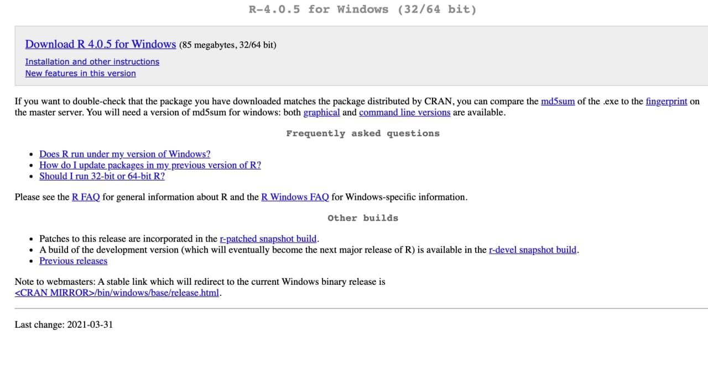
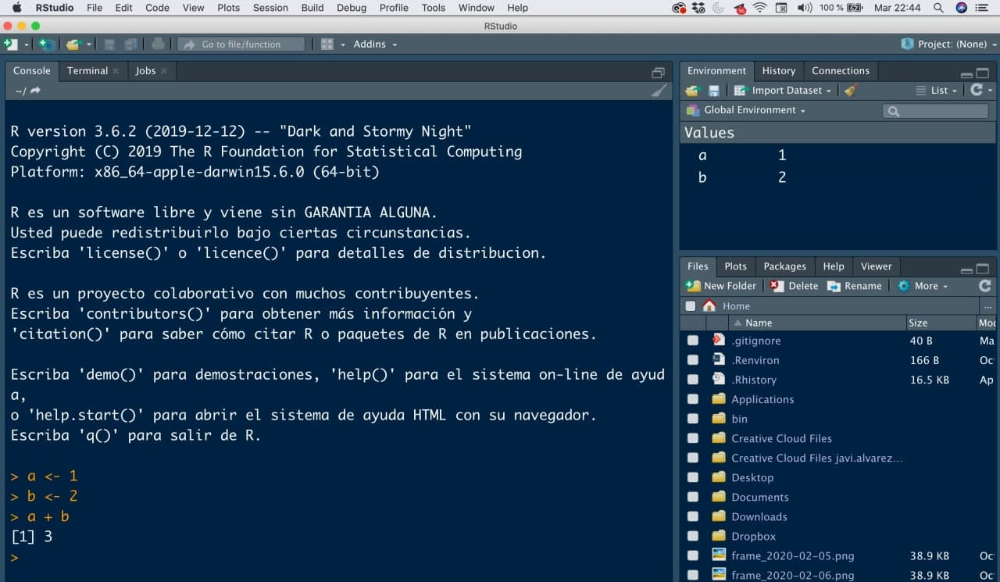
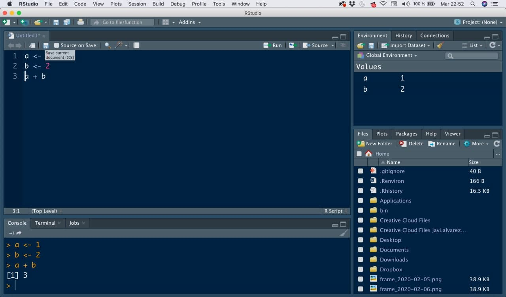

# (PART) Toma de contacto {-}

# Instalación {#instalacionR}

Vamos a necesitar solo 3 pasos (y conexión a internet).

- **Paso 1**: entra en la web de la plataforma <https://cran.r-project.org/> y en la pantalla de inicio **selecciona la instalación acorde a tu sistema operativo** (ver imagen \@ref(fig:pantalla-cran))

```{r pantalla-cran, echo = FALSE, out.width = "75%", fig.align = "center", fig.cap = "Pantalla inicial de la plataforma CRAN de R."}
knitr::include_graphics("./img/pantalla1_cran.jpg")
```

- **Paso 2**: para sistemas operativos Mac basta con que hacer click en `R-4.0.5.pkg`, y una vez descargado el archivo, abrirlo como cualquier archivo de instalación (ver imagen  \@ref(fig:pantalla-mac))

```{r pantalla-mac, echo = FALSE, out.width = "75%", fig.align = "center", fig.cap = "Pantalla de instalación de R en Mac OS."}
knitr::include_graphics("./img/pantall_mac_cran.jpg")

```

Para sistemas operativos Windows, debemos clickar en `install R for the first time` (ver imagen \@ref(fig:pantalla-windows-1)) y en la siguiente pantalla hacer click en `Download R 4.0.5 for Windows` (ver imagen  \@ref(fig:pantalla-windows-2)). Una vez descargado el archivo, abrirlo como cualquier archivo de instalación  

```{r pantalla-windows-1, echo = FALSE, out.width = "75%", fig.align = "center", fig.cap = "Pantalla previa de instalación de R en Windows."}
knitr::include_graphics("./img/pantalla_windows_1.jpg")

```

```{r pantalla-windows-2, echo = FALSE, out.width = "75%", fig.align = "center", fig.cap = "Pantalla final de instalación de R en Windows."}


```

- **Paso 3**: tras su instalación tendrás en tu escritorio (Windows) o en tu Launchpad (Mac Os) un **ejecutable de `R` para abrir**. En Windows puede que tengas dos ejecutables `i386` y `x64` (como todo programa en Windows está la versión de 32 y de 64 bits, haz click preferiblemente - si lo tienes - en el de `x64`). Te saldrá algo parecido a lo que observas en la imagen \@ref(fig:cranR).

```{r cranR, echo = FALSE, out.width = "75%", fig.align = "center", fig.cap = "Primera pantalla al abrir el ejecutable de R."}
knitr::include_graphics("./img/cranR.jpg")

```

Para comprobar que está correctamente instalado, **prueba a escribir en la consola** el siguiente código.

```{r codigo-prueba-1}
a <- 1
b <- 2
a + b
```


```{r primera-suma, echo = FALSE, out.width = "75%", fig.align = "center", fig.cap = "Primera suma en la consola de R."}
knitr::include_graphics("./img/primera_suma.jpg")

```


**¡Enhorabuena!** Si te ha devuelto `[1] 3`, ya has hecho más de lo que parece: has definido dos variables `a` y `b`, has **asignado un valor numérico a cada variable** (en `R` usaremos `<-` para asignar valores en lugar de `=`, como una flecha), y las hemos usado. **Ya sabemos usar `R` como calculadora**.

Bonita esa interfaz no es, así que lo cerraremos y no lo abriremos más. Tenemos nuestro lenguaje instalado, vamos a **instalar nuestro Word** para poder programar de forma cómoda.


## Instalación de RStudio {#instalacionRStudio}

Para instalar `RStudio` deberemos ir a la web <https://www.rstudio.com/products/rstudio/download/#download> y seleccionar el ejecutable que te aperezca acorde a tu sistema operativo (ver imagen \@ref(fig:pantalla-rstudio)). Tras descargar el ejecutable, hay que abrirlo como otro cualquier otro ejecutable y dejar que termine la instalación.

```{r rstudio-ide2, echo = FALSE, fig.align = 'center',  include = identical(knitr:::pandoc_to(), 'html'), fig.link = 'https://www.rstudio.com/products/rstudio/download/#download', out.width = '90%'}
knitr::include_graphics('img/rstudio_cheetsheet.jpg')
```


```{r pantalla-rstudio, echo = FALSE, out.width = "75%", fig.align = "center", fig.cap = "Descargar el ejecutable de RStudio para su posterior instalación."}
knitr::include_graphics("./img/pantalla_rstudio.jpg")

```

Tras instalar tendremos en el escritorio o Launchpad un ejecutable de `RStudio` que abriremos. Se nos aparecerá una pantalla similar a esta:

```{r inicio-rstudio-1, echo = FALSE, out.width = "75%", fig.align = "center", fig.cap = "Primer recibimiento de nuestro mejor amigo RStudio."}
knitr::include_graphics("./img/inicio_rstudio_1.jpg")

```

* **Consola**: es el nombre para llamar a esa ventana grande que te ocupa la mayor parte de tu pantalla. Prueba a escribir el mismo código que antes en ella (es el equivalente a la consola de R que hemos abierto al principio).

```{r codigo-prueba-1bis, eval = FALSE}
a <- 1
b <- 2
a + b
```

```{r inicio-rstudio-2, echo = FALSE, out.width = "75%", fig.align = "center", fig.cap = "Lanzando a consola nuestras primeras órdenes en RStudio."}


```

**La consola será donde ejecutaremos órdenes y mostraremos resultados**

* **Environment (entorno)**: la pantalla pequeña (puedes ajustar los márgenes con el ratón a tu gusto) que tenemos en la parte superior derecha se denomina environment o entorno de variables, donde como puedes ver, tras ejecutar el pequeño código en la consola, nos informa de que tenemos dos variables numéricas y su valor asignado. Nos **mostrará las variables que tenemos definidas, el tipo y su valor**.

```{r inicio-rstudio-3, echo = FALSE, out.width = "75%", fig.align = "center", fig.cap = "Environment de variables."}
knitr::include_graphics("./img/inicio_rstudio_3.jpg")

```

* **Panel multiusos**: la ventana que tenemos en la parte inferior derecha no servirá para buscar ayuda de comandos y órdenes, además de para visualizar gráficos. Lo veremos cuando sea necesario.

```{r inicio-rstudio-4, echo = FALSE, out.width = "75%", fig.align = "center", fig.cap = "Panel multiusos."}
knitr::include_graphics("./img/inicio_rstudio_4.jpg")

```

**WTF ¿Y DÓNDE PROGRAMAMOS?**

**¿Estás emocionado/a? Vamos a abrir nuestro primer script** (script = documento en el que programamos, nuestro `.doc`, pero aquí será un archivo `.R`).

Haz click en el menú superior en `File << New File << R Script` como se muestra en la imagen \@ref(fig:inicio-rstudio-5)

```{r inicio-rstudio-5, echo = FALSE, out.width = "75%", fig.align = "center", fig.cap = "Abriendo nuestro primer script de R."}
knitr::include_graphics("./img/inicio_rstudio_5.jpg")

```

Tras abrirlo tendremos una cuarta ventana: esta será la ventana de nuestros códigos, la ventana más importante ya que es donde **escribiremos lo que queremos ejecutar**. Escribe el código de arriba en ese script y guarda el archivo haciendo click en el botón `Save current document`

```{r inicio-rstudio-6, echo = FALSE, out.width = "75%", fig.align = "center", fig.cap = "Escribiendo y guardando nuestro primer script."}


```

Ese código no se ejecuta salvo que se lo digamos. Tenemos dos opciones para ello: o copiamos el trozo de código que queramos y lo pegamos en la consola (como hemos hecho al principio), o **activamos el cuadrado `Source on save` a la derecha del botón de guardar** y volvemos a hacer click en el botón de guardar: siempre que esa opción esté activada, al guardar no solo es nos guarda el archivo `.R` sino que además se ejecuta solo y nos devuelve los resultados por consola.

Listo, tienes instalado (casi) todo correctamente.


<details>
  <summary>{width=4%}  <strong>Consejos y tips</strong></summary>
  
<!-- toc -->
* **¿Cómo saber cuando la orden lanzada en consola ha terminado?**

A veces `R` y `RStudio` son tan silenciosos que no sabemos si ha acabado la orden que acabamos de lanzar en la consola o no.


{width=4%} **Truco**: siempre que veas este símbolo `>` como última línea en la consola significa que está listo para que le escribamos otra orden (es la forma cariñosa de decirte que ya ha acabado, ver imagen \@ref(fig:tip-consola-lista))

```{r tip-consola-lista, echo = FALSE,  out.width = "70%", fig.align = "center", fig.cap = "Ejemplo de que la orden lanzada ha acabado."}
knitr::include_graphics("./img/tip_consola_lista.jpg")

```

&nbsp;  

&nbsp;  

* **¿Cómo prevenir la fatiga visual programando?**

Estar delante de una pantalla de ordenador, con la vista muy fija mientras se programa, puede que acabes teniendo cierta fatiga visual en el trabajo.

{width=4%}  **Truco**: te aconsejo que cambies en tu `RStudio` la tonalidad del fondo de tu programa, en tonos oscuros y no blancos (¿te has fijado que mis capturas tienen un azul cobalto oscuro de fondo mientras el tuyo es un blanco nuclear? Echa un vistazo las imagenes \@ref(fig:menu-1) y \@ref(fig:menu-2))

```{r menu-1, echo = FALSE, out.height = "40%", out.width = "40%", fig.align = "center", fig.cap = "Menú de opciones de nuestro editor"}
knitr::include_graphics("./img/menu_1.jpg")

```

```{r menu-2, echo = FALSE, out.height = "40%", out.width = "40%", fig.align = "center", fig.cap = "Personalizar el color de fondo de nuestro editor, la letra y el tamaño de fuente"}
knitr::include_graphics("./img/menu_2.jpg")

```

<!-- tocstop -->
</details>


## Instalación de paquetes {#instalacionpaquetes}

El lenguaje `R` tiene 3 ventajas principales:

* Es un **lenguaje creado por y para estadísticos/as**, por lo que está pensado para optimizar al máximo los recursos, y poder hacer un análisis estadístico de calidad

* Es **software libre** (como C, C++, Python, Fortran, y otros tantos lenguajes). El software libre no solo tiene una ventaja evidente (es gratis, ok) en su instalación sino que permite acceder al código en el que están programados los comandos y permite hacer uso de trozos de código de otras personas.

* Es un **lenguaje modular**: en la instalación no se instalan todas las funcionalidades sino que instala un mínimo para poder funcionar, de forma que se ahorra espacio en disco y en memoria. Al ser software libre, existen trozos de código hechos por otras personas llamados **paquetes**, que podemos ir instalando a nuestro gusto según los vayamos necesitando. Esto es una ventaja enorme ya que `R` tiene una comunidad de usuarios gigante, con **más de 17 000 paquetes**: ¡hay más de 17 000  trozos de código validados por la comunidad y la plataforma, de forma gratuita!

```{r paquetes-R, echo = FALSE, out.width = "75%", fig.align = "center", fig.cap = "Paquetes disponibles en R."}
knitr::include_graphics("./img/paquetes_R.jpg")

```

Esto nos ahorra muchísimo tiempo ya el **90% de lo que querramos hacer ya lo habrá querido hacer otra persona y podemos usar o adaptar su código** para no empezar de cero. Vamos a instalar un paquete gráfico (`{ggplot2}`) que necesitaremos. Para ello, escribe en tu consola el siguiente código y pulsa enter.

```{r instalar-paquete, eval = FALSE}
install.packages("ggplot2")
```

Dicha orden (puede tardar un poco la primera vez, depende de tu conexión a internet) lo que hará será acceder a la web de R, bajarse a tu ordenador los trozos de código incluidos en el paquete llamado `{ggplot2}` (para realizar gráficas), y dejarlos para siempre en él: **la instalación de paquetes SOLO ES NECESARIO la primera vez** que se usa dicho paquete en la vida del ordenador, no hace falta hacerlo cada vez que lo usas.

Una vez que tenemos los trozos de código (el paquete) en nuestro ordenador, en cada sesión de `R` que abramos (cada vez que cierres y abras `RStudio`) deberemos (si queremos) llamar a ese paquete que tenemos instalado, escribiendo el siguiente comando en consola

```{r llamar-paquete, eval = FALSE}
library(ggplot2)
```

**Welcome to software libre**

<details>
  <summary>{width=4%}  <strong>Consejos y tips</strong></summary>
  
<!-- toc -->
* **Entender los paquetes**

Haciendo una metáfora con la colección de libros que tengas en casa: con la **instalación hemos comprado el libro** y lo tenemos en nuestra estantería (para siempre), con la llamada al paquete, por ejemplo `library(ggplot2)`, lo que hacemos es decidir, de entre todos los libros de la estantería, cuales queremos llevarnos de viaje (en cada maleta que hagamos).

<!-- tocstop -->
</details>

 
 