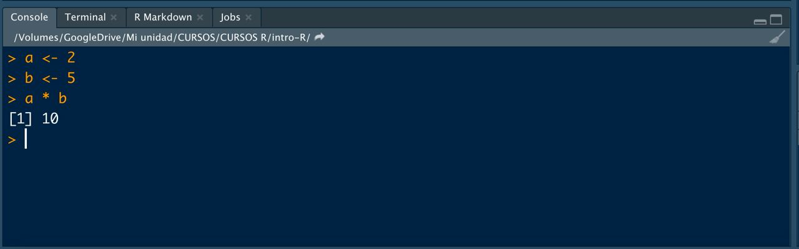

```{r echo = FALSE}
library(knitr)

# Color text
colorize <- function(x, color) {
  
  if (knitr::is_latex_output()) {
    
    sprintf("\\textcolor{%s}{%s}", color, x)
    
  } else if (knitr::is_html_output()) {
    
    sprintf("<span style='color: %s;'>%s</span>", color, x)
    
  } else { x }
}
```


# Instalación {#instalacionR}

:::: {.blackbox data-latex=""}

Scripts usados (códigos con los ejercicios):

* [**script02.R**](https://github.com/dadosdelaplace/courses-intro-R/blob/main/scripts/script02.R). Ver en <https://github.com/dadosdelaplace/courses-intro-R/blob/main/scripts/script02.R>

::::

En breve daremos nuestros primeros pasos pero antes necesitamos instalar algunas cosas. No serán tantas. Para entender lo que instalamos pensaremos que vamos a escribir un libro. <mark>**¿Qué necesitamos?**</mark>

* <mark>**Gramática/ortografía**</mark>: en nuestro caso será `R`, el lenguaje de programación que usaremos.
* <mark>**Word**</mark>: al igual que podemos escribir en castellano de distintas maneras (en un Word, un post-it, un cuaderno, etc), cuando programamos podemos trabajar en distintos **entornos de desarrollo (IDE)**. En nuestro caso escribiremos y programaremos en `RStudio`, nuestro **Word** para escribir en lenguaje `R`.


## Instalación de R

Al contrario que otros lenguajes de programación, la instalación será bastante sencilla gracias a su modularidad, ya que solo vamos a necesitar <mark>**3 pasos (y conexión a internet)**</mark>.

### Paso 1

Entra en la web <https://cran.r-project.org/> y en la pantalla de inicio **selecciona la instalación acorde a tu sistema operativo** (ver imagen \@ref(fig:pantalla-cran))

```{r pantalla-cran, echo = FALSE, out.width = "90%", fig.align = "center", fig.cap = "Pantalla inicial de la plataforma CRAN de R."}
knitr::include_graphics("./img/pantalla1_cran.jpg")
```

### Paso 2

Para sistemas operativos **Mac** basta con que hacer click en el archivo `.pkg`, y abrirlo una vez descargado (ver imagen  \@ref(fig:pantalla-mac))

```{r pantalla-mac, echo = FALSE, out.width = "100%", fig.align = "center", fig.cap = "Pantalla de instalación de R en Mac OS."}
knitr::include_graphics("./img/pantall_mac_cran.jpg")

```

Para sistemas operativos **Windows**, debemos clickar en `install R for the first time` (ver imagen \@ref(fig:pantalla-windows-1)) y en la siguiente pantalla hacer click en `Download R for Windows` (ver imagen  \@ref(fig:pantalla-windows-2)). Una vez descargado, abrirlo como cualquier archivo.

```{r pantalla-windows-1, echo = FALSE, out.width = "90%", fig.align = "center", fig.cap = "Pantalla previa de instalación de R en Windows."}
knitr::include_graphics("./img/pantalla_windows_1.jpg")

```

```{r pantalla-windows-2, echo = FALSE, out.width = "100%", fig.align = "center", fig.cap = "Pantalla final de instalación de R en Windows."}
knitr::include_graphics("./img/pantalla_windows_2.jpg")

```

### Paso 3

Tras su instalación tendrás en tu escritorio (Windows) o en tu Launchpad (Mac Os) un <mark>**ejecutable de `R` para abrir**</mark>. En Windows puede que tengas dos ejecutables `i386` y `x64` (como todo programa en Windows está la versión de 32 y de 64 bits, haz click preferiblemente - si lo tienes - en el de `x64`). Te saldrá algo parecido a lo que observas en la imagen \@ref(fig:cranR), lo que se conoce como <mark>**CONSOLA**</mark>

```{r cranR, echo = FALSE, out.width = "90%", fig.align = "center", fig.cap = "Primera pantalla al abrir el ejecutable de R."}
knitr::include_graphics("./img/cranR.jpg")
```


## Primera operación en consola: sumar dos números

Para comprobar que `R` está correctamente instalado, abre `R` y <mark>**prueba a escribir**</mark> en la pantalla blanca inferior las siguientes órdenes (<mark>**recuerda**</mark>: los códigos/órdenes de este manual puedes **copiarlos** directamente de la cajita <mark>**haciendo click en el botón de la esquina superior derecha**</mark> de la misma)

```{r codigo-prueba-1}
a <- 1
b <- 2
a + b
```


```{r primera-suma, echo = FALSE, out.width = "90%", fig.align = "center", fig.cap = "Primera suma en la consola de R."}
knitr::include_graphics("./img/primera_suma.jpg")
```

**¡Enhorabuena!**

* <mark>**¿Dónde hemos escrito ese código?**</mark> Esa pantalla blanca donde hemos escrito el código se llama <mark>**CONSOLA**</mark>, y será donde ejecutaremos las órdenes.

* <mark>**¿Qué hemos hecho?**</mark> Hemos hecho más de lo que parece. Primero, hemos definido dos variables `a` y `b`  <mark>**asignándole un valor numérico a cada una de ellas**</mark>. Imagina que el símbolo `<-` es visto en nuestra cabeza como una flecha: a una variable que llamamos `a` le asignamos el valor `1` (y se queda guardada en nuestro ordenador), y a una variable que llamamos `b` le asignamos el valor `2`. Podemos verlo como $a = 1,~b = 2$. Y tras definir ambas variables, las hemos usado en una <mark>**operación aritmética**</mark> `a + b`. Ya sabemos usar `R` como <mark>**calculadora**</mark>.

* <mark>**¿Cómo nos devuelve `R` el resultado de la operación?**</mark> Si te ha devuelto el resultado correcta, en la consola debe aparecer `[1] 3`. El valor `[1]` aparecerá siempre ya que simplemente nos **numera las líneas** de la consola usadas; lo que viene detrás es realmente el resultado, es decir, $a + b = 3$.

* <mark>**¿Por qué hemos escrito `a + b` al final?**</mark> Un mantra de `R`, que veremos a lo largo de todo el curso, es que  <mark>**`R` intenta molestarte lo menos posible**</mark> (eso es bueno cuando ya sabes usarlo, no tan bueno cuando empezamos a aprenderlo). Cuando asignamos los valores `a <- 1` y `b <- 2`, `R` no nos muestra nada: si guardamos un resultado en una variable, no nos muestra nada por consola, simplemente lo guarda. Para obtener el resultado en la consola necesitamos escribir el nombre de las variables (u operaciones entre ellas, como `a + b`).

&nbsp;

**`r colorize("WARNING: ", "#ffc107")`**

Como habrás advertido, en `R` usaremos `<-` para **asignar valores** en lugar de `=`, como una flecha. Usaremos `=` para **`r colorize("indicarle el valor a los argumentos que usemos en funciones", "#ffc107")`** y `==` como **`r colorize("operador de comparación", "#ffc107")`**: si escribimos `2 == 3`, le estamos preguntando si 2 es igual a 3.

```{r}
2 == 3
```

&nbsp;

Bonita esta interfaz no es, así que la cerraremos y no la abriremos más. Tenemos nuestro lenguaje instalado, vamos a **instalar nuestro Word** para poder programar de forma cómoda.


## Instalación de RStudio {#instalacionRStudio}

Para instalar `RStudio` deberemos ir a la web <https://www.rstudio.com/products/rstudio/download/#download> y seleccionar el ejecutable que te aperezca acorde a tu sistema operativo (ver imagen \@ref(fig:pantalla-rstudio)). Tras descargar el ejecutable, hay que abrirlo como otro cualquier otro ejecutable y dejar que termine la instalación.

```{r pantalla-rstudio, echo = FALSE, out.width = "70%", fig.align = "center", fig.cap = "Descargar el ejecutable de RStudio para su posterior instalación."}
knitr::include_graphics("./img/pantalla_rstudio.jpg")

```

Tras instalar tendremos en el escritorio o Launchpad un ejecutable de `RStudio` que abriremos. Se nos aparecerá una pantalla similar a esta:

```{r inicio-rstudio-1, echo = FALSE, out.width = "85%", fig.align = "center", fig.cap = "Primer recibimiento de nuestro mejor amigo RStudio."}
knitr::include_graphics("./img/inicio_rstudio_1.jpg")

```


Listo, tienes instalado (casi) todo correctamente.


## Instalación de paquetes {#instalacionpaquetes}

El lenguaje `R` tiene 3 ventajas principales:

* Es un **lenguaje creado por y para estadísticos/as**.

* Es <mark>**software libre**</mark> (como C, C++, Python, Fortran, y otros tantos lenguajes). El software libre no solo tiene una ventaja evidente (es gratis, ok) sino que permite acceder a código ajeno.

* Es un <mark>**lenguaje modular**</mark>: en la instalación no se instalan todas las funcionalidades salvo un mínimo para poder funcionar, de forma que se ahorra espacio en disco y en memoria. Al ser software libre, existen trozos de código hechos por otras personas llamados <mark>**paquetes**</mark>, que podemos ir instalando a nuestro gusto según los vayamos necesitando. Esto es una ventaja enorme ya que `R` tiene una comunidad de usuarios gigante, con **más de 17 000 paquetes**: ¡hay más de 17 000 trozos de código validados por la comunidad y la plataforma, de forma gratuita!

```{r echo = FALSE, out.width = "70%", fig.align = "center", fig.cap = "Paquetes disponibles en R."}
knitr::include_graphics("./img/paquetes_R.jpg")

```
 
Dichos paquetes son trozos de código realizadas por otros usuarios de la comunidad (y validados por el equipo de CRAN si la descarga es mediante `install.packages()`), listos para ser usados. Una vez instalados (descargados) los trozos de código, basta con «acudir» a ellos con `library()`.

Haciendo una metáfora con la colección de libros que tengas en casa: con la **instalación hemos comprado el libro** (por ejemplo, `install.packages("ggplot2")`) y lo tenemos en nuestra estantería (para siempre), con la llamada al paquete, por ejemplo `library(ggplot2)`, lo que hacemos es decidir, de entre todos los libros de la estantería, cuales queremos llevarnos de viaje (en cada maleta que hagamos).
 
## Glosario

**`r colorize("GLOSARIO", "#4197D2")`**

* **`r colorize("Consola", "#4197D2")`**: es el nombre para llamar a esa ventana grande que te ocupa buena parte de tu pantalla. Prueba a escribir el mismo código que antes en ella (es el equivalente a la consola de R que hemos abierto al principio).


```{r codigo-prueba-1bis, eval = FALSE}
a <- 1
b <- 2
a + b
```

```{r inicio-rstudio-2, echo = FALSE, out.width = "60%", fig.align = "center", fig.cap = "Lanzando a consola nuestras primeras órdenes en RStudio."}
knitr::include_graphics("./img/inicio_rstudio_2.jpg")

```

**`r colorize("La consola será donde ejecutaremos órdenes y mostraremos resultados", "#4197D2")`**


* **`r colorize("Environment (entorno)", "#4197D2")`**: la pantalla pequeña (puedes ajustar los márgenes con el ratón a tu gusto) que tenemos en la parte superior derecha se denomina environment o entorno de variables, donde como puedes ver, tras ejecutar el pequeño código en la consola, nos informa de que tenemos dos variables numéricas y su valor asignado. Nos **mostrará las variables que tenemos definidas, el tipo y su valor**.

```{r inicio-rstudio-3, echo = FALSE, out.width = "65%", fig.align = "center", fig.cap = "Environment de variables."}
knitr::include_graphics("./img/inicio_rstudio_3.jpg")

```

* **`r colorize("Panel multiusos", "#4197D2")`**: la ventana que tenemos en la parte inferior derecha no servirá para buscar ayuda de comandos y órdenes, además de para visualizar gráficos. Lo veremos cuando sea necesario.

```{r inicio-rstudio-4, echo = FALSE, out.width = "65%", fig.align = "center", fig.cap = "Panel multiusos."}
knitr::include_graphics("./img/inicio_rstudio_4.jpg")

```


Los **paquetes usados** los verás denotados como `{nombre_paquete}` a lo largo del manual.


## Consejos


**`r colorize("CONSEJOS", "#20935E")`**

**`r colorize("¿Cómo saber cuando la orden lanzada en consola ha terminado?", "#20935E")`**

A veces `R` y `RStudio` son tan silenciosos que no sabemos si ha acabado la orden que acabamos de lanzar en la consola o no. Siempre que veas el símbolo `>` como última línea en la consola significa que está listo para que le escribamos otra orden (es la forma cariñosa de decirte que ya ha acabado, ver imagen \@ref(fig:tip-consola-lista))


```{r tip-consola-lista, echo = FALSE,  out.width = "70%", fig.align = "center", fig.cap = "Ejemplo de que la orden lanzada ha acabado."}
knitr::include_graphics("./img/tip_consola_lista.jpg")

```

&nbsp;

**`r colorize("¿Cómo prevenir la fatiga programando?", "#20935E")`**

Estando delante de una pantalla de ordenador, con la vista muy fija mientras se programa, puede que acabes teniendo cierta fatiga visual en el trabajo. Te aconsejo que cambies en tu `RStudio` la tonalidad del fondo de tu programa, en tonos oscuros y no blancos (¿te has fijado que mis capturas tienen un azul cobalto oscuro de fondo mientras el tuyo es un **blanco nuclear**? Echa un vistazo a las imágenes \@ref(fig:menu-1) y \@ref(fig:menu-2))


```{r menu-1, echo = FALSE, out.height = "50%", out.width = "50%", fig.align = "center", fig.cap = "Menú de opciones de nuestro editor"}
knitr::include_graphics("./img/menu_1.jpg")

```

```{r menu-2, echo = FALSE, out.height = "50%", out.width = "50%", fig.align = "center", fig.cap = "Personalizar el color de fondo de nuestro editor, la letra y el tamaño de fuente"}
knitr::include_graphics("./img/menu_2.jpg")

```


## 📝 Ejercicios

(haz click en las flechas para ver soluciones)

<details>
  <summary>📝<strong>Ejercicio 1</strong>: abre `R Studio` y en tu consola (parte inferior de tu pantalla) asigna los valores `2` y `5` a dos variables `a` y `b`. Tras asignarles valores, multiplica los números en consola (**haz click** en la flecha para la solución propuesta). </summary>
  
<!-- toc -->
- Solución:

```{r}
# Para poner comentarios en el código se usa #

# Definición de variables
a <- 2
b <- 5

# Multiplicación
a * b
```

```{r consola-multi, echo = FALSE, out.width = "80%", fig.align = "center", fig.cap = "Multiplicación de a y b."}

```

<!-- tocstop -->
</details>

&nbsp;

<details>
  <summary>📝<strong>Ejercicio 2</strong>: modifica el código inferior para definir dos variables `c` y `d`, con valores `3` y `-1`, y calcular la división `c/d` (**haz click** en la flecha para la solución propuesta).
  
```{r eval = FALSE}
# Definición de variables
c <- 
d <-

# Operación (división)
c ? d
```
</summary>
  
<!-- toc -->
- Solución:

```{r}
# Definición de variables
c <- 3
d <- -1

# División
c / d
```

<!-- tocstop -->
</details>

&nbsp;

<details>
  <summary>📝<strong>Ejercicio 3</strong>: repite el ejercicio 1 pero ahora guarda el resultado de la multiplicación final en una variable `c`. Para ver el resultado guardado en `c` escribe dicha variable en consola (**haz click** en la flecha para la solución propuesta). </summary>
  
<!-- toc -->
- Solución:

```{r}
# Variables
a <- 2
b <- 5

# Resultado
c <- a * b

# Muestro en consola
c
```

```{r consola-multi-2, echo = FALSE, out.width = "80%", fig.align = "center", fig.cap = "Multiplicación de a y b guardando el resultado."}
knitr::include_graphics("./img/consola_multiplicacion_2.jpg")
```

<!-- tocstop -->
</details>

&nbsp;

**`r colorize("WARNING:", "#ffc107")`**

No hace falta gastar una línea por cada orden que quieras ejecutar. Tampoco necesitas guardar cada paso intermedio que realices. **`r colorize("Cuidado con la memoria", "#ffc107")`**: cada asignación que hagas es una variable guardada que consume recursos en tu ordenador.


