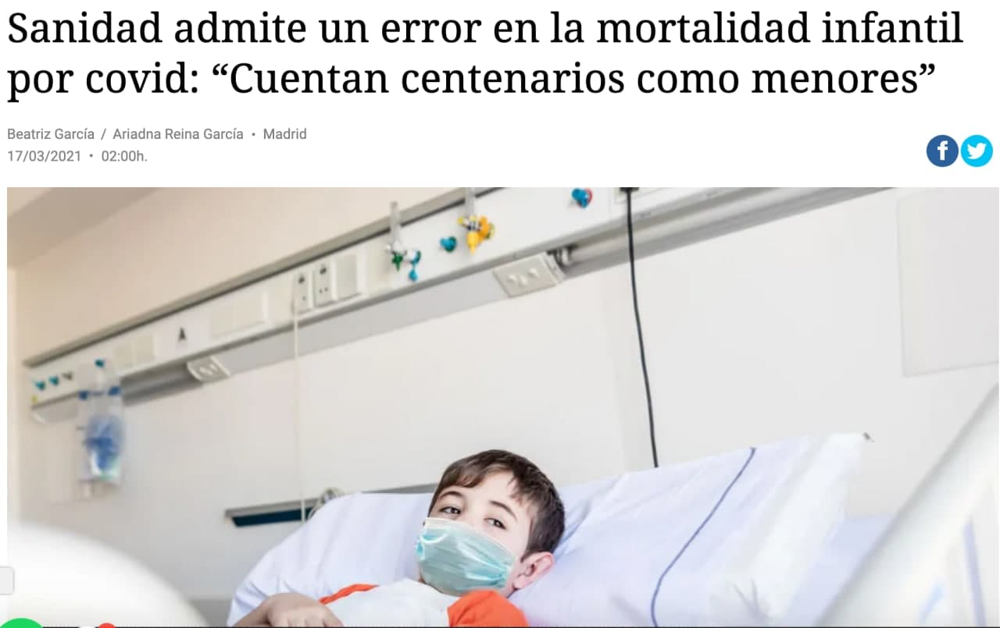

```{r echo = FALSE}
library(knitr)

# Color text
colorize <- function(x, color) {
  
  if (knitr::is_latex_output()) {
    
    sprintf("\\textcolor{%s}{%s}", color, x)
    
  } else if (knitr::is_html_output()) {
    
    sprintf("<span style='color: %s;'>%s</span>", color, x)
    
  } else { x }
}
```

# ¿Qué es R? {#que-es-R}

Una vez que tenemos todo instalado vamos a dar nuestros <mark>**primeros pasos**</mark> en `R`, pero antes veamos un poco de su historia y de una particularidad: <mark>`R` es un **lenguaje modular**</mark> (¿modu...qué?)

## Historia de R

Veamos antes un poco de la <mark>**historia**<mark> de nuestra deidad.

Allá por 1975, los **laboratorios Bell** (los que inventaron la radio moderna tal y como la conocemos), necesitaban una alternativa a los lenguajes más «rudos» y antiguos como `C++` o `Fortran`, lenguajes rápidos en la ejecución pero complejos en su uso, con una gran curva de aprendizaje y con **muy poca capacidad en la visualización de datos** que se empezaba a necesitar.

Así que en **1976 sacaron la primera versión del lenguaje conocido `S`** (hasta entonces estaba de moda lo de llamar a los lenguajes con una sola inicial). En **1980** se empezó a distribuir la primera versión pública de `S`, más allá de los laboratorios Bell, y en **1988** se añadieron bastantes funcionalidades nuevas como poder aplicar funciones a otras funciones (los famosos `apply()` que ya veremos). Años más tarde, en **1991**, dicho lenguaje se simplificó, reescribiendo muchas subrutinas de otros lenguajes más primitivos, para tener una versión muy parecida al actual `R`, permitiendo el usod de operadores, `data.frames` (que veremos) y otro tipo de objetos, sencillos en la programación pero muy versatiles.

Sin embargo, salvo uso docente, `S` tenía licencia así que **en 1992 Ross Ihaka y Robert Gentleman se lanzaron a crear una versión de `S` libre y gratuita**, un trabajo de casi 8 años hasta que en el año 2000, ambos investigadores de la Universidad de Auckland en Nueva Zelanda lanzaron la primera versión estable del lenguaje.

Tras dicho lanzamiento, se creó un <mark>**equipo de expertos en estadística computacional**</mark> (el conocido como _R Development Core Team_) que es el que se encarga de mantener toda la aerquitectura de `R` y los que se encargar de actualizar y mejorar el paquete `{base}`, una **librería motor** sobre la que se construye el resto de funciones.

Y es precisamente ese hecho una de las principales diferencias entre `Python` y `R`: `R` fue creado por y para estadísticos. Te dejo esta [entrada en el blog](https://dadosdelaplace.github.io/202112_R-python/) por si quieres curiosear las diferencias (aunque ambos pueden ser útiles para trabajos estadísticos muy generales).


## Comunidad de usuarios: paquetes {#comunidadpaquetes}

La pregunta del millón suele ser siempre la misma: **¿qué lenguaje elegir?** Podríamos hacer una comparativa técnico de distintos lenguajes pero vamos a quedarnos con dos <mark>**consejos fundamentales**</mark>: prioriza el software libre y aquellos lenguajes que tienen una <mark>**comunidad muy grande de usuarios**</mark> trabajando en los problemas o campo para el que vas a usar dicho lenguaje.

El lenguaje `R` (también `Python`) tiene <mark>**3 ventajas principales**</mark>:

* Es un **lenguaje creado por y para estadísticos/as**.

* Es <mark>**software libre**</mark> (como C++, Python, Fortran, y otros tantos lenguajes). El software libre no solo tiene una ventaja evidente (es gratis, ok) sino que permite acceder libremente a código ajeno.

* Es un <mark>**lenguaje modular**</mark>: en la instalación que hemos realizado no se han instalado todas las funcionalidades, solo el mínimo para poder funcionar, de forma que se ahorra espacio en disco y en memoria. Al ser software libre, existen trozos de código hechos por otras personas llamados <mark>**paquetes**</mark>, que podemos ir instalando a nuestro gusto según los vayamos necesitando. Esto es una ventaja enorme ya que `R` tiene una comunidad de usuarios gigante para hacer estadística (`Python` tiene una enorme comunidad pero más enfocada al _Machine Learning_), con **más de 17 000 paquetes**: ¡hay más de 17 000 trozos de código, muchos de ellos programados por expertos/as en `R`, validados por la comunidad y la plataforma, y de forma gratuita!

```{r paquetes-R, echo = FALSE, out.width = "70%", fig.align = "center", fig.cap = "Paquetes disponibles en R."}
knitr::include_graphics("./img/paquetes_R.jpg")
```

Esto nos ahorra muchísimo tiempo en nuestro día a día ya que **casi todo lo que querramos hacer ya lo habrá querido hacer otra persona** (y seguramente mejor que nosotros/as). Vamos a instalar, por ejemplo, un paquete gráfico (`{ggplot2}`) que necesitaremos en el futuro. Para ello, escribe en tu consola el siguiente código y pulsa _enter_.

```{r instalar-paquete, eval = FALSE}
install.packages("ggplot2")
```

Dicha orden (puede tardar un poco la primera vez, depende de tu conexión a internet) lo que hará será **acceder a la web de R**, **bajarse a tu ordenador los trozos de código** incluidos en el paquete llamado `{ggplot2}`, y dejarlos para siempre en él.

&nbsp;

**`r colorize("WARNING:", "#ffc107")`**

La **instalación de paquetes SOLO ES NECESARIA la primera vez** que se usa dicho paquete en la vida del ordenador, no hace falta hacerlo cada vez que lo usas.

&nbsp;

Una vez que tenemos los trozos de código (el paquete) en nuestro ordenador, en cada sesión de `R` que abramos (cada vez que cierres y abras `RStudio`) deberemos (si queremos) llamar a ese paquete que tenemos instalado, escribiendo el siguiente comando en consola

```{r llamar-paquete, eval = FALSE}
library(ggplot2)
```

**Welcome to <mark>software libre</mark>**

 
 
 
 
## ¿Por qué Excel no es tu amigo?

**`R` es un lenguaje de programación**, de alto nivel para el usuario y modular. Los lenguajes de alto nivel como `R`, `Python` (curso interactivo de Python en <https://checkio.org/>) o `Matlab`, facilitan la programación al usuario, teniendo que preocuparte solo de la tarea de programar. Son lenguajes con una <mark>**menor curva de aprendizaje**</mark> aunque suelen ser más lentos en su ejecución en comparación con lenguajes de bajo nivel (`C`, `C++` o `Fortran`), lenguajes muy rápidos en su ejecución pero cuya programación requiere un mayor tiempo y formación, teniendo que además estar pendiente del tipo de variables, espacio en memoria, etc.

Por su arquitectura, `R` es un lenguaje que puede ser usado para un propósito general pero que está especialmente diseñado para el **análisis estadístico de datos**. Su **modularidad** nos da la ventaja de que podemos instalar las funcionalidades que vayamos necesitando de forma progresiva.

**`r colorize("¿Por qué no es recomendable usar Excel como base de datos ni para realizar análisis estadísticos complejos?", "#20935E")`**


&nbsp;

* **Software de pago**: Excel, al igual que el resto de programas de Microsoft o SPSS (por desgracia programa estrella de nuestro sistema sanitario), es un programa de pago. A nivel individual, todos hemos tenido una versión que no hemos pagado, pero dicha evasión no se la puede permitir una empresa o administración, que debe de pagar altas cantidades de dinero anuales por las licencias, dinero que no sería necesario si los investigadores y trabajadores tuvieran formación (remunerada) en otras herramientas de software libre.

* **Software cerrado**: no solo es de pago sino que es cerrado, así que solo podemos hacer lo que Excel ha creído que interesante que podamos hacer. Incluso con la programación de MACROS, las funcionalidades de Excel siguen siendo mucho más limitadas ya que viene «programadas» de antemano

* **Alto consumo de memoria**: dicha programación predeterminada hace que Excel ocupe muchísimo espacio en el disco duro y tenga un alto consumo de memoria (la memoria es lo que te permite hacer varias tareas a la vez en tu ordenador).

* **No es universal**: no solo es de pago sino que además, dependiendo de la versión que tengas de Excel, tendrá un formato distinto para datos como fechas, teniendo incluso extensiones distintas, de forma que un archivo `.xls` abierto por un Excel moderno puede provocar errores en la carga.

* <mark>**¡ES SOLO UNA HOJA DE CÁLCULO!**</mark>: el propio Microsoft desaconseja el uso de Excel para el análisis de grandes volúmenes de datos. El Excel es una herramienta maravillosa para ser usada como una sencilla hoja de cálculo: llevar las cuentas de tu familia, de tu pequeño negocio, una declaración de la Renta sencilla, planificar viajes, etc. Pero el programa **NO ESTÁ DISEÑADO** para ser una base de datos ni para análisis detallado, y muchos menos pensado para generar un entorno flexible para el análisis estadístico y la visualización de datos.

&nbsp; 

**¿Puedes ser el mejor partiendo un filete con una cuchara?** Seguramente puedas (en Excel puedes hasta programar con macros), y si siempre lo hiciste así, acabarás normalizándolo, pero seguirás siendo una persona comiendo filete con cuchara.

**¿Qué sucede si usamos la herramienta equivocada?** Tres ejemplos: 

* **`r colorize("Problemas para codificar fechas", "#dc3545")`**: en 2016 se publicó una [revisión de artículos en genética](https://genomebiology.biomedcentral.com/articles/10.1186/s13059-016-1044-7), descubriendo que 1 de cada 5 artículos contenían errores debido a una mala codificación de las fechas, conviertiendo por ejemplo los genes Septin-2 (conocido como SEPT2) en fechas, y al revés [@Ziemannetal16].

```{r excel-genes, echo = FALSE,  out.width = "50%", fig.align = "center", fig.cap = "Excel en una noche loca."}
knitr::include_graphics("./img/excel_genes.jpg")
``` 


* **`r colorize("Problemas de memoria", "#dc3545")`**: un Excel permite por defecto una cantidad máxima de filas. Aunque dicha cantidad se puede ampliar, sigue siendo finita, por lo que cuando superas el umbral de filas, al añadir filas Excel te borra registros **sin avisarte de que lo está haciendo**. Esto es lo que sucedió con los [registros de casos covid en Reino Unido](https://www.redaccionmedica.com/secciones/sanidad-hoy/covid-reino-unido-pierden-16000-positivos-9989).

```{r excel-uk, echo = FALSE,  out.width = "50%", fig.align = "center", fig.cap = "Cuando Excel dice basta."}
knitr::include_graphics("./img/excel_uk.jpg")

```

* **`r colorize("Problemas para codificar edades", "#dc3545")`**: una variable de tipo fecha, aunque nosotros la veamos con letras, en realidad es una variable numérica que representa los días que han pasado desde una fecha origen. En función de las distintas versiones de Excel, dicha fecha origen cambia. Además, si se codifica mal la fecha en formato `dd-mm-YY`, dicho formato cuando se exporta a otro excel en texto, no permite distinguir a un nacido en 1918 y a un nacido en 2018, así que podemos estar confundiendo personas de 103 años con niños de 3 años (y es lo que [sucedió en España](https://www.niusdiario.es/sociedad/sanidad/sanidad-reconoce-datos-muertes-ninos-covid-erroneos-contabilizaban-centenarios-como-menores_18_3107220241.html), observando unas tasas de mortalidad en niños muy pequeños equivalentes a personas mayores).

```{r excel-edades, echo = FALSE,  out.width = "50%", fig.align = "center", fig.cap = "Los centenarios con biberón."}


```


## Glosario

**`r colorize("GLOSARIO", "#4197D2")`**

* **`r colorize("Paquete", "#4197D2")`**: trozos de código realizadas por otros usuarios de la comunidad (y validades por el equipo de CRAN si la descarga es mediante `install.packages()`) para ser usados. Una vez instalados (descargados) los trozos de código a nuestro ordenador, basta con «acudir» a ellos con `library()`.

Haciendo una metáfora con la colección de libros que tengas en casa: con la **instalación hemos comprado el libro** y lo tenemos en nuestra estantería (para siempre), con la llamada al paquete, por ejemplo `library(ggplot2)`, lo que hacemos es decidir, de entre todos los libros de la estantería, cuales queremos llevarnos de viaje (en cada maleta que hagamos).

Los **paquetes usados** los verás denotados como `{nombre_paquete}` a lo largo del manual.
