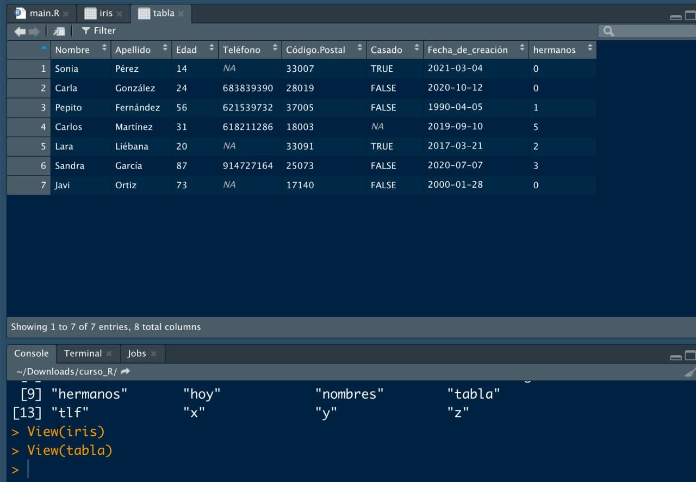

```{r echo = FALSE}
library(knitr)

# Color text
colorize <- function(x, color) {
  
  if (knitr::is_latex_output()) {
    
    sprintf("\\textcolor{%s}{%s}", color, x)
    
  } else if (knitr::is_html_output()) {
    
    sprintf("<span style='color: %s;'>%s</span>", color, x)
    
  } else { x }
}
```

# Tipos de datos II: datos estructurados {#datos}


**`r colorize("CONSEJO: acceder a las funciones de los paquetes", "#20935E")`**

A veces puede que no queramos cargar todo un paquete sino solo una función del mismo, para lo que es suficiente `nombre_paquete::nombre_funcion`.

&nbsp;


Sabemos un poco de la gramática y ortografía de nuestro lenguaje, y sabemos las funcionalidades básicas de nuestro Word. Vamos a encontrar la mejor trama para la novela: **hablemos de estructuras de datos**.

## Matrices

Hasta ahora **hemos visto solo datos en una dimensión**: una variable, que tiene n valores numéricos, n valores lógicos o n valores de tipo texto. **Una sola variable** (de n elementos).

Pero cuando analizamos datos solemos tener varias variables distintas. Cuando tenemos **distintas variables numéricas de igual longitud**, un formato de dato muy habitual de trabajar es lo que conocemos como **matrices**: una «tabla» de números, con filas y columnas.

Vamos a definir las **edades, teléfonos y códigos postales de una serie de individuos**.

```{r}
edades <- c(14, 24, 56, 31, 20, 87, 73) # vector numérico de longitud 7
tlf <- c(NA, 683839390, 621539732, 618211286, NA, 914727164, NA)
cp <- c(33007, 28019, 37005, 18003, 33091, 25073, 17140)
```

Hasta ahora, cada variable la hemos definido por separado, pero ahora vamos a juntarlas: vamos a crear nuestro **primer conjunto de datos** juntado todas ellas en una matriz, un conjunto de números organizado en **3 columnas (una por variable)** y **7 filas o registros (una por persona)**. Para ello usaremos la función `cbind()`, que nos concatena vectores de igual longitud en formato columna.

```{r}
x <- cbind(edades, tlf, cp) # Construimos la matriz por columnas
x
```

Lo que tenemos es una columna por variable y una fila por registro. También podemos construir la matriz por filas con el comando `rbind()` (aunque lo habitual es tener cada variable en una columna).


```{r}
y <- rbind(edades, tlf, cp) # Construimos la matriz por filas
y
```

Como ves, ahora nuestros datos están **tabulados**, tienen dos dimensiones. ¿Cómo saber las **dimensiones** que tiene una matriz? Prueba a ejecutar la función `dim()`.

```{r}
dim(x)
dim(y)
```

Fíjate que `dim()` devuelve un vector de 2 elementos, por lo que para acceder las filas deberemos ejecutar `dim(x)[1]` (y `dim(x)[2]` para las columnas). 

```{r}
dim(x)[1]
dim(x)[2]
nrow(x)
ncol(x)
```

También tenemos a nuestra disposición las funciones `nrow()` y `ncol()`, que nos devuelven directamente el número de filas y columnas.

```{r}
nrow(x)
ncol(x)
```

Bien, ya sabemos definir una matriz a partir de variables. Igual que a veces es útil generar un vector de elementos repetidos, también podemos definir una **matriz de números repetidos** (por ejemplo, de ceros), con la función `matrix()`, indicándole el número de filas y columnas.

```{r}
matrix(0, nrow = 5, ncol = 3) # 5 filas, 3 columnas, todo 0's
```

También podemos definir una **matriz a partir de un vector numérico**, reorganizando los valores en forma de matriz (con una dimensión tal que `filas * columnas = longitud del vector`), sabiendo que los elementos se van colocando por columnas (primeros valores en la primera columna, de arriba a abajo).

```{r}
z <- matrix(1:15, ncol = 5) # Matriz con el vector 1:5 con 5 columnas (ergo 3 filas)
z
class(z) # Clase de la variable
```

&nbsp;

Dada una matriz `x` podemos darle vuelta (lo que se conoce como **matriz transpuesta**, donde filas pasan a ser columnas y viceversa) con la función `t()`.

```{r}
x
t(x) # Matriz transpuesta
```


## Apply vs bucles

Si has programado en algún otro lenguaje, estarás echando en falta elementos como un `if (blabla) {...} else {...}` (que los usaremos a veces) o bucles `for` y `while`. Si es la primera que programas en algún lenguaje, dichas estructuras te las encontrarás programes en lo que programes:

* `if (condición) { código A } else { código B }`: si `condición` (por ejemplo, `x == 1`) es cierta, se ejecuta `código A`; si es falsa, se ejecuta `código B`.
* `for`: **bucle** que permite repetir el mismo código un número fijo de veces (normalmente en función de un índice).
* `while`: **bucle** que permite repetir el mismo código un número a priori indeterminado de veces (solo pararía cuando la condición del `while` no se cumpliese).


Si eres un programador avezado te estarás preguntando: **¿no existen los bucles en `R`?** Sí, sí existen. He aquí un ejemplo: tras definir un vector de 0's, para cada valor `i`, se guardará en el lugar i-ésimo el valor `i^2`.

```{r}
v <- rep(0, 20) # Vector de 20 ceros
for (i in 1:20) { # Bucle en base a un índice i que va de 1 a 20

  v[i] <- i^2 # En cada iteración guardamos el valor de i al cuadrado en el elemento i del vector v
    
}
v
``` 

La razón por la que no hemos usado aún **bucles**, e intentaremos evitarlos lo máximo posible, es porque en `R` son **muy ineficientes** en tiempo de ejecución. Vamos a poner un ejemplo. Supongamos que de la matriz `x` queremos calcular la suma de cada fila (es decir, 7 valores) o la suma de cada columna (3 valores). Con bucles sería así.

```{r}
x
```


```{r}
suma_por_filas <- rep(0, dim(x)[1]) # dim(x)[1] número de filas
suma_por_cols <- rep(0, dim(x)[2]) # dim(x)[2] número de columnas
for (i in 1:dim(x)[1]) { # Bucle recorriendo filas

  suma_por_filas[i] <- sum(x[i, ], na.rm = TRUE) # Suma de la fila i, eliminando NA
    
}
suma_por_filas

for (j in 1:dim(x)[2]) { # Bucle recorriendo filas

  suma_por_cols[j] <- sum(x[, j], na.rm = TRUE) # Suma de la columna j, eliminando NA
    
}
suma_por_cols
``` 

En el código anterior puedes ver como para **acceder a la fila i-ésima de la matriz** se usa el operador `[i, ]` (dejando libre el índice de la columna), mientras que para **acceder a la columna j-ésima de la matriz** se usa el operador `[, j]`. Para **acceder al elemento `(i, j)`** se usa el operador `[i, j]`. También habrás observado que, si escribes los bucles en tu script, tienen una flecha a la izquierda para ser minimizados.

La pregunta es: **¿no hay una forma más eficiente de hacerlo?**

La respuesta: sí. La **función `apply()` nos permite ejecutar una función por filas o por columnas**.

```{r}
# Suma por filas (MARGIN = 1) quitando NA
suma_por_filas <- apply(x, MARGIN = 1, FUN = "sum", na.rm = TRUE)
suma_por_filas 

# Una función cualquiera por filas
operacion_por_filas <- apply(x, MARGIN = 1, FUN = function(x) { sum(sqrt(2) - 2) })
operacion_por_filas

# Suma por columnas (MARGIN = 2) quitando NA
suma_por_cols <- apply(x, MARGIN = 2, FUN = "sum", na.rm = TRUE)
suma_por_cols
```

Como puedes observar, necesitas tres argmentos y otros opcionales: la matriz, el índice por el que operar (`MARGIN = 1` por filas, `MARGIN = 2` por columnas) y la función a aplicar, amén de otros argumentos extras que pudiera necesitar la función.

Veamos qué es más eficiente con el ya conocido paquete `{microbenchmark}`.

```{r}
microbenchmark::microbenchmark(for (i in 1:dim(x)[1]) {
  suma_por_filas[i] <- sum(x[i, ], na.rm = TRUE)}, apply(x, MARGIN = 1, FUN = "sum", na.rm = TRUE), times = 1e2) # Comparamos tiempos de ejecución de ambas formas, y lo repetimos 100 veces para sacar tiempos medios
```

**¡El bucle nos tarda 50 veces más que el `apply`!**

&nbsp;

**`r colorize("CONSEJO: evita los bucles", "#20935E")`**

Di no a los bucles: casi siempre hay una forma mejor de hacerlo.
&nbsp;


## Tablas: data.frames


Además del nombre de las columnas que ha heredado la matriz `x` de la concatenación de las columnas que hemos realizado, podemos poner **nombre a los registros**, por ejemplo, el nombre de las personas a las que pertenece cada dato, definiendo una nueva variable con los nombres y concatenándola.


```{r}
nombres <- c("Sonia", "Carla", "Pepito", "Carlos", "Lara", "Sandra", "Javi")
cbind(nombres, x)
```

**¿Has visto lo que ha sucedido?**

Como **una matriz SOLO puede tener un tipo de dato**, al añadir una variable de tipo textos, ha convertido los números también a texto poniéndole comillas: **hemos roto la integridad de nuestro dato**. Una forma de añadir **nombre a los registros, sin incluirlo como variable**, es usando la función `row.names()`.

```{r}
row.names(x) <- c("Sonia", "Carla", "Pepito", "Carlos", "Lara", "Sandra", "Javi")
x
```

&nbsp; 

*¿Qué sucede si realmente queremos añadir variables cuyos tipos sean distintos (¡ojo, pero con la misma longitud!)?*

Vamos a crear nuevas variables de texto `nombres` y `apellidos`, un valor lógico `casado` y una fecha `fecha_creacion` (fecha de entrada en el sistema) para cada persona.

```{r}
# Nombres
nombres <- c("Sonia", "Carla", "Pepito", "Carlos", "Lara", "Sandra", "Javi")

# Apellidos
apellidos <- c("Pérez", "González", "Fernández", "Martínez", "Liébana", "García", "Ortiz")

# Estado civil (no lo sabemos de una persona)
casado <- c(TRUE, FALSE, FALSE, NA, TRUE, FALSE, FALSE)

# Fecha de creación (fecha en el que esa persona entra en el sistema)
# lo convertimos a tipo fecha
fecha_creacion <- as.Date(c("2021-03-04", "2020-10-12", "1990-04-05",
                            "2019-09-10", "2017-03-21", "2020-07-07",
                            "2000-01-28"))
```


Seguimos teniendo 7 registros, uno por persona pero ahora tenemos un popurrí de variables, de la **misma longitud pero de tipos distintos**: 

* `(edades, tlf, cp)` son variables numéricas.
* `(nombres, apellidos)` son variables de texto.
* `casado` es una variable lógica.
* `fecha_creacion` de tipo fecha.

**¿Qué sucedería si yo intento mezclar todo en una matriz?**


```{r}
# Juntamos todo en una matriz (juntamos por columnas)
x <- cbind(nombres, apellidos, edades, tlf, cp, casado, fecha_creacion)
x
```

Efectivamente: como **en una matriz solo puede haber datos de un tipo**, los números los convierte a texto, las variables lógicas las convierte a texto (`TRUE` es un valor lógico, `"TRUE"` es un texto, como `"Pepito"`, sin significado lógico - booleano - de verdadero/falso) y las fechas las ha convertido a texto (aunque las veas igual, ya no son de tipo de fecha, son texto y no podemos operar con ellas).

```{r error = TRUE}
# Días entre la primera y el segundo elemento de fecha de creación
fecha_creacion[1] - fecha_creacion[2]

# Días entre primera y segunda fecha de creación pero tomándolo de nuestra matriz (columna 7, fila 1 y 2)
x[1, 7] - x[2, 7]
```

&nbsp; 

He aquí LA PREGUNTA: **¿cómo juntar variables de distinto tipo, sin cambiar su naturaleza, como cuando juntamos datos en una tabla de excel?**

El formato de tabla de datos en `R` que vamos a empezar a usar se llama **data.frame**: una **colección de variables de igual longitud pero cada una de un tipo distinto**. Para crear un objeto de este tipo basta con usar la función `data.frame()`, pasándole como argumentos (separados por comas) las variables que queremos reunir, indicando en texto `"..."` el nombre de las columnas.

```{r}
# Creamos nuestro primer data.frame
tabla <- data.frame("Nombre" = nombres, "Apellido" = apellidos,
                    "Edad" = edades, "Teléfono" = tlf,
                    "Código Postal" = cp, "Casado" = casado,
                    "Fecha_de_creación" = fecha_creacion)
tabla
```

**¡TENEMOS NUESTRO PRIMER CONJUNTO DE DATOS!**


### Data.frames: selección manual de columnas y filas

Si tenemos un `data.frame` ya creado y queremos **añadir una columna** es tan simple como usar la función  `data.frame()` que ya hemos visto para concatenar la columna. Si queremos acceder a una columna, fila o elemento en concreto, **los `data.frame` tienes las mismas ventajas que una matriz**, así basta con usar los mismos operadores.

```{r}
# Añadimos una nueva columna con nº de hermanos/as
hermanos <- c(0, 0, 1, 5, 2, 3, 0)
tabla <- data.frame(tabla, hermanos)
tabla

# Accedemos a la tercera columna
tabla[, 3]

# Accedemos a la quinta fila
tabla[5, ]

# Accedemos a la tercera variable del quinto registro
tabla[5, 3]
``` 


Un `data.frame` **no solo tiene las ventajas de una matriz sino que también tiene las ventajas de una tabla de datos**. Por ejemplo, podemos **aceder a las variables** por el índice de columna que ocupan pero **también por su nombre**, poniendo el nombre de la tabla, el símbolo `$` y con el tabulador nos aparecerá un menú de columnas a elegir. 

```{r tabla-dolar, echo = FALSE, out.width = "50%", fig.align = "center", fig.cap = "Menú desplegable de variables (columnas) de un data.frame."}
knitr::include_graphics("./img/tabla_dolar.jpg")
```

**Volvamos a nuestro script**.

Vamos a crear un script nuevo en la caprta `CODIGOS` de nuestro proyecto que se llame `primer_data_frame.R`. En él vamos a definir las variables que habíamos lanzado en consola, y vamos a construir el mismo `data.frame` llamado `tabla` que teníamos pero en nuestro script.


```{r codigo-primer-data-frame, echo = FALSE, out.width = "50%", fig.align = "center", fig.cap = "Creando nuestro primer data.frame en el script."}
knitr::include_graphics("./img/codigo_primer_data_frame.jpg")
```

```{r}

# Descripción: creación de nuestros primeros data.frame

# Variables
edades <- c(14, 24, 56, 31, 20, 87, 73) # vector numérico de longitud 7
tlf <- c(NA, 683839390, 621539732, 618211286, NA, 914727164, NA)
cp <- c(33007, 28019, 37005, 18003, 33091, 25073, 17140)
nombres <- c("Sonia", "Carla", "Pepito", "Carlos", "Lara", "Sandra", "Javi")
apellidos <- c("Pérez", "González", "Fernández", "Martínez", "Liébana", "García", "Ortiz")
casado <- c(TRUE, FALSE, FALSE, NA, TRUE, FALSE, FALSE)
fecha_creacion <-
  as.Date(c("2021-03-04", "2020-10-12", "1990-04-05", "2019-09-10",
            "2017-03-21", "2020-07-07", "2000-01-28"))
hermanos <- c(0, 0, 1, 5, 2, 3, 0)

# Creamos el data.frame
tabla <- data.frame("Nombre" = nombres, "Apellido" = apellidos,
                    "Edad" = edades, "Teléfono" = tlf, "Código Postal" = cp,
                    "Casado" = casado, "Fecha_de_creación" = fecha_creacion)
tabla <- data.frame(tabla, hermanos)
tabla
```


```{r codigo-2, echo = FALSE, out.width = "50%", fig.align = "center", fig.cap = "Llamando a nuestro script desde nuestro código principal."}
knitr::include_graphics("./img/codigo_2.jpg")
```

Además de dicho conjunto de datos, vamos a instalar (sino lo hemos hecho nunca en este ordenador) un paquete muy útil en `R` llamado `{datasets}`. Los paquetes que vayamos necesitando los instalaremos y llamaremos al inicio del código principal.

```{r carga-paquetes-inicial, echo = FALSE, out.width = "50%", fig.align = "center", fig.cap = "Instalamos y cargamos los paquetes necesarios al principio de nuestro main.R."}
knitr::include_graphics("./img/carga_paquetes_inicial.jpg")
```


```{r}
# Paquetes necesarios
# install.packages("datasets") # Descomentar si nunca se ha instalado
library(datasets)
```

Tras ello llamaremos a nuestro script `primer_data_frame.R` desde nuestro código principal `main.R` y guardaremos el script con el _source on save_ activado para que se ejecute. Además de que ahora tenemos nuestro conjunto de datos `tabla` en nuestro panel de entorno, si escribimos `datasets::` y pulsamos tabulador, se nos abre un desplegable con distintos conjuntos de datos para ser usados: el paquete `datasets` nos proporciona `data.frames` de prueba para que podamos usarlos en nuestros códigos según vamos aprendiendo.

```{r datasets, echo = FALSE, out.width = "50%", fig.align = "center", fig.cap = "Menú desplegable con los data.frame de prueba en datasets"}
knitr::include_graphics("./img/datasets.jpg")
```

Una de las **ventajas de los `data.frame`** es que podemos visualizarlos como si fuera una tabla de Excel dentro de nuestro `R` con la función `View()`. Vamos a visualizar no solo el conjunto de datos `tabla` sino también el conjunto `iris` del paquete `datasets`: **los `data.frame` nos permiten trabajar con ellos como bases de datos o como matrices, con las ventajas de ambos**.

```{r eval = FALSE}
View(iris)
View(tabla)
```

```{r view-datasets, echo = FALSE, out.width = "50%", fig.align = "center", fig.cap = "Menú desplegable con los data.frame de prueba en datasets"}

```

&nbsp;

En el caso de los `data.frame` tenemos además a nuestro disposición una **herramienta muy potente: la función `subset()`** Dicha función nos va a permitir seleccionar filas y columnas automáticamente, tomando de entrada los siguientes argumentos

* `x`: una tabla de entrada, un `data.frame` de entrada.
* `subset`: la condición lógica que queramos usar para seleccionar registros (filas).
* `select`: un vector que contenga el nombre de las columnas que queremos seleccionar (a lo mejor solo queremos filtrar por filas pero quizás también por columnas).

Por ejemplo, vamos a seleccionar solo los nombres y apellidos de aquellas personas mayores de edad de nuestro conjunto de datos `tabla`, y del conjunto `iris` vamos a extraer todos los registros en los que el largo del sépalo es mayor que 7.1, seleccionando solo las columnas de longitud de sépalo y la especie de la planta.


```{r}
subset(tabla, subset = Edad > 18, select = c("Nombre", "Apellido"))
subset(iris, subset = Sepal.Length > 7.1, select = c("Sepal.Length", "Species"))
``` 

&nbsp;

**`r colorize("CONSEJO: nombre de variables", "#20935E")`**

La función `names()` no solo sirve para consultar los nombres de las variables de un `data.frame` sino también para cambiarlos a nuestro gusto.

```{r}
# Consultamos nombres
names(tabla)

# Cambiamos nombres
names(tabla) <- c("nombre_persona", "apellido_persona", "edad", "tlf",
                  "cp", "casado", "f_creacion")
tabla
```


## 📝 Ejercicios

(haz click en las flechas para ver soluciones)

<details>
  <summary><strong>Ejercicio 1</strong>: define una matriz `x` de ceros de 3 filas y 7 columnas.</summary>

- Solución:

```{r}
# Matriz
x <- matrix(0, nrow = 3, ncol = 7)
x
```

</details>

&nbsp; 

<details>
  <summary><strong>Ejercicio 2</strong>: tras definir la matriz `x` calcula su transpuesta y obtén sus dimensiones</summary>

- Solución:

```{r}
# Transpuesta
t(x)

# Dimensiones transpuesta: pasa de ser 3x7 a 7x3
dim(t(x))
ncol(t(x))
nrow(t(x))
```

</details>

&nbsp;

<details>
  <summary><strong>Ejercicio 3</strong>: calcula la suma de cada fila de la matriz `matrix(1:12, nrow = 4)` usando un bucle. Haz lo mismo evitando usar bucles.</summary>

- Solución:

```{r}
# Matriz
matriz <- matrix(1:12, nrow = 4)

# Con bucle (recorremos sus filas)
suma <- rep(0, nrow(matriz)) # Definimos un vector de 0's con tantos elementos como filas, donde iremos metiendo los valores de la suma
for (i in 1:nrow(matriz)) {
  
  suma[i] <- sum(matriz[i, ]) # Sumamos la fila i
}
suma

# Sin bucle (MARGIN = 1 ya que es una operación por filas)
suma <- apply(matriz, MARGIN = 1, FUN = "sum")
suma
```
</details>

&nbsp; 

<details>
  <summary><strong>Ejercicio 4</strong>: del conjunto `iris` del paquete `{datasets}` obtén el nombre de las variables, y selecciona aquellas filas cuya variable `Petal.Width` sea distinta de 0.2, y quédate solo con las variables `Sepal.Length`, `Sepal.Width` y `Species`.</summary>
  
- Solución:

```{r}
# Nombres de variables
names(iris)

# Filtramos filas
filtro_fila <- subset(iris, subset = Petal.Width != 0.2)

# Filtramos columnas
filtro_col <- subset(filtro_fila,  select = c("Sepal.Length", "Sepal.Width", "Species"))

# Todo de una vez
filtro <- subset(iris, subset = Petal.Width != 0.2, select = c("Sepal.Length", "Sepal.Width", "Species"))
filtro
```

</details>


&nbsp; 

<details>
  <summary><strong>Ejercicio 5</strong>: calcula el número de filas borradas del ejercicio anterior. Tras hacer todo ello, traduce a castellano el nombre de las columnas del `data.frame` filtrado.</summary>
  
- Solución:

```{r}
# Filas borradas
nrow(iris) - nrow(filtro)

# Cambiamos nombres a castellano del conjunto filtrado
names(filtro) <- c("longitud_sepalo", "anchura_sepalo", "especies")
```

</details>

