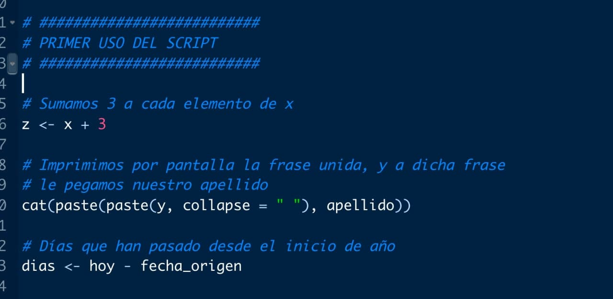

```{r echo = FALSE}
library(knitr)

# Color text
colorize <- function(x, color) {
  
  if (knitr::is_latex_output()) {
    
    sprintf("\\textcolor{%s}{%s}", color, x)
    
  } else if (knitr::is_html_output()) {
    
    sprintf("<span style='color: %s;'>%s</span>", color, x)
    
  } else { x }
}
```

# Importando/exportando {#importar_exportar}

Hemos aprendido a **crear nuestros propios datos** pero la mayoría de veces los cargaremos de distintos archivos, fuentes, etc. Vamos a ver las **4 formas más comunes de importar (cargar) datos**

## Importación de datos

::: {.rmdnote}

Las **`r colorize("4 formas más comunes de importar (cargar) datos", "#4197D2")`** son:

- desde un archivo propio de `R` (extensión `.RData`).
- desde un archivo separado por comas (un archivo `.csv`).
- desde un excel (archivo `.xlsx`).
- desde un enlace de internet.
:::

### Archivo .RData

La forma más sencilla de guardar datos y variables en `R`, y que además ocupa menos espacio en nuestro disco duro, es guardarlo en archivos propios que tiene `R` como son los archivos con extensiones `.rda` y `.RData`.

Es **recomendable** tener los datos en la misma carpeta del proyecto pero una carpeta separada, ya que podemos tener muchos archivos y así no mezclamos dichos ficheros con los códigos que escirbamos. En la carpeta `DATOS` del proyecto tenemos 4 archivos `.RData`: `coches.RData`, `panel_vacunas_ccaa.RData`, `panel_vacunas_fecha.RData` y `panel_variables.RData`. **¿Cómo cargar archivos `.RData`?**

Muy sencillo: como son ficheros nativos de `R`, basta con usar la función de carga `load()`, y dentro la ruta de los archivos. 

```{r include = FALSE}
# Al fijar directorio de trabajo, no necesitamos toda la ruta, solo "./" y la ruta dentro de la carpeta del proyecto
load("./DATOS/coches.RData")
load("./DATOS/panel_vacunas_ccaa.RData")
load("./DATOS/panel_vacunas_fecha.RData")
load("./DATOS/panel_variables.RData")
```

```{r eval = FALSE}
# Al fijar directorio de trabajo, no necesitamos toda la ruta, solo "./" y la ruta dentro de la carpeta del proyecto
load("./DATOS/coches.RData") 
load("./DATOS/panel_vacunas_ccaa.RData")
load("./DATOS/panel_vacunas_fecha.RData")
load("./DATOS/panel_variables.RData")
```

```{r carga-RDATA, echo = FALSE, out.width = "50%", fig.align = "center", fig.cap = "Importación de ficheros de extensión .RData."}
knitr::include_graphics("./img/carga_RDATA.jpg")
```


Como ves en la imagen \@ref(fig:carga-RDATA), en el panel de entorno de la parte superior derecha ahora tendremos 4 `data.frames` que antes no teníamos. Un función muy útil es `head()`, con argumento el nombre de un `data.frame`, que nos permite visualizar las primeras columnas.

```{r}
# Ver las primeras filas de la tabla que guarda distintos modelos de coche y características
head(coches)
```


### Archivo .csv

Otra opción de importación habitual son los **archivos `.csv` (comma separated values)**: son archivos separados por comas (u otro caracter como puntos, puntos y comas, o tabuladores). En apariencia cuando los abrimos en el ordenador son como un Excel (ya que los abre el Excel), pero ocupan mucho menos que un Excel y su **lectura es universal** (independiente de tener instalado o no el Excel) ya que son archivos de texto **sin formato**.

Para leer un archivo `.csv` basta con usar la función `read_csv()` del paquete `{readr}` y la mayoría de las veces basta indicarle la ruta del archivo para su lectura (argumento `file`).

```{r echo = FALSE}
library(knitr)
paquetes <-
  data.frame("paquetes" = c("{base}", "{bookdown}", "{glue}",
                            "{stringr}", "{lubridate}", "{microbenchmark}",
                            "{tibble}", "{datasets}", "{readr}"),
             "descripción" = c("utilidades básicas",
                               "creación de libros, manuales e informes en R",
                               "manejo de texto literal",
                               "manejo complejo de cadenas de texto",
                               "manejo de fechas",
                               "comparativa de tiempos de ejecución",
                               "data.frames eficientes",
                               "conjuntos de datos",
                               "lectura de datos rectangulares (tablas)"))
kable(paquetes, col.names = c("paquetes", "descripción"), align = "ll",
      caption = "Paquetes mencionados hasta ahora")
``` 


```{r paquete-readr, echo = FALSE, out.width = "95%", fig.align = "center", fig.cap = "Paquete readr."}
knitr::include_graphics("./img/readr.png")
```

```{r include = FALSE}
library(readr)
vacunas_esp <-
  read_csv(file = "~/Dropbox/DOCENCIA/CURSOS DE R/cursoR_intro_2021_2022/DATOS/datos_ES.csv")
```

```{r eval = FALSE}
install.packages("readr")
library(readr)
vacunas_esp <- read_csv(file = "./DATOS/datos_ES.csv")
```

```{r}
head(vacunas_esp)
vacunas_esp[1:5, 1:7] # Primeras filas y columnas
```

Ya tenemos nuestro archivo `.csv` cargado y además en formato `tibble`. Como hemos mentado anteriormente, las tablas en formato `tibble` son una especie particular de tablas `data.frame` con una gestión más eficiente. 


### Archivo .xlsx

Muchas veces no tendremos un `.csv` (por desgracia) y nos tocará leer desde un excel. Para ello deberemos instalar (la primera vez) y cargar el paquete `{readxl}` que nos permitirá usar funciones para cargar archivos `.xls` (la función `read_xls()`) y archivos `.xlsx` (la función `read_xlsx()`). Además del argumento `path` con la ruta del archivo, podemos en el argumento `sheet` indicarle la hoja de Excel a leer (en caso de tener varias).

```{r eval = FALSE}
install.packages("readxl")
library(readxl)
boston <- read_xlsx(path = "./DATOS/Boston.xlsx")
```

```{r include = FALSE}
library(readxl)
boston <- read_xlsx(path = "~/Dropbox/DIVULGACIÓN/CURSO R BIOQUIMICA EN MOVIMIENTO/CURSO R/curso_R/DATOS/Boston.xlsx")
```

```{r}
head(boston)
```

::: {.rmdimportant}

**`r colorize("CONSEJO: entorno tidyverse", "#20935E")`**

Una de las **herramientas más potentes en `R`** es el conjunto de paquetes `{tidyverse}`: un entorno de paquetes que nos permite una gestión ágil y eficiente de nuestros conjuntos de datos. Aunque su uso profundo corresponde a un futuro curso, veamos una función muy útil del paquete `{dplyr}` (incluido en `{tidyverse}`) para visualizar un resumen de nuestros datos.


```{r include = FALSE}
library(tidyverse)
glimpse(boston) # Resumen por columnas
```

```{r eval = FALSE}
install.packages("tidyverse")
library(tidyverse)
```

```{r}
glimpse(boston)# Resumen por columnas
```
:::

```{r echo = FALSE}
library(knitr)
paquetes <-
  data.frame("paquetes" = c("{base}", "{bookdown}", "{glue}",
                            "{stringr}", "{lubridate}", "{microbenchmark}",
                            "{tibble}", "{datasets}", "{readr}", "{tidyverse}",
                            "{readxl}"),
             "descripción" = c("utilidades básicas",
                               "creación de libros, manuales e informes en R",
                               "manejo de texto literal",
                               "manejo complejo de cadenas de texto",
                               "manejo de fechas",
                               "comparativa de tiempos de ejecución",
                               "data.frames eficientes",
                               "conjuntos de datos",
                               "lectura de datos rectangulares (tablas)",
                               "entorno de paquetes para el manejo de datos",
                               "lectura de datos en formato excel"))
kable(paquetes, col.names = c("paquetes", "descripción"), align = "ll",
      caption = "Paquetes mencionados hasta ahora")
``` 


### Desde web

Por último, muchas veces querremos cargar archivos colgados en la web que, aunque al descargarlos son `.csv` o `.xlsx`, son archivos dinámicos que sabemos que van a ir cambiando, como por ejemplo los datos de casos covid, hospitalizados, ingresos UCI y fallecidos, de la página del ISCIII <https://cnecovid.isciii.es/covid19/#documentaci%C3%B3n-y-datos>.


```{r ISCIII, echo = FALSE, out.width = "75%", fig.align = "center", fig.cap = "Archivos de la pandemia en el ISCIII."}
knitr::include_graphics("./img/ISCIII.jpg")
```

Esos archivos cambian cada día, por lo que para visualizarlos, analizarlos o guardarlos cada día, tendríamos que, cada día, entrar de forma manual a la página y bajarnos el archivo. O no...

`R` nos permite **leer archivos subidos en una web, dándole a la función de lectura el enlace del archivo en lugar de la ruta local de nuestro ordenador** (para averiguar el enlace, basta con clickar botón derecho en la web y seleccionar «copiar dirección de enlace»)

```{r}
datos_ISCIII <- read_csv(file = "https://cnecovid.isciii.es/covid19/resources/casos_hosp_uci_def_sexo_edad_provres.csv")
head(datos_ISCIII)
```

Mientras el enlace web no cambie, cada vez que ejecutemos esa orden en nuestro código tendremos en `datos_ISCIII` el último archivo actualizado que haya, sea el que sea, sin tener que descargarlo de forma manual, ¡y sin necesidad de guardarlo en nuestro local, solo en la memoria virtual de nuestra sesión de `R`!


## Exportación de datos

Aunque se puede exportar en cualquier formato que puedas importar, vamos a ver las **dos formas más útiles y eficientes de exportar datos en `R`**: 

- fichero `.RData`.
- fichero `.csv` (obviaremos la exportación a Excel porque un `.csv` ya es posible abrirlo con dicho engendro del demonio).

### Guardar en .RData

La exportación en fichero `.RData` es la opción **más recomendable si tú o tu equipo solo trabajáis con `R`**, es la opción nativa de fichero, para que su importación sea tan sencilla como una función `load()`. Para exportar en `R.Data` basta con uses la función `save()`, indícandole lo que quieres guardar y la ruta donde quieres guardarlo.

Es **importante** entender que la principal ventaja de exportar un fichero `.RData` es que no se está portando una tabla, o un fichero tabulado con un formato de filas y columnas: estás exportando **cualquier cosa**, cualquier variable de `R`, con la naturaleza de esa variable intacta, sin necesidad de pasarlo otro formato.

```{r eval = FALSE}
# Exportamos en .RData la variable nombres 
save(nombres, file = "./EXPORTAR/nombres.RData")
``` 

Para tenerlo organizado, la orden anterior está hecha habiendo creado en nuestra carpeta del proyecto una carpeta `EXPORTAR` para guardar lo que vayamos exportando. Ese fichero solo podrá ser abierto por `R`, pero cuando lo cargemos, tendremos la variable `nombres` tal cual la hemos guardado.

### Guardar en .csv

No siempre trabajamos en `R` y a veces necesitamos una exportación de  un `data.frame` o una tabla que podamos abrir en nuestra ordenador, ya sea para explicársela a alguien o para enviársela a otra persona. Para ello exportaremos en `.csv`, un fichero sin formato, y que es capaz de ser abierto por todo tipo de hojas de cálculo: basta que usemos la función `write.csv()` del paquete `{readr}`.

```{r eval = FALSE}
# Exportamos en .csv el data.frame tabla
write_csv(tabla, file = "./EXPORTAR/tabla.csv")
```


::: {.rmdnote}

**`r colorize("Paquete rvest", "#4197D2")`**

En dicho paquete tienes más **funciones para una lectura directamente de una página web (no desde un documento, desde la propia página web, como si estuvieras navegando en ella)**. Ver <https://github.com/tidyverse/rvest>.

:::

```{r echo = FALSE}
library(knitr)
paquetes <-
  data.frame("paquetes" = c("{base}", "{bookdown}", "{glue}",
                            "{stringr}", "{lubridate}", "{microbenchmark}",
                            "{tibble}", "{datasets}", "{readr}", "{tidyverse}",
                            "{readxl}", "{rvest}"),
             "descripción" = c("utilidades básicas",
                               "creación de libros, manuales e informes en R",
                               "manejo de texto literal",
                               "manejo complejo de cadenas de texto",
                               "manejo de fechas",
                               "comparativa de tiempos de ejecución",
                               "data.frames eficientes",
                               "conjuntos de datos",
                               "lectura de datos rectangulares (tablas)",
                               "entorno de paquetes para el manejo de datos",
                               "lectura de datos en formato excel",
                               "lectura de datos web"))
kable(paquetes, col.names = c("paquetes", "descripción"), align = "ll",
      caption = "Paquetes mencionados hasta ahora")
``` 

::: {.rmdimportant}

**`r colorize("CONSEJO: secciones en el código", "#20935E")`**

Los comentarios no solo sirven para documentar el código sino que además pueden servirnos para **construir secciones de código**. Prueba a escribir un comentario con varias `###############`: ¿ves la flecha que te aparece en la parte izquierda? Sirve para minimizar o maximizar trozos de código, de forma que tu código aún más limpio.

```{r indice, echo = FALSE, out.width = "50%", fig.align = "center", fig.cap = "Secciones en el código."}

```

:::

::: {.rmdwarning}

**`r colorize("Líneas de código en los errores", "#ffc107")`**
  
Dado que los errores del código nos vendrán referenciados en la consola por el número de línea donde fueron detectados, puede sernos muy útil mostrar dichos números en la barra lateral izquierda, yendo a `Tools << Global Options << Code << Display << Show line numbers`

```{r show-line-numbers, echo = FALSE, out.width = "50%", fig.align = "center", fig.cap = "Líneas de código."}
knitr::include_graphics("./img/show_line_numbers.jpg")
```

:::

::: {.rmdimportant}

**`r colorize("CONSEJO: Margen derecho en la ventana de scripts", "#20935E")`**

  

Aunque no afecte a nuestro código escribir todo en una línea sin saltos de línea, no somos bárbaros/as. ¿Por qué cuadno escribes en un Word lo haces en formato vertical pero cuando programas pones todas las órdenes seguidas? Recuerda que la legibilidad de tu código no solo te ahorrará tiempo sino que te hará programar mejor. ¿Cómo podemos fijar un margen imaginario para nosotros ser quienes demos al _ENTER_? Yendo a `Tools << Global Options << Code << Display << Show margin` (es un margen imaginario para ser nosotros quienes lo hagamos efectivo, a `R` le da igual)

```{r show-margin, echo = FALSE, out.width = "50%", fig.align = "center", fig.cap = "Margen derecho."}
knitr::include_graphics("./img/show_margin.jpg")
```

:::
