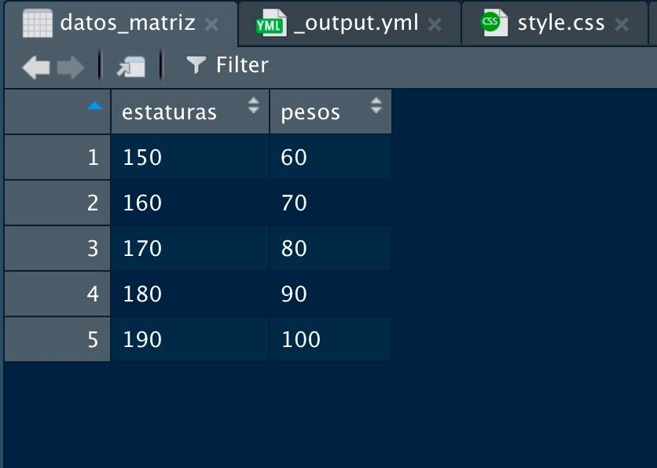

```{r echo = FALSE}
library(knitr)

# Color text
colorize <- function(x, color) {
  
  if (knitr::is_latex_output()) {
    
    sprintf("\\textcolor{%s}{%s}", color, x)
    
  } else if (knitr::is_html_output()) {
    
    sprintf("<span style='color: %s;'>%s</span>", color, x)
    
  } else { x }
}
```

# Datos estructurados {#datos}

:::: {.blackbox data-latex=""}

Scripts usados:

* [**script09.R**](https://github.com/dadosdelaplace/courses-intro-R/blob/main/scripts/script09.R). Ver en <https://github.com/dadosdelaplace/courses-intro-R/blob/main/scripts/script09.R>

::::

Ya sabemos un poco la gramática y ortografía de nuestro lenguaje, y algunas de las funcionalidades básicas de nuestro «Word». Vamos a introducir cómo escribir la mejor trama para la novela: hablemos por fin de <mark>**datos**</mark> (introducción muy reducida).

## Matrices

Hasta ahora, si quisiéramos trabajar con los datos de una persona y lo imaginamos en un Excel, hemos <mark>**aprendido algunos tipos básicos**</mark> que pueden tomar las celdas, y hemos <mark>**aprendido a formar columnas**</mark> (vectores, colecciones de elementos del mismo tipo). 

Pero hasta ahora cada columna la hemos tratado por separado: una colección de números, otra de caracteres, fechas, etc. Pero de momento solo **hemos visto solo datos en <mark>una dimensión</mark>**: una sola variable de $n$ elementos.

```{r}
# Ejemplos de variables unidimensionales (vectores)
c(1, 4, NA, -2, 0)
c("a", NA, "b", "c")
c(TRUE, TRUE, FALSE, TRUE)
c(today() - 1, today(), today() + 1)
```

Pero cuando analizamos datos solemos tener <mark>**varias variables distintas de cada individuo**</mark>, por ejemplo, la **estatura y el peso de una persona**. Necesitamos una <mark>**«tabla»**</mark>, una manera de <mark>**unir distintas variables numéricas**</mark>, todas de <mark>**IGUAL longitud**</mark>. Y ese conjunto de variables  (del <mark>**mismo tipo**</mark> e <mark>**igual longitud**</mark>), dispuestas en columnas, es lo que conocemos como <mark>**matrices**</mark>: una **«tabla» de valores del mismo tipo**, con filas y columnas.

Vamos a empezar definiendo una **matriz sencilla**: imagina que tenemos las estaturas y pesos de 5 personas.

```{r}
estaturas <- c(150, 160, 170, 180, 190)
pesos <- c(60, 70, 80, 90, 100)
```

¿Cómo **juntar las dos variables** creando nuestro <mark>**primer conjunto de datos**</mark>? Vamos a crear una matriz, un conjunto de números organizado en **2 columnas (una por variable)** y **5 filas o registros (una por persona)**. Para ello usaremos la función `cbind()`, que nos <mark>**concatena vectores de igual longitud en columnas**</mark>.

```{r}
datos_matriz <- cbind(estaturas, pesos) # Construimos la matriz por columnas
datos_matriz # nuestra primera matriz
```

Nuestro primer conjunto de datos :) Podemos **visualizar la matriz** en un formato «excelizado» con la función `View()`

```{r eval = FALSE}
View(datos_matriz)
```

```{r echo = FALSE, fig.align = 'center', include = identical(knitr:::pandoc_to(), 'html'), fig.cap = "Nuestra primera matriz de datos", out.width = '70%'}

```

También podemos <mark>**construir la matriz por filas**</mark> con el comando `rbind()`, que nos permite añadir filas a una matriz o construirla desde cero (aunque lo habitual **y recomendable** es tener cada variable en una columna y cada individuo en una fila).

```{r}
rbind(estaturas, pesos) # Construimos la matriz por filas
```

Para practicar vamos a definir otro ejemplo, con las **edades, teléfonos y códigos postales** de una serie de individuos (fíjate que hay adrede datos ausentes, ya que a veces no tendremos datos de algunas personas de algunas variables).

```{r}
edades <- c(14, 24, 56, 31, 20, 87, 73) # vector numérico de longitud 7
tlf <- c(NA, 683839390, 621539732, 618211286, NA, 914727164, NA)
cp <- c(33007, 28019, 37005, 18003, 33091, 25073, 17140)

# Construimos la matriz por columnas
datos_matriz <- cbind(edades, tlf, cp) 
datos_matriz
```

De nuevo tenemos una tabla de números: <mark>**una columna por variable y una fila por registro**</mark>. Los comandos `cbind()` y `rbind()` no solo nos permiten crear matrices desde cero sino también **añadir filas o columnas** a matrices existentes.


```{r}
# Añadimos una fila
rbind(datos_matriz, c(27, 620125780, 28051))

# Añadimos una columna
cbind(datos_matriz, "estaturas" = c(160, 155, 170, 181, 174, NA, 165))
```

Como ves, ahora nuestros <mark>**datos están tabulados**</mark>, tienen dos dimensiones. ¿Cómo saber las <mark>**dimensiones**</mark> que tiene una matriz? Prueba a ejecutar la función `dim()`.

```{r}
dim(datos_matriz)
```

Fíjate que `dim()` devuelve un vector de 2 elementos (las dos dimensiones), por lo que para acceder al **número de filas** deberemos ejecutar `dim(x)[1]` (y `dim(x)[2]` para el **número de columnas**). 

```{r}
dim(datos_matriz)[1]
dim(datos_matriz)[2]
```

También tenemos a nuestra disposición las funciones `nrow()` y `ncol()`, que nos devuelven directamente el <mark>**número de filas y columnas**</mark>.

```{r}
nrow(datos_matriz)
ncol(datos_matriz)
```

Igual que a veces es útil generar un vector de elementos repetidos, también podemos definir una <mark>**matriz de números repetidos**</mark> (por ejemplo, de ceros), con la función `matrix()`, indicándole el número de filas y columnas.

```{r}
matrix(0, nrow = 5, ncol = 3) # 5 filas, 3 columnas, todo 0's
```

También podemos definir una <mark>**matriz a partir de un vector numérico**</mark>, reorganizando los valores en forma de matriz (con una dimensión tal que `filas * columnas = longitud del vector`), sabiendo que los **elementos se van colocando por columnas** (primeros valores en la primera columna, de arriba a abajo).

```{r}
z <- matrix(1:15, ncol = 5) # Matriz con el vector 1:5 con 5 columnas (ergo 3 filas)
z
```

&nbsp;

Dada una matriz también podemos «darle vuelta» (lo que se conoce como <mark>**matriz transpuesta**</mark>, donde filas pasan a ser columnas y viceversa) con la función `t()`.

```{r}
datos_matriz
t(datos_matriz) # Matriz transpuesta
```


Con las matrices sucede como con los vectores: cuando <mark>**aplicamos una operación aritmética**</mark>, se la estamos aplicando <mark>**elemento a elemento**</mark>, por ejemplo, dividir entre 5 o sumar una constante

```{r}
datos_matriz / 5
datos_matriz + 3
```

También podemos crear **matrices de otros tipos de datos**, siempre y cuando las columnas sean del <mark>**mismo tipo e igual longitud**</mark>, por ejemplo una matriz de caracteres o una matriz de valores lógicos

```{r}
# matriz de caracteres
nombres <- c("Javier", "Carlos", "María", "Paloma")
apellidos <- c("Álvarez", "García", "Pérez", "Liébana")
cbind(nombres, apellidos)

# matriz de valores lógicos
var1 <- c(TRUE, TRUE, FALSE, FALSE, TRUE)
var2 <- c(TRUE, FALSE, FALSE, TRUE, TRUE)
cbind(var1, var2)
cbind(var1, var2) + 1
```

### Acceder a elementos

Si recuerdas para los vectores, usábamos el operador `[i]` para acceder al elemento i-ésimo.

```{r}
x <- c(1, 2, 10, 67, -1, 0)
x[3] # accedemos al tercer elemento 
x[c(3, 5)] # accedemos al tercer y quinto elemento
x[1:4] # accedemos al primero, segundo, tercero, cuarto elemento
```

En el caso de las matrices la lógica será la misma: para <mark>**acceder a la fila i-ésima de la matriz**</mark> se usa el operador `[i, ]` (dejando libre el índice de la columna), mientras que para **acceder a la columna j-ésima de la matriz** se usaría el operador `[, j]` (dejando libre el índice de la fila). Para **acceder conjuntamente al elemento `(i, j)`** (fila i, columna j) se usa el operador `[i, j]`. 

```{r}
datos_matriz
datos_matriz[1, 3] # elemento (1, 3)
datos_matriz[2, 2] # elemento (1, 3)
datos_matriz[1, ] # fila 1
datos_matriz[, 3] # columna 3
```

Si las **columnas tienen nombres** también podemos hacer uso de ellos para acceder a las columnas

```{r}
datos_matriz[, c("edades", "tlf")]
```

Incluso podemos **asignar nombres a las filas de una matriz** con `row.names()` y acceder a filas y columnas por nombres.

```{r}
row.names(datos_matriz) <- c("Javi", "Laura", "Patricia", "Carlos",
                             "Juan", "Luis", "Carla")
datos_matriz["Javi", "edades"]
```


### Operaciones por filas y columnas (apply)

Normalmente, para explicar las operaciones con matrices en un lenguaje de programación al uso, necesitaríamos hablar de una herramienta llamada **bucles**. Lo mencionaremos más adelante pero no los vamos a necesitar de momento (y cuántos menos los usemos en `R`, mejor) 

Imagina que tuviésemos nuestra matriz de estaturas y pesos.

```{r}
datos_matriz <- cbind(estaturas, pesos)
datos_matriz
```

¿Cómo podemos <mark>**aplicar una operación para cada una de las filas o columnas**</mark> de una matriz? Imagina que queremos obtener la <mark>**media de cada columna**</mark> (media de las estaturas y media de los pesos).

Lo haremos con la <mark>**función `apply()`**</mark>, y le indicaremos como argumentos

* la matriz
* el sentido de la operación (`MARGIN = 1` hará la **opearción por filas**, `MARGIN = 2` hará la **opearción por columnas**)
* la función a aplicar por filas (o por columnas)


```{r}
# Media (mean) por columnas (MARGIN = 2)
apply(datos_matriz, MARGIN = 2, FUN = "mean")
```

El resultado es un vector de longitud 2 (la media de las estaturas y la media del peso). La **misma operación la podemos realizar por filas** con `MARGIN = 1` (aunque en este caso no tiene mucho sentido hacer la media de variables con magnitudes distintas)

```{r}
# Media por filas (MARGIN = 1)
apply(datos_matriz, MARGIN = 1, FUN = "mean")
```

Si la función a aplicar requiere de <mark>**argumentos extras**</mark>, por ejemplo indicarle que ignore los datos ausentes con `na.rm = TRUE`, se lo podemos indicar al final como argumento extra.

```{r}
estaturas_bis <- c(150, NA, 170, 180, 190)
pesos_bis <- c(60, 70, 80, NA, 100)
datos_matriz_bis <- cbind(estaturas_bis, pesos_bis) 

# Nos devolverá ausente porque en ambas columnas tenemos
apply(datos_matriz_bis, MARGIN = 2, FUN = "mean")

# Media por columnas (MARGIN = 2) ignorando los ausentes
apply(datos_matriz_bis, MARGIN = 2, FUN = "mean", na.rm = TRUE)
```


## Tablas: data.frames

Recapitulando:

* Hemos visto los <mark>**tipos de datos**</mark> que podemos tener en cada celda.
* Hemos aprendido a <mark>**recolectar datos de distintos individuos**</mark> (vectores de edades, vectores de fechas, vectores de nombres).
* Siempre que sean del <mark>**mismo tipo y longitud**</mark>, hemos aprendido a juntar en un mismo objeto (matrices) variables distintas (edades, estaturas, alturas, por ejemplo).

Retomemos nuestra matriz de datos, en la que teníamos para cada individuo guardado las edades (`edades`), teléfonos (`tlf`) y códigos postales (`cp`), y probemos a ver que pasa cuando seleccionamos la columna de edades y le sumamos un año a todas las personas

```{r}
datos_matriz

# Sumamos un año a todas las personas
datos_matriz[, "pesos"] + 1
```

¿Qué sucede si ahora <mark>**añadimos una columna con los nombres**</mark> (tipo caracter) de cada persona?

```{r}
nombres <- c("Sonia", "Carla", "Pepito", "Carlos", "Lara", "Sandra", "Javi")
datos_matriz_nueva <- cbind(nombres, datos_matriz)
```

<mark>**¿Has visto lo que ha sucedido?**</mark>

Como una matriz <mark>**SOLO puede tener un tipo de dato**</mark> (todo números, todo texto, todo lógicas, todo fechas, etc), al añadir una variable de tipo texto, `R` se ha visto obligado a **convertir los números en texto** poniéndole comillas a los datos que tenemos: hemos roto la <mark>**integridad de los datos**</mark>. De hecho, como ahora los números con caracteres, **no podremos sumar** un año a cada persona como antes.

```{r error = TRUE}
datos_matriz_nueva[, "edades"] + 1
```

&nbsp; 

Las matrices nos permiten almacenar distintas variables **SIEMPRE Y CUANDO** tengan

* <mark>**Misma longitud**</mark> (todas las columnas deben tener la misma longitud).
* <mark>**Mismo tipo**</mark> de dato (o todo números o todo caracteres, pero sin mezclar).

Esto es bastante limitante ya que en la vida real nuestros <mark>**datos tendrán variables de todo tipo**</mark>. Veamos un ejemplo real: supongamos que queremos guardar de 7 personas las variables de texto `nombres` y `apellidos`.

```{r}
# Nombres
nombres <- c("Sonia", "Carla", "Pepito", "Carlos", "Lara", "Sandra", "Javi")

# Apellidos
apellidos <- c(NA, "González", "Fernández", "Martínez", "Liébana", "García", "Ortiz")
```

Hasta aquí no habría ningún problema ya que podemos crear una **matriz de caracteres**.

```{r}
matriz <- cbind(nombres, apellidos)
matriz
```

De esas 7 personas también disponemos información de si están o no casadas (representado en un valor lógico, `casado`) y algunos valores numéricos (`edades`, `cp` y `tlf`).

```{r}
# Código postal
cp <- c(28019, 28001, 34005, 18410, 33007, 34500, 28017)

# Edades
edades <- c(45, 67, NA, 31, 27, 19, 50)

# Teléfono
tlf <- c(618910564, 914718475, 934567891, 620176565, NA, NA, 688921344)

# Estado civil (no lo sabemos de una persona)
casado <- c(TRUE, FALSE, FALSE, NA, TRUE, FALSE, FALSE)
```

Por último, vamos a añadir a cada persona una fecha de registro en el sistema (`fecha_creacion`, imagina que fuese la fecha de expedición del DNI).

```{r}
# Fecha de creación (fecha en el que esa persona entra en el sistema)
# lo convertimos a tipo fecha
fecha_creacion <-
  as_date(c("2021-03-04", "2020-10-12", "1990-04-05",
            "2019-09-10", "2017-03-21", "2020-07-07",
            "2000-01-28"))
```

En cada variable tenemos 7 registros, uno por persona, pero ahora tenemos un popurrí de variables, de la <mark>**misma longitud pero de tipos distintos**</mark>: 

* `(edades, tlf, cp)` son variables **numéricas**.
* `(nombres, apellidos)` son variables de **texto**.
* `casado` es una variable **lógica**.
* `fecha_creacion` de tipo **fecha**.

¿Qué sucedería si <mark>**intentamos mezclar todo en una matriz**</mark>? Vamos a unir las columnas con `cbind()`.

```{r}
# Juntamos todo en una matriz (juntamos por columnas)
datos_matriz <-
  cbind(nombres, apellidos, edades, tlf, cp, casado, fecha_creacion)
datos_matriz
```

Dado que en una **matriz solo podemos almacenar datos del mismo tipo**, los <mark>**números los convierte a texto**</mark>, las variables lógicas las convierte a texto (`TRUE` ahora es un valor lógico, `"TRUE"` es un texto, como `"Pepito"`, sin significado lógico de verdadero/falso) y las fechas las ha convertido a texto (aunque las veas igual, ya no son de tipo de fecha, son texto y no podemos operar con ellas).

```{r error = TRUE}
# Días entre la primera y el segundo elemento de fecha de creación
fecha_creacion[1] - fecha_creacion[2]
datos_matriz[1, 7] - datos_matriz[2, 7]
```

&nbsp; 

Vamos a aprender cómo <mark>**juntar variables de distinto tipo**</mark>, sin cambiar su naturaleza, como lo haríamos en una tabla de Excel.

El formato de tabla de datos en `R` que vamos a empezar a usar desde ya se llama <mark>**`data.frame`**</mark>, y no es más que una <mark>**colección de  variables de igual longitud pero cada una puede ser de un tipo distinto**</mark>. Para crear un `data.frame` basta con usar la función `data.frame()`, pasándole como argumentos (separados por comas) las variables que queremos reunir.

```{r}
# Creamos nuestro primer data.frame
tabla <- data.frame(nombres, apellidos, edades, tlf, cp,
                    casado, fecha_creacion)
tabla
class(tabla)
```

Al igual que con las matrices, podemos crearlas **indicando además el nombre de las columnas**.

```{r}
tabla <- data.frame("nombre" = nombres, "apellido" = apellidos, 
                    "edad" = edades, "teléfono" = tlf, 
                    "cp" = cp, "casado" = casado,
                    "fecha_registro" = fecha_creacion)
tabla
```

<mark>**¡TENEMOS NUESTRO PRIMER CONJUNTO DE DATOS!**</mark> Puedes <mark>**visualizarlo de nuevo**</mark> escribiendo su nombre en consola o con la función `View()`

```{r eval = FALSE}
View(tabla)
```


### Selección de columnas y filas

Si tenemos un `data.frame` ya creado y queremos <mark>**añadir una columna**</mark> es tan simple como usar la función `data.frame()` que ya hemos visto para concatenar la columna. Vamos añadir por ejemplo una nueva variable, el **número de hermanos** de cada individuo.

```{r}
# Añadimos una nueva columna con nº de hermanos/as
hermanos <- c(0, 0, 1, 5, 2, 3, 0)
tabla <- data.frame(tabla, "n_hermanos" = hermanos)
tabla
```

Si queremos <mark>**acceder a una columna, fila o elemento en concreto**</mark>, los `data.frame` tienen las **mismas ventajas que una matriz**, así que bastaría con usar los mismos operadores.

```{r}
tabla[, 3] # Accedemos a la tercera columna
tabla[5, ] # Accedemos a la quinta fila
tabla[5, 3] # Accedemos a la tercera variable del quinto registro
``` 

Un `data.frame` **no solo tiene las ventajas de una matriz** si no que también tiene las <mark>**ventajas de una «base» de datos**</mark>. Por ejemplo, podemos **aceder a las variables** por el índice de columna que ocupan pero <mark>**también acceder a las columnas por su nombre**</mark>, poniendo el nombre de la tabla, el símbolo `$` y, con el tabulador, nos aparecerá un menú de columnas a elegir. 

```{r tabla-dolar, echo = FALSE, out.width = "50%", fig.align = "center", fig.cap = "Menú desplegable de variables (columnas) de un data.frame."}
knitr::include_graphics("./img/tabla_dolar.jpg")
```

### Primer análisis de datos: arrestos en EE. UU.

Además del conjunto de datos `tabla` que hemos construido artificialmente, vamos a instalar (sino lo hemos hecho nunca en este ordenador) un paquete muy útil en `R` llamado `{datasets}`.

```{r}
# Paquetes necesarios
# install.packages("datasets") # Descomentar si nunca se ha instalado
library(datasets)
```

Ahora si escribimos `datasets::` y pulsamos tabulador, se nos abre un desplegable con <mark>**distintos conjuntos de datos reales**</mark> para ser usados: el paquete `datasets` nos proporciona `data.frames` de prueba para que podamos usarlos. 

Vamos a jugar con el conjunto de datos `datasets::USArrests`, que contiene <mark>**estadísticas de arrestos en 1973 (por cada 100 000 habitantes)**</mark> por agresión, asesinato y violación, en cada uno de los 50 estados de Estaods Unidos.

```{r eval = FALSE}
datasets::USArrests
View(USArrests)
```

<mark>**¿Cómo visualizar la cabecera de la tabla?**</mark> Con la función `head()`.

```{r}
head(USArrests)
```

<mark>**¿Cómo obtener el nombre de las variables?**</mark> Con la función `names()`.

```{r}
names(USArrests)
```

El conjunto contiene los 3 tipos de delito mencionados (para cada estado), y además el porcentaje de población que vive en áreas urbanas. Esto lo podemos saber ejecutando la <mark>**ayuda**</mark> con `? datasets::USArrests`.

<mark>**¿Cómo obtener el nombre de las filas (de los estados)?**</mark> Con la función `row.names()`.

```{r}
row.names(USArrests)
```

<mark>**¿Cómo averiguar el número de registros y el número de variables?**</mark> Con las funciones `dim()`, `nrow()` y `ncol()`.

```{r}
dim(USArrests)
nrow(USArrests)
ncol(USArrests)
```

<mark>**¿Cómo seleccionar solo las columnas `Murder` y `Assault` para el segundo y el décimo estado?**</mark>

```{r}
USArrests[c(2, 10), c("Murder", "Assault")]
```

&nbsp;

<mark>**¿Cómo cambiar el nombre de las variables?**</mark> Con la función `names()`.

```{r}
names(USArrests) <- c("asesinato", "agresion",
                      "pobl_urbana", "violacion")
```

&nbsp;

<mark>**¿Cómo seleccionar y filtrar datos?**</mark>

En el caso de los `data.frame` tenemos además a nuestro disposición una <mark>**herramienta muy potente: la función `subset()`**</mark>. Dicha función nos va a permitir <mark>**seleccionar filas y columnas a la vez**<mark>, tomando de entrada los siguientes argumentos

* `x`: una tabla de entrada, un `data.frame` de entrada.
* `subset`: la <mark>**condición lógica**</mark> que queramos usar para seleccionar registros (filas).
* `select`: un vector que contenga el nombre de las <mark>**columnas que queremos seleccionar**</mark> (a lo mejor solo queremos filtrar por filas pero quizás también por columnas).

Por ejemplo, vamos a **seleccionar solo los delitos de asesinato de aquellos estados cuyo porcentaje de población urbana sea superior al 70%**.

```{r}
subset(USArrests, subset = pobl_urbana > 70,
       select = c("asesinato"))
```

Como sucedía en otros contextos, podemos combinar condiciones lógicas, seleccionando por ejemplo **aquellos estados cuyo porcentaje de población urbana sea inferior al 70%** y donde las **agresiones sean superiores a 250 por cada 100 000 habitantes**, pero luego seleccionando solo dos variables.

```{r}
subset(USArrests, subset = pobl_urbana < 70 & agresion > 250,
       select = c("asesinato", "violacion"))
```

## Consejos


**`r colorize("CONSEJOS", "#20935E")`**

&nbsp;

**`r colorize("Acceder a las funciones de los paquetes", "#20935E")`**

A veces puede que no queramos cargar todo un paquete sino solo una función del mismo, para lo que es suficiente `nombre_paquete::nombre_funcion`. Recuerda que instalar un paquete es cómo comprar un libro, cargar el paquete con `library()` es cómo traer el libro comprado de la estantería a tu mesa, y usar solo una función con `nombre_paquete::nombre_funcion` es cómo pedirle a alguien que te arranque solo una página y te la traiga a la mesa.

&nbsp;

## 📝 Ejercicios

(haz click en las flechas para ver soluciones)

<details>
  <summary><strong>Ejercicio 1</strong>: modifica el código para definir una matriz `x` de ceros de 3 filas y 7 columnas.
  
```{r eval = FALSE}
# Matriz
x <- matrix(0, nrow = 2, ncol = 3)
x
```

</summary>

- Solución:

```{r}
# Matriz
x <- matrix(0, nrow = 3, ncol = 7)
x
```

</details>

&nbsp; 

<details>
  <summary><strong>Ejercicio 2</strong>: a la matriz anterior, suma un 1 a cada número de la matriz y divide el resultado entre 5.</summary>

- Solución:

```{r}
(x + 1) / 5
```

</details>

&nbsp; 


<details>
  <summary><strong>Ejercicio 3</strong>: tras definir la matriz `x` calcula su transpuesta y obtén sus dimensiones</summary>

- Solución:

```{r}
# Transpuesta
t(x)

# Dimensiones transpuesta: pasa de ser 3x7 a 7x3
dim(t(x))
ncol(t(x)) # número de columnas de la transpuesta
nrow(t(x)) # número de filas de la transpuesta
```

</details>

&nbsp;

<details>
  <summary><strong>Ejercicio 4</strong>: el siguiente código define una matriz de dimensiones `4 x 3` y calcula la suma por columnas. Modifica el código para que realice la suma por filas.
  
```{r}
# Matriz
matriz <- matrix(1:12, nrow = 4)

# Suma por columnas
apply(matriz, MARGIN = 2, FUN = "sum")
```

</summary>


- Solución:

```{r}
# Matriz
matriz <- matrix(1:12, nrow = 4)

# Suma por filas
apply(matriz, MARGIN = 1, FUN = "sum")
```
</details>

&nbsp; 

<details>
  <summary><strong>Ejercicio 5</strong>: con la matriz anterior definida como `matrix(1:12, nrow = 4)`, calcula la media de todos los elementos, la media de cada fila y la media de cada columna.</summary>

- Solución:

```{r}
# Matriz
matriz <- matrix(1:12, nrow = 4)

#  media de todos
mean(matriz)

# Media por filas (MARGIN = 1 ya que es una operación por filas)
apply(matriz, MARGIN = 1, FUN = "mean")

# Media por filas (MARGIN = 2 ya que es una operación por filas)
apply(matriz, MARGIN = 2, FUN = "mean")
```
</details>

&nbsp; 

<details>
  <summary><strong>Ejercicio 6</strong>: el `data.frame` llamado `airquality`, del paquete `{datasets}`, contiene variables de la calidad del aire de la ciudad de Nueva York desde mayo hasta septiembre de 1973. Obtén el nombre de las variables.
</summary>
  
- Solución:

```{r}
library(datasets)
names(airquality)
```

</details>

 &nbsp; 

<details>
  <summary><strong>Ejercicio 7</strong>: obtén las dimensiones del conjunto de datos. ¿Cuántas variables hay? ¿Cuántos días se han medido?
  
</summary>
  
- Solución:

```{r}
# Dimensiones
dim(airquality)
nrow(airquality)
ncol(airquality)
```

</details>

&nbsp; 

<details>
  <summary><strong>Ejercicio 8</strong>: modifica el código inferior para que nos filtre solo los datos del mes de julio.
  
```{r eval = FALSE}
# Filtramos filas
filtro_fila <- subset(., subset = Month < 6)
filtro_fila
```
</summary>
  
- Solución:

```{r}
# Filtramos filas
filtro_fila <- subset(airquality, subset = Month == 7)
filtro_fila
```

</details>

&nbsp; 

<details>
  <summary><strong>Ejercicio 9</strong>: del conjunto `airquality` selecciona aquellos datos que no sean ni de julio ni de agosto.</summary>
  
- Solución:

```{r}
# Filtramos filas
filtro_fila <-
  subset(airquality, subset = !(Month %in% c(7, 8)))
filtro_fila
```

</details>

&nbsp; 

<details>
  <summary><strong>Ejercicio 10</strong>: modifica el siguiente código para quedarte solo con las variable `Ozone` y `Temp`.
  
```{r eval = FALSE}
filtro_col <- subset(.,  select = c("Ozone"))
filtro_col
```
</summary>
  
- Solución:

```{r}
# Filtramos columnas
filtro_col <- subset(airquality,  select = c("Ozone", "Temp"))
filtro_col
```

</details>


&nbsp; 

<details>
  <summary><strong>Ejercicio 11</strong>: del conjunto `airquality` selecciona los datos de temperatura y viento de agosto.</summary>
  
- Solución:

```{r}
# Todo de una vez
filtro <- subset(airquality, subset = Month == 8,
                 select = c("Temp", "Wind"))
filtro
```

</details>


&nbsp; 

<details>
  <summary><strong>Ejercicio 12</strong>: calcula el número de filas borradas del ejercicio anterior. Tras hacer todo ello, traduce a castellano el nombre de las columnas del `data.frame` filtrado.</summary>
  
- Solución:

```{r}
# Filas borradas
nrow(airquality) - nrow(filtro)

# Cambiamos nombres a castellano del conjunto filtrado
names(filtro) <- c("temperatura", "viento")
```

</details>

&nbsp; 

<details>
  <summary><strong>Ejercicio 13</strong>: añade a los datos originales una columna con la fecha completa (recuerda que es del año 1973 todas las observaciones.</summary>
  
- Solución:

```{r}
# Construimos las fechas (pegamos año-mes-día con "-")
fechas <- 
  as_date(paste("1973", airquality$Month, airquality$Day,
                sep = "-"))

# Añadimos
data.frame(airquality, fechas)
```

</details>

&nbsp; 


