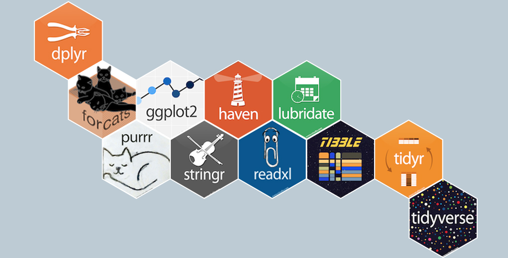

```{r echo = FALSE}
library(knitr)

# Color text
colorize <- function(x, color) {
  
  if (knitr::is_latex_output()) {
    
    sprintf("\\textcolor{%s}{%s}", color, x)
    
  } else if (knitr::is_html_output()) {
    
    sprintf("<span style='color: %s;'>%s</span>", color, x)
    
  } else { x }
}
```


# (PART) Alto en el camino {-}


# ¿Qué sabemos hacer? {#resumen-1}

**Hasta aquí el aperitivo**

::: {.rmdnote}

**`r colorize("¿Qué datos hemos aprendido a manejar?", "#4197D2")`**


```{r echo = FALSE}
library(knitr)
paquetes <-
  data.frame("tipo de dato" = c("x <- 1 (dato numérico)",
                                "x <- c(1, 2, 3) (vector de números)",
                                "x <- c('a', 'b', 'c') (vector de caracteres)",
                                "x <- matrix(1:6, nrow = 2)",
                                "x <- data.frame('a' = 1:3, 'b' = c('a', 'b', 'c'), 'c' = c(TRUE, TRUE, FALSE))",
                                "x <- list(1:3, c('a'), c(TRUE, FALSE))"),
             "descripción" = c("vector de longitud 1",
                               "vector (mismo tipo)",
                               "vector (mismo tipo)",
                               "matriz (mismo tipo, misma longitud)",
                               "data.frame (distinto tipo, misma longitud)",
                               "lista (distinto tipo, distinta longitud)"))
kable(paquetes, col.names = c("paquetes", "descripción"), align = "ll",
      caption = "Tipos de datos mencionados hasta ahora")
``` 
:::

::: {.rmdnote}

**`r colorize("¿Qué paquetes hemos usado ya?", "#4197D2")`**

Como ves, hemos podido hacer bastantes cosas ya en `R` con muy pocos paquetes, y ocupando el mínimo espacio y tiempo en nuestro ordenador.


```{r echo = FALSE}
library(knitr)
paquetes <-
  data.frame("paquetes" = c("{base}", "{bookdown}", "{glue}",
                            "{stringr}", "{lubridate}", "{microbenchmark}",
                            "{tibble}", "{datasets}", "{readr}", "{tidyverse}",
                            "{readxl}", "{rvest}"),
             "descripción" = c("utilidades básicas",
                               "creación de libros, manuales e informes en R",
                               "manejo de texto literal",
                               "manejo complejo de cadenas de texto",
                               "manejo de fechas",
                               "comparativa de tiempos de ejecución",
                               "data.frames eficientes",
                               "conjuntos de datos",
                               "lectura de datos rectangulares (tablas)",
                               "entorno de paquetes para el manejo de datos",
                               "lectura de datos en formato excel",
                               "lectura de datos web"))
kable(paquetes, col.names = c("paquetes", "descripción"), align = "ll",
      caption = "Paquetes mencionados hasta ahora")
``` 
:::


Quizás creas que te queda un mundo por aprender:

- ¿Cómo **manejo datos de forma más profunda** (filtrar, operar con ellos, etc)?
- ¿Cómo realizo **análisis estadísticos**?
- ¿Cómo **visualizo datos**?
- ¿Cómo **generar informes** con los resultados (ver [@xie2015])?
- ¿Cómo **crear webs interactivas** para la visualización y análisis de datos?

No te voy a mentir: no tendrías días de tu vida para ir investigando todos los paquetes que hay hechos en `R` (ni tú ni nadie). Pero la idea de estos primeros capítulos no era que fueses experto en `R` sino que vieses que, **con pocas líneas de código y con cierta práctica**, se puede empezar a tener herramientas para **comenzar nuestra andadura** en el análisis estadístico a través de este software. No te obsesiones con saberte todos los comandos de todos los paquetes o acabarás loco/a.

```{r echo = FALSE, out.width = "50%", fig.align = "center", fig.cap = "Cuando intentas aprenderte todos los paquetes."}
knitr::include_graphics("./img/stanley_kubrick.jpg")

```

Estos primeros capítulos de un lenguaje de programación suelen ser un poco «aburridos»

* **Si sabes programar**, te habrán parecido triviales (más allá de conocer la sintaxis propia de `R`).
* **Si no sabías programar**, han sido de repente un puñado de conceptos y cosas a recordar, que hasta que nos los vayas practicando tendrás que acudir a este manual (u otros recursos). **No te obsesiones con memorizar**: yo consulto cada día cosas que aparecen en este tutorial porque se me olvidan.

**Lo importante es entender, no memorizar comandos**

Pero aunque sean más aburridos estos primeros conceptos, **son necesarios para empezar a caminar**: el inicio de aprender un idioma siempre es un poco meh, pero sin las reglas básicas de gramática y un mínimo de léxico nunca podrás empezar.

## Recursos extras {#recursos}

Ahora que ya sabes lo básico para poder empezar a trabajar en un entorno amigable, aunque la idea es que este manual tenga más capítulos (¿los tiene?) para seguir avanzando, por si se me olvida, te dejo una **lista de recursos útiles** para que puedas ir viendo el abanico de opciones que tienes

* **Código de este manual**: este manual está programado en sí mismo en `R` y los códigos pueden ser consultados libremente en el repositorio de [GitHub](https://github.com/dadosdelaplace/docencia) (hablaremos más adelante de como gestionar versiones de nuestro código en dicha plataforma).

```{r github, echo = FALSE, fig.align = 'center',  include = identical(knitr:::pandoc_to(), 'html'), fig.link = 'https://github.com/dadosdelaplace/docencia', out.width = '70%'}
knitr::include_graphics('img/me_github.jpg')
```

* [Cursos y selección de paquetes](https://dadosdelaplace.com): **recopilatorio y selección de tutoriales y cursos de `R`** en distintos campos.

* [Incursión a los modelos de regresión en `R`](https://bookdown.org/roback/bookdown-BeyondMLR/): manual sobre el uso de distintos modelos predictivos basados los Modelos Lineales Generalizados (GLM).

* **Paquete para aprender `R`**: el paquete `{swirl}` permite ir aprendiendo de forma sencilla (con preguntas tipo test) algunos conceptos básicos de `R` (muchos de ellos vistos en este manual). Puedes consultar la documentación en su [página web](https://swirlstats.com/)

```{r swirl, echo = FALSE, fig.align = 'center',  include = identical(knitr:::pandoc_to(), 'html'), fig.link = 'https://swirlstats.com/', out.width = '60%'}
knitr::include_graphics('img/swirl.png')
```


* **Manejo de datos**: probablemente el conjunto de herramientas más usadas en `R` sean los paquetes agrupados en {`tidyverse`} (y que veremos en capítulos sucesivos si los hubiese), un [conjunto de paquetes integrados para un manejo intuitivo de los datos](https://www.tidyverse.org/), tanto en su preprocesamiento, como en la generación de estadísticas y gráficas.

* [Tidyverse cookbook](https://rstudio-education.github.io/tidyverse-cookbook/)
* [Tidyverse skills for data science](https://jhudatascience.org/tidyversecourse/)

```{r tidyverse-png, echo = FALSE, fig.align = 'center',  include = identical(knitr:::pandoc_to(), 'html'), fig.link = 'https://www.tidyverse.org/', out.width = '60%'}

```

* **Visualización de datos en Twitter**: una de las **fortalezas de `R`** es su versatilidad para la visualización de datos. Y al igual que un escritor necesita leer mucho para tomar ideas, hay dos recursos en Twitter que te recomiendo encarecidamente:
  - El **hashtag #TidyTuesday** es una etiqueta en la que cada semana se plantea el reto de proponer la mejor visualización para un conjunto de datos dado, donde no solo puedes participar con la comunidad sino [ver las visualizaciones de otros usuarios](https://github.com/rfordatascience/tidytuesday) de `R`.
  - Además he elaborado una [lista de Twitter](https://twitter.com/i/lists/1324478481338683392?s=20) de usuarios que se dedican a la visualización de datos.
  
* **Paquetes para la visualización de datos**: los paquetes `{ggplot2}` y `{plotly}` son probablemente los paquetes por excelencia en `R` para la visualización de datos. El **primero es uno de los paquetes más potentes de `R`, dentro del entorno `{tidyverse}`**, que no solo nos permite crear gráficos muy limpios y elegantes con pocas líneas sino que su sintaxis es muy intuitiva respecto a los datos visualizados. La idea inicial es poder aprender algo de `{ggplot2}` en futuros capítulos pero puedes empezar si quieres echando un vistazo a su [web oficial](https://ggplot2.tidyverse.org/). También te recomiendo el [tutorial de Cédric Scherer](https://www.cedricscherer.com/2019/08/05/a-ggplot2-tutorial-for-beautiful-plotting-in-r/). El segundo paquete, `{plotly}` puede llegar a tener las mismas funcionalidades pero su programación es más tediosa. Su principal ventaja es que **genera gráficos interactivos: gráficos HTML (como si fuera una página web)** (no una imagen estática) que permite al usuario interactuar con los datos pasando el ratón (incluso permite crear menús). Un ejemplo es la [web de visualización covid de Asturias](https://dgspasturias.shinyapps.io/panel_de_indicadores_asturias/) que elaboré durante la pandemia para el Gobierno de Asturias (la web en sí está elaborada con `{shiny}`, un paquete de `R` que [permite crear aplicaciones web](https://shiny.rstudio.com/tutorial/)).

* **Generación de informes desde R**: el paquete `{rmarkdown}` permite [generar directamente informes](https://rmarkdown.rstudio.com/) que mezclen texto, fórmulas matemáticas, gráficas y código `R` (como este mismo manual), sin necesidad de importarlos a otras herramientas de Office.

* **Comunidad de R hispano**: tenemos un [grupo de Discord](https://discord.gg/7ueKQqeaGr) y [grupo de Telegram](https://t.me/hispanoverse) varios usuarios de R en España para compartir recursos.


## Incursión aleatoria {#aleatorio-1}

Antes de acabar esta breve introducción a `R` merece la pena hablar de **«lo aleatorio»** y su generación en `R`.


**¿Cómo se define la aleatoriedad?**

Si alguna vez has interactuado con matemáticos o estadísticos (Dios te libre), seguramente es una palabra que les hayas escuchado mentar: **aleatoriedad**. Existen múltiples definiciones, y este manual tampoco pretende ser un tratado de filosofía de la ciencia, pero podemos definir la aleatoriedad de la siguiente manera:

::: {.rmdnote}

**`r colorize("Aleatoriedad", "#4197D2")`**

Propiedad de todo proceso cuyo resultado final no se puede conocer con exactitud - a nivel individual  o particular - antes de que se realice, aunque las condiciones iniciales se mantengan constantes (ejemplo: lanzar un dado).

**¿Qué NO significa la palabra «aleatorio»?**

🛑 **NO** tiene que implicar algo **caótico**.  
🛑 **NO** significa que no se pueda **predecir** a nivel de conjunto.  
🛑 **NO** significa que **carezca de un patrón** de comportamiento.
:::


El ejemplo perfecto para **entender las implicaciones de algo aleatorio es un dado**, ya que no podemos saber con exactitud cuál será la siguiente tirada, pero tiene un patrón: si tiramos un millón de veces, aproximadamente un sexto del total de tiradas serán un 1.

&nbsp;

En el análisis estadístico y en la programación en `R` nos vamos a encontrar con múltiples situaciones en las que **lo aleatorio juega un papel importante**, y aunque este sea un tutorial muy básico e introductorio, creo que es interesante conocer **algunas formas muy sencillas de generar números aleatorios** (o...no tanto, ahora llegamos a la Sección \@ref(pseudoaleatorio)).

Empecemos por lo más simple: vamos a **simular tiradas de una moneda**, asumiendo que solo tenemos dos opciones (eliminando la opción de caer de canto). Cuando tiramos una moneda es un experimento aleatorio, ya que no sabemos el resultado exacto de la siguiente tirada, pero sí sabemos que la probabilidad teórica es de 50-50, y que las únicas opciones a elegir son `cara` y `cruz`.

Una forma de ver el experimento de lanzar una moneda es pensar que tenemos una **urna con dos bolas (cara y cruz)**, y empezamos a sacar bolas de la urna (**permitiendo que al sacar una bola, se pueda devolver a la urna de nuevo**). Eso es precisamente lo que hace la función `sample()`, una función que nos seleccionará «aleatoriamente» elementos de una urna.

* `x`: los elementos distintos que tiene para elegir, que en nuestro caso serán `"cara"` y `"cruz"`.
* `size`: el número de bolas que queremos sacar de la urna.
* `replace`: si tras extraer devolvemos la bola a la urna (`replace = TRUE`) o si se queda fuera (`replace = FALSE`, valor por defecto).
* `prob`: la probabilidad que tiene cada elemento en caso de no ser equiprobables (valor por defecto).

```{r moneda}
# Tiramos 20 veces una moneda
sample(x = c("cara", "cruz"), size = 20, replace = TRUE)
```

Fíjate que hemos indicado explícitamente `replace = TRUE` para decirle que aunque solo tengamos dos opciones, vamos a permitir que tras extraer una bola, la apuntemos, y la volvamos a introducir (puede salir de nuevo). ¿Qué sucede si `replace = FALSE` (su valor por defecto)?

```{r moneda2, error = TRUE}
# Tiramos 20 veces una moneda SIN reemplazamiento
sample(x = c("cara", "cruz"), size = 20)
```

**Al tener solo dos opciones**, y no permitir que al extraer bolas vuelvan a la urna, tras extraer las dos únicas bolas, **el proceso no puede continuar** hasta los 20 lanzamientos.

Como seguramente te hayas percatado, lanzar una moneda es un experimento dicotómico, y dichos experimentos tienen una gran ventaja en programación y es que podemos escribirlo en binario: `0` para lo que llamemos fracaso (cara, por ejemplo), `1` para lo que llamemos éxito (cruz).

Generar experimentos dicotómicos de forma binario nos permite hacer cálculos sobre las tiradas de forma muy sencilla e intuitiva, ya que nos permite pasar de tener cadenas de texto a números.

```{r}
# Tiramos 50 veces una moneda: 0 es cara, 1 es cruz
n_tiradas <- 50
tiradas <- sample(x = 0:1, size = n_tiradas, replace = TRUE)
tiradas

# Cantidad de cruces: sumamos los 1's
sum(tiradas)

# Cantidad de caras: lo que son cruces
n_tiradas - sum(tiradas)

# % de caras
cat(paste0(100 * sum(tiradas) / n_tiradas, "% de cruces"))
```

El argumento `prob = ...` nos permite generar experimentos que sean dicotómicos pero que **no sean equiprobables**, algo similar a **lanzar una moneda trucada** (por ejemplo, 30% caras y 70% cruces). Nótese como dichas probabilidades deben ser introducidas como proporciones (divididas entre 100).

```{r}
# Tiradas de una moneda trucada
tiradas <- sample(x = 0:1, size = n_tiradas, replace = TRUE, prob = c(0.3, 0.7))

# % de caras
cat(paste0(100 * sum(tiradas) / n_tiradas, "% de cruces"))
```

<details>
  <summary>📝<strong>Ejercicio</strong>: ¿cómo simularías 200 tiradas de un dado?</summary>
  
<!-- toc -->
- Solución:

```{r}
# Lo único que cambia son las opciones en la urna
sample(x = 1:6, size = 200, replace = TRUE)
```

<!-- tocstop -->
</details>


## Pseudoaleatoriedad {#pseudoaleatorio}

Si has hecho varias pruebas con los códigos de arriba quizás ya hayas visto que **cada vez que lanzas el código, el resultado es distinto**, algo similar a lo que sucedería si lanzas una moneda. Prueba a ejecutar este código varias veces.

```{r}
sample(0:1, size = 20, replace = TRUE)
```

```{r}
sample(0:1, size = 20, replace = TRUE)
```

```{r}
sample(0:1, size = 20, replace = TRUE)
```


**¿Y si quisiéramos generar toda la clase la misma tirada de moneda?**

Lo primero que quizás pienses es que es **imposible**, ya que al tirar una moneda en la vida real, nunca vamos a tener forma de garantizar que salgan las mismas tiradas a diferentes personas. Y **efectivamente eso sería cierto si nuestros procesos generados hubiesen sido aleatorios**, como en la vida real pero...no lo son.

Mientras esperamos a que lleguen al mainstream los ordenadores cuánticos, **TODO lo que hay en tu ordenador es determínistico**, ya que cualquier proceso se reduce a una **secuencia de bits (`0's` y `1's`)** y un **algoritmo** (sin azar, cuyo resultado siempre será el mismo bajo las mismas condiciones iniciales). He aquí la decepción de tu vida: un ordenador «normal» NO puede generar procesos aleatorios, sino **procesos y números PSEUDOALEATORIOS**, basados en **cadenas pseudoaleatorias** generadas por un algoritmo determinístico.

Dichas secuencias aparentan ser aleatorias pero no lo son, y de hecho muchas son **periódicas**: si generamos el número suficiente de elementos de la cadena pseudoaleatoria volveremos al inicio. Muchos de los algoritmos disponibles para generar números aleatorios dependen, entre otros factores, de un **valor inicial llamada semilla** (normalmente obtenida a partir del reloj interno del ordenador): misma semilla, mismo resultado «aleatorio». Para **fijar la semilla** usaremos `set.seed()`, pasándole como argumento una secuencia de números (todos la misma).

```{r}
set.seed(1234567)
sample(0:1, size = 20, replace = TRUE)
```

```{r}
set.seed(1234567)
sample(0:1, size = 20, replace = TRUE)
```


```{r}
set.seed(1234567)
sample(0:1, size = 20, replace = TRUE)
```

**Siempre la misma tirada si la semilla inicial es la misma** ya que las cadenas pseudoaleatorias que usa el ordenador para simular nuestras tiradas son idénticas.


