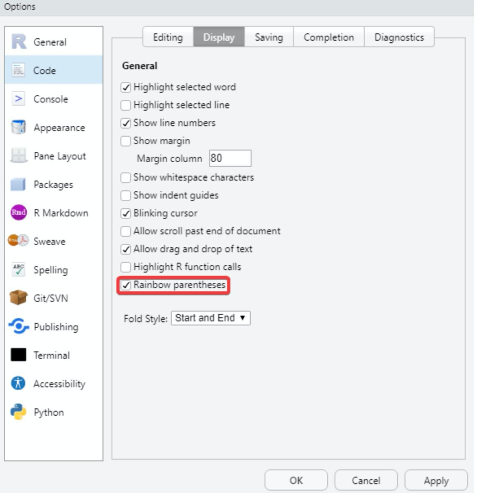

```{r echo = FALSE}
library(knitr)

# Color text
colorize <- function(x, color) {
  
  if (knitr::is_latex_output()) {
    
    sprintf("\\textcolor{%s}{%s}", color, x)
    
  } else if (knitr::is_html_output()) {
    
    sprintf("<span style='color: %s;'>%s</span>", color, x)
    
  } else { x }
}
```

# (PART) Haciendo el trabajo más fácil {-}


# Estructuras de control: if-else {#if-else}

:::: {.blackbox data-latex=""}

Scripts usados:

* [**script11.R**](https://github.com/dadosdelaplace/courses-intro-R/blob/main/scripts/script11.R). Ver en <https://github.com/dadosdelaplace/courses-intro-R/blob/main/scripts/script11.R>

::::

Hasta ahora hemos trasteado con datos: hemos empezado desde una celda, para luego construir columnas (vectores), y luego juntarlas en algo parecido a una base de datos (tablas o _data.frame_). Pero para poder manejarnos con soltura con dichos datos es importante que conozcamos cómo se usan las <mark>**expresiones de control más típicas**</mark>. 

Una <mark>**expresión de control**</mark> será un <mark>**conjunto de órdenes**</mark> que nos permiten decidir por dónde queremos que avance nuestro programa: ¿qué hacemos si sucede A? ¿Y si sucede B?

Si has programado en algún otro lenguaje, estarás familiarizado/a con elementos como un `if (blabla) {...} else {...}` (que los usaremos a veces) o bucles `for` y `while` (que intentaremos no usarlos en `R`). Si es la primera que programas en algún lenguaje, no te preocupes, las empezamos desde cero, empezando por las <mark>**estructuras condicionales**</mark>


## if {}

Una de las estructuras de control más famosas de cualquier lenguaje de programación es la estructura `if`: <mark>**SI las condiciones impuestas se cumplen (`TRUE`)**</mark>, ejecuta las órdenes que tengamos dentro.

 
* `if (x == 1) { código A }`: si `condición` (por ejemplo, `x == 1`) es cierta, se ejecuta `código A`; en caso contrario, no hace nada.

Definamos por ejemplo una variable sencilla, las edades de 8 personas.

```{r}
edades <- c(14, 17, 24, 56, 31, 20, 87, 73)
```

Para comprobar cuales son menores de edades podemos aplicar lo aprendido en temas anteriores, realizando una **comparación lógica**: si es menor de edad, devuelve un `TRUE`; en caso contrario, devuelve un `FALSE`.

```{r}
edades < 18
```

Con las funciones `any()` y `all()` podemos saber si <mark>**todos o alguno de los elementos**</mark> de un vector <mark>**cumplen una condición**</mark>.

```{r}
all(edades >= 18) # todos mayores de edad
any(edades < 18) # existe algun menor de edad
```

Con dichos elementos vamos a construir nuestra **primera estructura condicional**: queremos que, SI existe algún menor de edad, nos imprima un mensaje.

```{r}
if (any(edades < 18)) { # TRUE si al menos una persona mayor de edad
  
  print("existe alguna persona mayor de edad")
  
}
```

En caso de que no se cumplan las condiciones dentro del `if()` (condiciones que devuelvan un `FALSE`), no sucederá nada. Podemos hacer lo mismo cambiando la condición: SI todos son mayores de edad, imprime el mensaje.

```{r}
if (all(edades >= 18)) { # TRUE si TODOS son mayores de edad
  
  print("todas las personas son mayores de edad")
  
}
```

Fíjate que en este caso no hemos obtenido ningún mensaje porque la condición `all(edades >= 18)` no es cierta (no son todos mayores de 18 años), así que no ha ejecutado el código interno.

## if - else {}

La estructura `if (condicion) { }` puede ser combinada con un `else { }`: cuando la condición del `if` no se cumpla (como en el último ejemplo), se ejecutará el código que haya dentro del `else { }`, permitiéndonos decidir que sucede cuando SÍ se cumple y cuando NO se cumple.

* `if (x == 1) { código A } else { código B }`: si `condición` (por ejemplo, `x == 1`) es cierta, se ejecuta `código A`; si es falsa, se ejecuta `código B`.

Siguiendo con el ejemplo de las edades, queremos nos imprima un mensaje SI todos son mayores de edad, y un mensaje diferente en caso de que dicha condición no se cumpla.

```{r}
if (all(edades >= 18)) { # TRUE si TODOS son mayores de edad
  
  print("todas las personas son mayores de edad")
  
} else { # si hay alguno menor de edad 
  
  print("existe alguna persona menor de edad")
}
```

Podemos ya complicar un poco el código con lo que hemos aprendido de temas anteriores. Por ejemplo, en caso de que no se cumpla (es decir, que haya alguno menor de edad), queremos extraer la edad por pantalla de esos menores (con `edades[edades < 18]` extraeremos las edades que cumplen la condición de ser menor de edad).

```{r}
if (all(edades >= 18)) { # TRUE si TODOS son mayores de edad
  
  print("todas las personas son mayores de edad")
  
} else { # si hay alguno menor de edad 
  
  print(glue("Existen menores de edad. Sus edades son: {paste(edades[edades < 18], collapse = '-')} años"))
}
```

## if - else anidados

Dicha estructura `if - else` puede <mark>**anidarse**</mark>, de forma que vayamos <mark>**concatenando**</mark> dichas estructuras, como en el ejemplo que tenemos debajo. Imagina que queremos realizar una acción si todos fuesen mayores de edad; en caso contrario, pero si todos los menores de edad tienen 16 años o más, realizar otra acción; en caso contrario, otra acción

```{r}
if (all(edades >= 18)) { # TRUE si TODOS son mayores de edad
  
  print("todas las personas son mayores de edad")
  
} else if (all(edades >= 16)) { # si todos los menores de edad tienen >=16
  
  print("Existe alguna persona menor de edad pero todos con 16 años o más")
  
} else {
  
  print("Existe alguna persona menor de 16 años")

}
```

## ifelse () vectorizado

Esta <mark>**estructura condicional puede ser vectorizada**</mark>, de forma que podamos reunir en una **sola fila un número elevado de estructuras de comparación** la función `ifelse()`, cuyos argumentos de entrada serán la condición a evaluar, lo que sucede cuando se cumple y lo que no, que aplicará a cada elemento del vector de entrada. Con el ejemplo de las edades, vamos a **dejar el dato ausente si son menores de edad**, y si son mayores de edad se queda como está (recuerda: primero la condición, después lo que devuelve cuando es `TRUE`, y por último lo que devuelve cuando es `FALSE`)

```{r}
# NA si no cumple la condición, la edad si se cumple.
ifelse(edades >= 18, edades, NA)
```

Todas estas estructuras no solo sirven para datos numéricos. Vamos a definir un vector de nombres con algunos ausentes (`NA`), y vamos a sustituir los ausentes por el texto `"nombre_desconocido"` (los que no sean ausentes, es decir los que `is.na()` devuelva `FALSE`, se quedan como están).


```{r}
nombres <- c("Juan", "María", NA, NA, "Lucía", "Carmen", "Javier",
             NA, "Carlos", NA, "Gregorio", "Paloma")

# Si tiene ausente --> "nombre_desconocido"
# Si no tiene ausente --> nombres originales
nombres <- ifelse(is.na(nombres), "nombre_desconocido", nombres)
nombres
```

Esta función `ifelse()` es muy util para codificar variables o averiguar cuales cumplen una condición.

## Consejos


**`r colorize("CONSEJOS", "#20935E")`**

&nbsp;

**`r colorize("Rainbow parentheses", "#20935E")`**

Uno de los **errores más habituales**, y que seguirás cometiendo aunque lleves años programando, es <mark>**no cerrar un paréntesis que has abierto**</mark>, por lo que el programa no sabe si has acabado de llamar a una orden o no. Para ello en las nuevas versiones de `RStudio`, en el menú `Tools < Global Options < Code < Display` podemos habilitar la opción `Rainbow Parentheses` que nos escribe cada par de `()` de un color distinto

```{r echo = FALSE, out.width = "80%", fig.align = "center", fig.cap = "Activando Rainbow Parentheses."}


```

&nbsp;

**`r colorize("Minimiza estructuras de control en el código", "#20935E")`**

Puedes colapsar las estructuras de control pulsando en la flecha que aparece a la izquierda de ellas en tu script.

&nbsp;


## 📝 Ejercicios

(haz click en las flechas para ver soluciones)

<details>
  <summary>📝<strong>Ejercicio 1</strong>: modifica el código inferior para imprimir un mensaje por pantalla si todos los datos del conjunto `airquality` son de meses que no sean enero.
  
```{r eval = FALSE}
# install.packages("dataset") # solo la primera vez
library(datasets) # paquete con los datos
mes <- airquality$Month

if (mes == 2) {
  
  print("Ningún dato es del mes de enero")
  
}
  
```
</summary>
  
<!-- toc -->
- Solución:

```{r}
# install.packages("dataset") # solo la primera vez
library(datasets) # paquete con los datos
mes <- airquality$Month

if (all(mes != 1)) { # todos con mes distinto de 1
  
  print("Ningún dato es del mes de enero")
  
}

```

<!-- tocstop -->
</details>

&nbsp;

<details>
  <summary>📝<strong>Ejercicio 2</strong>: modifica el código inferior para guardar en una variable `temperatura_alta` un valor `TRUE`  si alguno de los registros tiene una temperatura mayor a 90 (están en Farenheit) y un `FALSE` en caso contrario.
  
```{r eval = FALSE}
temperatura <- airquality$Temp

if (temperatura == 100) {
  
  print("Alguno de los registros tiene temperatura superior a 90 Farenheit")
  
}
  
```
</summary>
  
<!-- toc -->
- Solución:

```{r}
temperatura <- airquality$Temp
temperatura_alta <- FALSE # por defecto FALSE
if (any(temperatura > 90)) {
  
  temperatura_alta <- TRUE # si se cumple la condición, a TRUE
  
}

```

<!-- tocstop -->
</details>

&nbsp;

<details>
  <summary>📝<strong>Ejercicio 3</strong>: modifica el código inferior para imprimir un mensaje por pantalla si alguno de los días supera la temperatura de 100.
  
```{r eval = FALSE}
temperatura <- airquality$Temp

if (all(temperatura < 50)) {
  
  print("Alguno de los registros tiene temperatura superior a 100 Farenheit")
  
}
  
```

</summary>
  
<!-- toc -->
- Solución:

```{r}
temperatura <- airquality$Temp

if (any(temperatura > 100)) { # nos basta con uno
  
  print("Alguno de los registros tiene temperatura superior a 100 Farenheit")
  
}

```

No debería imprimar nada porque ninguno cumple la condición.


<!-- tocstop -->
</details>

&nbsp;

<details>
  <summary>📝<strong>Ejercicio 4</strong>: del paquete `{lubridate}`, la función `hour()` nos devuelve la hora de una fecha dada, y la función `now()` nos devuelve fecha y hora del momento actual. Con ambas funciones, y usando `if`, imprime por pantalla  `"buenas noches"` solo a partir de las 21 horas. </summary>
  
<!-- toc -->
- Solución:

```{r}
# Cargamos librería
library(lubridate)

# Fecha-hora actual
fecha_actual <- now()

# Estructura if
if (hour(fecha_actual) > 21) {
  
  cat("Buenas noches") # print/cat dos formas de imprimir por pantalla
}
```

<!-- tocstop -->
</details>

&nbsp;


<details>
  <summary>📝<strong>Ejercicio 5</strong>: con las funciones del ejercicio anterior, y usando una estructura `if-else`, imprime por pantalla (con `cat()` o `print()`) los mensajes `"buenos días"` (de 6 a 14 horas), `"buenas tardes"` (de 14 a 21 horas) o `"buenas noches"` (de las 21 a las 6 horas). </summary>
  
<!-- toc -->
- Solución:

```{r}
# Fecha actual
fecha_actual <- now()

# Estructura if-else
if (hour(fecha_actual) > 6 & hour(fecha_actual) < 14) {
  
  cat("Buenos días")
  
} else if (hour(fecha_actual) > 14 & hour(fecha_actual) < 21) {
  
  cat("Buenas tardes")
  
} else {
  
  cat("Buenas noches")
}
```

<!-- tocstop -->
</details>

&nbsp;


<details>
  <summary>📝<strong>Ejercicio 6</strong>: realiza el ejercicio anterior pero sin estructura de llaves, de forma concisa con `ifelse()`. Mira la ayuda si la necesitases poniendo `? ifelse` en consola. </summary>
  
<!-- toc -->
- Solución:

```{r}
# Fecha actual
fecha_actual <- now()

# Estructura if-else
cat(ifelse(hour(fecha_actual) > 6 & hour(fecha_actual) < 14,
           "Buenos días",
           ifelse(hour(fecha_actual) > 14 &
                    hour(fecha_actual) < 21,
                  "Buenas tardes", "Buenas noches")))
  
```

<!-- tocstop -->
</details>

&nbsp;


