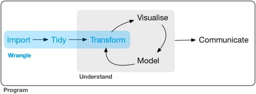

```{r echo = FALSE}
library(knitr)

# Color text
colorize <- function(x, color) {
  
  if (knitr::is_latex_output()) {
    
    sprintf("\\textcolor{%s}{%s}", color, x)
    
  } else if (knitr::is_html_output()) {
    
    sprintf("<span style='color: %s;'>%s</span>", color, x)
    
  } else { x }
}
```

# (PART) EXPLORANDO: introducción al análisis exploratorio de datos{-}

# Tidy data: ordenando datos {#tidydata}

Empieza lo interesante :)

```{r flujo-tidy-data, echo = FALSE,  out.width = "60%", fig.align = "center", fig.cap = "Flujo deseable de datos según Hadley Wickham, extraída de <https://r4ds.had.co.nz/wrangle-intro.html>"}

``` 

Fíjate bien en el anterior **flujo de trabajo**: aunque el objetivo de este manual es muy introductorio, y no vamos a profundizar excesivamente en ninguna de las etapas, vamos a intentar tener unas nociones básicas para <mark>**preparar y manejar los datos**</mark>.

El **primero de los pasos**, la [importación de datos](#importar-exportar), la hemos revisado de forma superficial en la Sección \@ref(importar-exportar), pero **nos bastará con lo aprendido** para poder empezar a manipular datos. Antes de pasar al segundo paso, <mark>**la limpieza de los datos**</mark>, vamos a repasar los tipos de datos que hemos hasta ahora.

## Repaso: tipos de datos {#repaso_datos}

¿Existen más tipos de datos de los que ya conocemos?

La respuesta te la estarás imaginando: sí. De hecho no es solo que existan más sino que **puedes crear tus propios tipos de datos**, pero seguramente acabarán siendo, en su nivel más profundo, una combinación de alguna de las estructuras que ya conocemos. El objetivo de este curso es empezar a ser autónomo/a en el análisis de datos, pero **no es un curso profundo de R**, así que (de momento) vamos a quedarnos como estamos.

&nbsp;

**`r colorize("GLOSARIO:", "#4197D2")`**

Si es importante entender las diferencias entre los datos que ya hemos definido.

* **`r colorize("Vectores", "#4197D2")`**: es el tipo de dato más simple, una colección de valores **PERO DEL MISMO TIPO**. Los vectores pueden ser de longitud 1 (valores individuales a secas), una **colección de números**, una **colección de cadenas de texto** o una **colección de valores lógicos** (pudiendo tener dentro datos ausentes, o valores especiales como `Inf` o `NaN`)

* **`r colorize("Matrices", "#4197D2")`**:  se pueden entender como una especie de colección de vectores, una colección de colecciones, un tipo de dato **BIDIMENSIONAL**. Una matriz se conforma de filas y columnas pero, de nuevo, **LOS DATOS DEBEN SER DEL MISMO TIPO**, y los vectores concatenados que forma las filas y/o columnas **DEBEN TENER LA MISMA LONGITUD**.

* * **`r colorize("data,frame", "#4197D2")`**:  son datos estructurados, lo que comunmente conocemos como «tablas». A diferencia de las matrices, aunque deben **SEGUIR TENIENDO LA MISMA LONGITUD**, las variables que lo conforman pueden ser de **TIPOS DIFERENTES**, puediendo tener el mismo conjunto de datos numéricos, caracteres, lógicos, etc.

* * **`r colorize("Listas", "#4197D2")`**:  las listas son una concatenación de elementos, a secas, de forma que nos permite concatenar cualquier tipo de dato anterior, pudiendo ser de **DIFERENTE LONGITUD Y DIFERENTE TIPO**.
      
&nbsp;

**`r colorize("WARNING: cuidado con las listas", "#ffc107")`**

Como hemos mencionado, una **`r colorize("lista no se puede vectorizar de forma inmediata", "#ffc107")`**, por lo cualquier operación aritmética aplicada a una lista dará error. Para poder operar con ellas tenemos una opción que es aplicar la función `lapply()`, o directamente acudir al paquete `{purrr}` (te animo a investigar en dicho paquete pero se escapa de los objetivos del curso).


## Mejorando los data.frame: tibble {#tibble}

Antes de ordenar, limpiar y procesar nuestros datos, vamos a ver un tipo de dato que quizás hayamos mencionado por encima: las <mark>**tablas `tibble`**</mark>. Los datos en formato `tibble` (del paquete `{tibble}`) son un tipo de `data.frame` mejorado, para una gestión más ágil, eficiente y coherente. Las **tablas en formato tibble (su clase será tbl_df)** tiene 4 ventajas principales frente a los ya vistos `data.frame`:

* Permite <mark>**imprimir por consola la tabla con mayor información**</mark> de las variables, y **solo imprime por defecto las primeras filas** (todas si son 20 o menos, 10 si son más de 20 filas).

```{r}
library(tibble)

# data.frame
tabla_df <-
  data.frame("x" = 1:50,
             "y" = rep(c("a", "b", "c", "d", "e"), 10),
             "z" = 11:60,
             "logica" = rep(c(TRUE, TRUE, FALSE, TRUE, FALSE), 10))
tabla_df

# tibble
tabla_tb <- tibble("x" = 1:50,
             "y" = rep(c("a", "b", "c", "d", "e"), 10),
             "z" = 11:60,
             "logica" = rep(c(TRUE, TRUE, FALSE, TRUE, FALSE), 10))
tabla_tb
```

Puedes imprimir las filas y columnas que quieras con `print()`, pero por defecto te aseguras de **no saturar la consola**.


```{r}
print(tabla_tb, n = 13, width = Inf)
```


*  Mantiene la <mark>**integridad de los datos**</mark> (no cambia los tipos de las variables y hace una carga de datos inteligente, interpretando las fechas como tal).

* La **función `tibble()` construye las variables secuencialmente**, pudiendo hacer uso en la propia definición de variables recién definidas en dicha definición.

```{r error = TRUE}
# data.frame
data.frame("x" = 1:5,
           "y" = c("a", "b", "c", "d", "e"),
           "z" = 11:15,
           "logica" = c(TRUE, TRUE, FALSE, TRUE, FALSE),
           "x*z" = x * z)

# tibble
tibble("x" = 1:5,
       "y" = c("a", "b", "c", "d", "e"),
       "z" = 11:15,
       "logica" = c(TRUE, TRUE, FALSE, TRUE, FALSE),
       "x*z" = x * z)
```

* Si **accedes a una columna que no existe avisa** con un warning.

```{r warning = TRUE, error = TRUE}
# data.frame
tabla_df$variable_inexistente

# tibble
tabla_tb$variable_inexistente
```

* No solo no te cambiará el tipo de datos sino que **no te cambiará el nombre de las variables** (los `data.frame` transforma los caracteres que no sean letras).

```{r}
# data.frame
data.frame(":)" = "emoticono", " " = "en blanco", "2000" = "número")

# tibble
tibble(":)" = "emoticono", " " = "en blanco", "2000" = "número")
```

* Realiza una <mark>**carga de los datos más ágil**</mark>

```{r message = FALSE}
library(microbenchmark)
library(readr)

ruta <- "./DATOS/datos_ES.csv"

# Comparamos read_csv (tibble) con read.csv (data.frame)
microbenchmark(read_csv(file = ruta), read.csv(file = ruta), times = 10)
``` 

&nbsp;


Puedes consultar más funcionalidades de dichos datos en <https://tibble.tidyverse.org/>.

## Tidy data vs messy data {#tidy}

> Tidy datasets are all alike, but every messy dataset is messy in its own way (Hadley Wickham, Chief Scientist en RStudio)

Hasta ahora solo le hemos dado importancia al «qué» pero no al **«cómo» manejamos los datos**. La <mark>**organización de nuestros datos**</mark> es fundamental para que la preparación y explotación de los datos sea **lo más eficiente posible**: la limpieza y preprocesamiento puede llevarnos hasta el **80% del tiempo** en nuestro análisis si no se hace forma correcta [@DasuJohnson03].

El concepto _tidy data_ fue introducido por **Hadley Wickham** [@Wickham14] como objetivo del entorno de paquetes que posteriormente se fueron desarrollando en el entorno `{tidyverse}`. Los conjuntos _tidy_ o <mark>**datos ordenados**</mark> tienen tres objetivos

* **Estandarización** en su estructura.
* **Sencillez** en su manipulación.
* Listos para ser **modelizados y visualizados**.

Para ello, los <mark>**datos ordenados**</mark> o _tidy data_ deben cumplir:

1. Cada <mark>**variable en una columna**</mark>.
2. Cada <mark>**observación/registro/individuo en una fila diferente**</mark>.
3. Cada <mark>**celda con un único valor**</mark>.
4. Cada <mark>**conjunto o unidad observacional conforma una tabla**</mark>.
5. Si contamos con **múltiples tablas**, debemos tener una **columna común** en cada una que nos permita **cruzarlas**.

```{r tidy-data, echo = FALSE,  out.width = "80%", fig.align = "center", fig.cap = "Infografía con datos ordenados (tidy data) extraída de <https://r4ds.had.co.nz/tidy-data.html>"}
knitr::include_graphics("./img/tidy_data.png")
``` 

Lo contrario lo llamaremos **datos desordenados** o _messy data_. Para trabajar con los datos vamos a cargar `{tidyverse}`, un entorno de paquetes para el manejo de datos (ver más detalles en [Transformando los datos: incursión al universo tidyverse](#tidyverse)).

```{r eval = FALSE}
install.packages("tidyverse") # SOLO la primera vez
```

```{r}
library(tidyverse)
```


### Messy data: valores en columnas en lugar de variables

Vamos a visualizar la tabla `table4a` del paquete `{tidyr}` (que ya lo tenemos cargado del entorno `{tidyverse}`).

```{r}
table4a
```

Si te fijas, tenemos una columna `country`, representando una variable con el nombre de los países, **¡pero las otras columnas no representan cada una a una sola variable!** Ambas son la misma variable, solo que medida en años distintos (que debería ser a su vez otra variable): **cada fila está representando dos observaciones** (1999, 2000) en lugar de un solo registro. Lo que haremos será incluir una nueva columna llamada `year` que nos marque el año y otra `values` que nos diga el valor de la variable de interés en cada uno de esos años.

Con la <mark>**función `pivot_longer`**</mark> del mencionada paquete le indicaremos lo siguiente:

- `cols`: el nombre de las columnas que vamos a **pivotar** (con comillas porque son números, no texto como nombre).
- `names_to`: el nombre de la columna a la que vamos a mandar los valores que figuran ahora en los nombres de las columnas.
- `values_to`: el nombre de la columna a la que vamos a mandar los valores.

```{r}
table4a %>% pivot_longer(cols = c("1999", "2000"),
                         names_to = "year",
                         values_to = "values")
```

Ahora tenemos un **registro por fila, una variable por columna y cada celda representa un único valor**. Este ejemplo de _messy data_ lo podemos encontrar muy a menudo cuando **construimos rangos de variables** pensando que es mejor tener una tabla más compacta (alargar la tabla a lo ancho en lugar de a lo largo). Es el caso de la tabla `relig_income`.

```{r}
relig_income
```

Salvo la primera, el resto de columnas tienen como **nombre los valores de una variable en sí misma** (ingresos). Para ordenar los datos vamos a razonar de la misma manera solo que ahora, en lugar de indicarle el nombre de todas las columnas que queremos usar de entrada, vamos a **indicarle de forma más corta la columna que NO queremos seleccionar**.

```{r}
# No necesitamos las comillas en el nombre de columnas salvo que tengan caracteres que no sean letras
relig_income %>% pivot_longer(-religion, names_to = "ingresos",
                              values_to = "frecuencia")
```

Lo que hacemos con `pivot_longer()` es **«ampliar» la tabla, haciéndola más larga (más filas) pero con menos columnas**.


### Messy data: una observación guardada en varias filas

Vamos a visualizar ahora la tabla `table2` del paquete `{tidyr}`.

```{r}
table2
```

Fíjate en las cuatro primeras filas: los registros con el mismo año deberían ser el mismo, es la misma información, debería estar en la misma fila, pero está dividada en dos. Por un lado una fila para la variable `cases` y otra para `population`. Lo que haremos será lo opuesto a antes: con `pivot_wider()` **«ampliaremos» la tabla a lo ancho, haciéndola menos (menos filas) pero con más columnas**.

- `names_from`: el nombre de la columna de la que vamos a sacar las nuevas columnas que vamos a crear (`cases` y `population`).
- `values_from`: el nombre de la columna de la que vamos a sacar los valores.

```{r}
table2 %>% pivot_wider(names_from = type, values_from = count)
```

Ahora tenemos **cada registro en una fila**, que nos indica país-año-casos-población.

### Messy data: una celda con múltiples valores

Por último vamos a visualizar la tabla `table3` del paquete `{tidyr}`.

```{r}
table3
```

En la variable `rate` hay guardados dos valores, separados por `/`, lo que hace que en **una celda no tiene un único valor sino dos**. La función `separate()` del paquete `{tidyr}` nos permitirá <mark>**separar los múltiples valores de la columna**</mark> `rate` simplemente indicándole el nombre de las nuevas columnas en el argumento `into = ...`, creando una nueva columna para cada uno de ellos.

```{r}
table3 %>% separate(rate, into = c("cases", "population"))
```

Por defecto lo que hace es **localizar como separador cualquier caracter que no sea alfa-numérico**. Si queremos un caracter concreto para dividir podemos indicárselo explícitamente

```{r}
table3 %>% separate(rate, into = c("cases", "population"), sep = "/")
```

Si **usas un separador que no está en los datos** te devolverá dichas columnas vacías ya que no ha podido dividirlas.

```{r warning = TRUE}
table3 %>% separate(rate, into = c("cases", "population"), sep = ".")
```


De la misma manera que podemos separar columnas <mark>**también podemos unirlas**</mark>. Para ello vamos a usar la tabla `table5` del ya mencionado paquete. Con la función `unite()` vamos a unir el siglo (en `century`) y el año (en `year`), y al inicio le indicaremos como se llamará la nueva variable (`año_completo`).

```{r}
table5 %>% unite(año_completo, century, year)
```


Como pasaba en `separate()`, tiene un argumento de separador por defecto, en este caso `sep = "_"`. **Si queremos cambiarlo podemos hacerlo indicándoselo explícitamente**.

```{r}
table5 %>%
  unite(año_completo, century, year, sep = "")
```


## Consejos


**`r colorize("CONSEJOS", "#20935E")`**

&nbsp;


**`r colorize("Convertir a tibble", "#20935E")`**

Si ya tienes un `data.frame` es altamente recomendable convertirlo a tibble con `as_tibble()`

```{r}
as_tibble(tabla_df)
```

&nbsp;

**`r colorize("Convertir variables al procesar", "#20935E")`**

Una opción muy útil que podemos usar al aplicar la separación de los múltiples valores es <mark>**convertir los datos al tipo adecuado**</mark>. Los datos unidos en `rate` eran caracteres ya que tenía el separador `/` (no podían ser numéricos). Al separarlos, por defecto, aunque ahora ya son solo números, los separa como si fueran textos. Con `convert = TRUE` podemos indicarle que identifique el tipo de dato y lo convierta (fíjate en la cabecera de las columnas ahora).

```{r}
table3 %>% 
  separate(rate, into = c("cases", "population"), convert = TRUE)
```


Dicha función también puede ser usada para **dividir cifras, como por ejemplo el año**

```{r warning = TRUE}
table3 %>% separate(year,
                    into = c("siglo", "año"),
                    sep = 2)
```
  


## 📝 Ejercicios

(haz click en las flechas para ver soluciones)

<details>
  <summary>📝<strong>Ejercicio 1</strong>: ¿es el conjunto de datos `datasets::anscombe` (del paquete `{datasets}`) de tipo `tibble`? </summary>
  
<!-- toc -->
- Solución:

Recuerda que podemos cargar elementos de un paquete (en este caso `{datasets}`) cargando `library(datasets)` y luego el elemento, o bien `datasets::anscombe` (prefijo::nombre).

La respuesta: NO. Tienes muchas formas de comprobarlo si imprimes el conjunto por defecto.

```{r}
mtcars
class(mtcars)
```

- Imprime por defecto todas las filas (tiene 32 filas, debería imprimir solo 10 si fuese un tibble, para no saturar consola).
- No especifica al imprimir que es de tipo `tibble`.
- No especifica al imprimir el tipo de dato de las columnas.
- Imprime el nombre de las filas (el nombre de los modelos) como si fuera una variable (¡que no existe!).

Así debería de salir si fuera `tibble`.

```{r}
as_tibble(mtcars)
class(as_tibble(mtcars))
```

<!-- tocstop -->
</details>

&nbsp;


<details>
  <summary>📝<strong>Ejercicio 2</strong>: define un `tibble` con tres variables numéricas `a, b, c`, tal que la tercera sea el producto de las dos primeras `c = a * b`<mark>. Inténtalo hacer con un `data.frame`</summary>
  
<!-- toc -->
- Solución:

Un ejemplo:

```{r}
tibble("a" = 1:7, "b" = 11:17, "c" = a * b)
```

Si lo intentamos con un `data.frame`, intentará buscar una variable real que tengamos guardada que se llame `a` y `b`, sin encontrarlas.

```{r error = TRUE}
data.frame("a" = 1:7, "b" = 11:17, "c" = a * b)
```

<!-- tocstop -->
</details>

&nbsp;

<details>
  <summary>📝<strong>Ejercicio 3</strong>: define un `tibble` con tres variables de nombres `variable`, `2`, `tercera :)`, e intenta acceder a ellas.</summary>
  
<!-- toc -->
- Solución:

Las variables solo con caracteres del alfabeto se podrán acceder sin necesidad de comillas.

```{r}
# Definimos el tibble
datos_tb <- tibble("variable" = 1:7, "tercera falsa :)" = 0,
                   "2" = 11:17)

# Accedemos a sus columnas
datos_tb$variable
datos_tb$`tercera falsa :)`
datos_tb$`2`
```

También se puede acceder por el orden que ocupan:

```{r}
datos_tb[1]
datos_tb[2]
datos_tb[3]
```

Y también por el nombre entre corchetes (doble corchete extrae la variable fuera del tibble, corchete simple en formato tibble):

```{r}
datos_tb["variable"]
datos_tb[["variable"]]

datos_tb["tercera falsa :)"]
datos_tb["2"]
```

<!-- tocstop -->
</details>

&nbsp;

<details>
  <summary>📝<strong>Ejercicio 4</strong>: convierte en _tidy data_ el siguiente `data.frame`.</summary>

```{r}
tabla_tb <- tibble("trimestre" = c("T1", "T2", "T3"),
                   "2020" = c(10, 12, 7.5),
                   "2021" = c(8, 0, 9))
```

<!-- toc -->
- Solución:

El problema es que las dos columnas con nombres de año son en realidad valores que deberían pasar a ser variables, así que deberíamos disminuir aplicar `pivot_longer()`

```{r}
# Aplicamos pivot_longer
tabla_tb %>% pivot_longer(cols = c("2020", "2021"),
                          names_to = "año", values_to = "valores")
```

<!-- tocstop -->
</details>


&nbsp;

<details>
  <summary>📝<strong>Ejercicio 5</strong>: convierte en _tidy data_ el siguiente `data.frame`.</summary>

```{r}
tabla_tb <- tibble("año" = c(2019, 2019, 2020, 2020, 2021, 2021),
                   "variable" = c("A", "B", "A", "B", "A", "B"),
                   "valor" = c(10, 9383, 7.58, 10839, 9, 32949))
```

<!-- toc -->
- Solución:

El problema es que las filas que comparten año son el mismo registro (pero con dos características que tenemos divididas en dos filas), así que deberíamos disminuir aplicar `pivot_wider()`

```{r}
# Aplicamos pivot_wider
tabla_tb %>% pivot_wider(names_from = "variable", values_from = "valor")
```

<!-- tocstop -->
</details>

&nbsp;

<details>
  <summary>📝<strong>Ejercicio 6</strong>: convierte en _tidy data_ la tabla `table5` del paquete `{tidyr}`.</summary>

<!-- toc -->
- Solución:

Primero uniremos el siglo y las dos últimas cifras del año para obtener el año completo (guardado en `año`)

```{r}
table5 %>%
  unite(año, century, year, sep = "")
```

Tras ello deberemos separar el valor del ratio en denominador y numerador (ya que ahora hay dos valores en una celda), y convertiremos el tipo de dato en la salida para que sea número.

```{r}
table5 %>%
  unite(año, century, year, sep = "") %>%
  separate(rate, c("numerador", "denominador"), convert = TRUE)

```

<!-- tocstop -->
</details>


