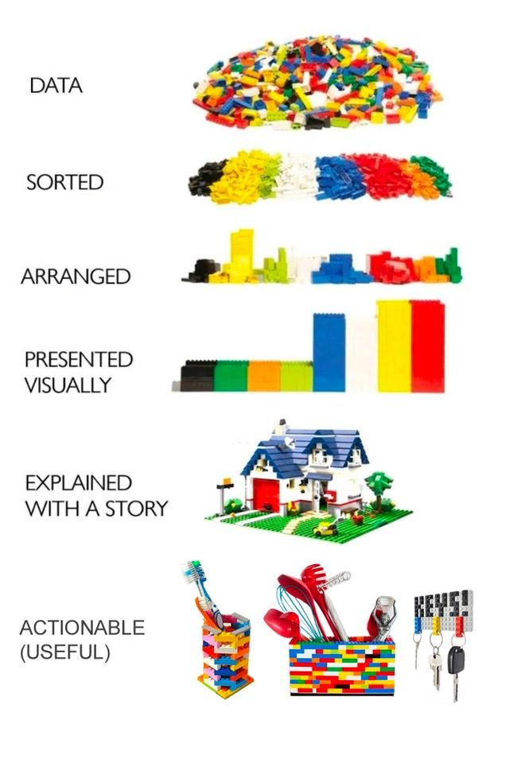

```{r echo = FALSE}
library(knitr)

# Color text
colorize <- function(x, color) {
  
  if (knitr::is_latex_output()) {
    
    sprintf("\\textcolor{%s}{%s}", color, x)
    
  } else if (knitr::is_html_output()) {
    
    sprintf("<span style='color: %s;'>%s</span>", color, x)
    
  } else { x }
}
```

# Recursos extras {#recursos}


## Incursión aleatoria {#aleatorio-1}

Antes de acabar esta breve introducción a `R` merece la pena hablar de **«lo aleatorio»** y su generación en `R`.


**¿Cómo se define la aleatoriedad?**

Si alguna vez has interactuado con matemáticos o estadísticos (Dios te libre), seguramente es una palabra que les hayas escuchado mentar: **aleatoriedad**. Existen múltiples definiciones, y este manual tampoco pretende ser un tratado de filosofía de la ciencia, pero podemos definir la aleatoriedad de la siguiente manera:

&nbsp;

**`r colorize("GLOSARIO: aleatoriedad", "#4197D2")`**

Propiedad de todo proceso cuyo resultado final no se puede conocer con exactitud - a nivel individual  o particular - antes de que se realice, aunque las condiciones iniciales se mantengan constantes (ejemplo: lanzar un dado).

**¿Qué NO significa la palabra «aleatorio»?**

🛑 **NO** tiene que implicar algo **caótico**.  
🛑 **NO** significa que no se pueda **predecir** a nivel de conjunto.  
🛑 **NO** significa que **carezca de un patrón** de comportamiento.
&nbsp;


El ejemplo perfecto para **entender las implicaciones de algo aleatorio es un dado**, ya que no podemos saber con exactitud cuál será la siguiente tirada, pero tiene un patrón: si tiramos un millón de veces, aproximadamente un sexto del total de tiradas serán un 1.

&nbsp;

En el análisis estadístico y en la programación en `R` nos vamos a encontrar con múltiples situaciones en las que **lo aleatorio juega un papel importante**, y aunque este sea un tutorial muy básico e introductorio, creo que es interesante conocer **algunas formas muy sencillas de generar números aleatorios** (o...no tanto, ahora llegamos a la Sección \@ref(pseudoaleatorio)).

Empecemos por lo más simple: vamos a **simular tiradas de una moneda**, asumiendo que solo tenemos dos opciones (eliminando la opción de caer de canto). Cuando tiramos una moneda es un experimento aleatorio, ya que no sabemos el resultado exacto de la siguiente tirada, pero sí sabemos que la probabilidad teórica es de 50-50, y que las únicas opciones a elegir son `cara` y `cruz`.

Una forma de ver el experimento de lanzar una moneda es pensar que tenemos una **urna con dos bolas (cara y cruz)**, y empezamos a sacar bolas de la urna (**permitiendo que al sacar una bola, se pueda devolver a la urna de nuevo**). Eso es precisamente lo que hace la función `sample()`, una función que nos seleccionará «aleatoriamente» elementos de una urna.

* `x`: los elementos distintos que tiene para elegir, que en nuestro caso serán `"cara"` y `"cruz"`.
* `size`: el número de bolas que queremos sacar de la urna.
* `replace`: si tras extraer devolvemos la bola a la urna (`replace = TRUE`) o si se queda fuera (`replace = FALSE`, valor por defecto).
* `prob`: la probabilidad que tiene cada elemento en caso de no ser equiprobables (valor por defecto).

```{r moneda}
# Tiramos 20 veces una moneda
sample(x = c("cara", "cruz"), size = 20, replace = TRUE)
```

Fíjate que hemos indicado explícitamente `replace = TRUE` para decirle que aunque solo tengamos dos opciones, vamos a permitir que tras extraer una bola, la apuntemos, y la volvamos a introducir (puede salir de nuevo). ¿Qué sucede si `replace = FALSE` (su valor por defecto)?

```{r moneda2, error = TRUE}
# Tiramos 20 veces una moneda SIN reemplazamiento
sample(x = c("cara", "cruz"), size = 20)
```

**Al tener solo dos opciones**, y no permitir que al extraer bolas vuelvan a la urna, tras extraer las dos únicas bolas, **el proceso no puede continuar** hasta los 20 lanzamientos.

Como seguramente te hayas percatado, lanzar una moneda es un experimento dicotómico, y dichos experimentos tienen una gran ventaja en programación y es que podemos escribirlo en binario: `0` para lo que llamemos fracaso (cara, por ejemplo), `1` para lo que llamemos éxito (cruz).

Generar experimentos dicotómicos de forma binario nos permite hacer cálculos sobre las tiradas de forma muy sencilla e intuitiva, ya que nos permite pasar de tener cadenas de texto a números.

```{r}
# Tiramos 50 veces una moneda: 0 es cara, 1 es cruz
n_tiradas <- 50
tiradas <- sample(x = 0:1, size = n_tiradas, replace = TRUE)
tiradas

# Cantidad de cruces: sumamos los 1's
sum(tiradas)

# Cantidad de caras: lo que son cruces
n_tiradas - sum(tiradas)

# % de caras
cat(paste0(100 * sum(tiradas) / n_tiradas, "% de cruces"))
```

El argumento `prob = ...` nos permite generar experimentos que sean dicotómicos pero que **no sean equiprobables**, algo similar a **lanzar una moneda trucada** (por ejemplo, 30% caras y 70% cruces). Nótese como dichas probabilidades deben ser introducidas como proporciones (divididas entre 100).

```{r}
# Tiradas de una moneda trucada
tiradas <- sample(x = 0:1, size = n_tiradas, replace = TRUE, prob = c(0.3, 0.7))

# % de caras
cat(paste0(100 * sum(tiradas) / n_tiradas, "% de cruces"))
```

<details>
  <summary>📝<strong>Ejercicio</strong>: ¿cómo simularías 200 tiradas de un dado?</summary>
  
<!-- toc -->
- Solución:

```{r}
# Lo único que cambia son las opciones en la urna
sample(x = 1:6, size = 200, replace = TRUE)
```

<!-- tocstop -->
</details>


## Pseudoaleatoriedad {#pseudoaleatorio}

Si has hecho varias pruebas con los códigos de arriba quizás ya hayas visto que **cada vez que lanzas el código, el resultado es distinto**, algo similar a lo que sucedería si lanzas una moneda. Prueba a ejecutar este código varias veces.

```{r}
sample(0:1, size = 20, replace = TRUE)
```

```{r}
sample(0:1, size = 20, replace = TRUE)
```

```{r}
sample(0:1, size = 20, replace = TRUE)
```


**¿Y si quisiéramos generar toda la clase la misma tirada de moneda?**

Lo primero que quizás pienses es que es **imposible**, ya que al tirar una moneda en la vida real, nunca vamos a tener forma de garantizar que salgan las mismas tiradas a diferentes personas. Y **efectivamente eso sería cierto si nuestros procesos generados hubiesen sido aleatorios**, como en la vida real pero...no lo son.

Mientras esperamos a que lleguen al mainstream los ordenadores cuánticos, **TODO lo que hay en tu ordenador es determínistico**, ya que cualquier proceso se reduce a una **secuencia de bits (`0's` y `1's`)** y un **algoritmo** (sin azar, cuyo resultado siempre será el mismo bajo las mismas condiciones iniciales). He aquí la decepción de tu vida: un ordenador «normal» NO puede generar procesos aleatorios, sino **procesos y números PSEUDOALEATORIOS**, basados en **cadenas pseudoaleatorias** generadas por un algoritmo determinístico.

Dichas secuencias aparentan ser aleatorias pero no lo son, y de hecho muchas son **periódicas**: si generamos el número suficiente de elementos de la cadena pseudoaleatoria volveremos al inicio. Muchos de los algoritmos disponibles para generar números aleatorios dependen, entre otros factores, de un **valor inicial llamada semilla** (normalmente obtenida a partir del reloj interno del ordenador): misma semilla, mismo resultado «aleatorio». Para **fijar la semilla** usaremos `set.seed()`, pasándole como argumento una secuencia de números (todos la misma).

```{r}
set.seed(1234567)
sample(0:1, size = 20, replace = TRUE)
```

```{r}
set.seed(1234567)
sample(0:1, size = 20, replace = TRUE)
```


```{r}
set.seed(1234567)
sample(0:1, size = 20, replace = TRUE)
```

**Siempre la misma tirada si la semilla inicial es la misma** ya que las cadenas pseudoaleatorias que usa el ordenador para simular nuestras tiradas son idénticas.


## Visualizando datos: incursión a ggplot2 {#ggplot2}

Este curso es una pequeña introducción y no pretende ser un manual extenso ni detallado de `R`, así que no entraremos en profundidad en la parte visual. Pero si creo que merece la pena hacer una <mark>**breve incursión al dataviz**</mark> ya que una de las principales fortalezas de `R` frente a `Python` es el manejo de datos con `{tidyverse}`, entorno en el que se incluye el paquete `{ggplot2}`.

La <mark>**visualización de datos o dataviz**</mark> debería ser una parte fundamental de todo análisis de datos. No es solo que nuestro trabajo sea más **presentable y estético** (algo fundamental). La visualización de datos es <mark>**fundamental para convertir el dato en información**</mark>, y usar dicha información para <mark>**contar una historia**</mark> con nuestros datos: no solo importa lo que cuentas sino **cómo lo cuentas**). 

```{r echo = FALSE, out.width = "70%", fig.align = "center", fig.cap = "Imagen extraída de Reddit <https://www.reddit.com/r/lego/comments/pezxk5/oc_a_lego_data_story_adapted_from_original_image/>."}


```

Uno de los ejemplos más famosos para explicar la **importancia de la visualización de datos** en el análisis exploratorio es el conocido como [**cuarteto de Anscombe**](https://cartasdelaplace.substack.com/p/carta-2): cuatro pares de datos $(X, Y)$ con la misma media de todas las $X$, la misma media de todas las $Y$, la misma correlación en todos los pares y la misma recta de regresión si la pintásemos. Matemáticamente, con dichos indicadores, no podríamos distinguir un conjunto de datos de otro, pero al visualizarlos, son datos totalmente distintos. Algo similar sucede con el <mark>**conjunto de datos `Datasaurus`**</mark> que te visualizo debajo de estas líneas, conjunto creado por el experto en visualización de datos **Alberto Cairo**: mismas medias y varianzas, mismas correlaciones, pero datos totalmente distintos.

```{r include = FALSE}
library(datasauRus)
library(glue)
library(ggthemes)
library(gganimate)

anotaciones <- datasaurus_dozen %>% group_by(dataset) %>%
  mutate(media_x = mean(x), media_y = mean(y),
         var_x = var(x), var_y = var(y),
         cor_xy = cor(x, y),
         texto = glue("Media X = {round(media_x, 1)}
                      Varianza X = {round(var_x, 1)}
                      Media Y = {round(media_y, 1)}
                      Varianza Y = {round(var_y, 1)}
                      Corr(X, Y) = {round(cor_xy, 1)}")) %>%
  ungroup()

ggplot(datasaurus_dozen,
         # Color en función del conjunto
         aes(x = x, y = y, color = as.numeric(as.factor(dataset)))) +
  geom_point(size = 9, alpha = 0.5, show.legend = FALSE) +
  # Escala de colores en gradiente
  scale_color_gradient2_tableau("Red-Blue Diverging") +
  # Anotaciones de los cálculos
  geom_text(data = anotaciones %>% group_by(dataset) %>% slice(1),
            aes(x = 83, y = 5, label = texto),
            color = "black", hjust = 0, vjust = -1.5,
            size = 4) +
  ggtitle("THE DATASAURUS DOZEN\n") +
  labs(subtitle =
         paste0("Gráficos: J. Álvarez Liébana | ",
                "Datos: Alberto Cairo")) +
  coord_cartesian(clip = "off") +
  theme(legend.position = "none") + # sin leyenda
  # Transiciones y fade-in/fade-out
  transition_states(dataset, 3, 1) + enter_fade() + exit_fade()

```


### Grammar of graphics (gg): entendiendo la gramática ggplot2

La idea de la filosofía detrás del paquete `{ggplot2}` (ya incluido en `{tidyverse}`) es <mark>**entender los gráficos como parte integrada del flujo de procesamiento, depuración y modelado**</mark> de los datos, dándoles una gramática _Grammar of Graphics_ (ver <https://ggplot2-book.org/introduction.html>) que nos permite combinar diferentes elementos gráficos y ligarlos a los datos. El objetivo es empezar con un lienzo en blanco e ir <mark>**añadiendo capas**</mark> a tu gráfico, como harías por ejemplo en Photoshop, con la diferencia de que nuestras **capas podemos ligarlas al conjunto de datos**, tanto las capas estéticas como las estadísticas. Y dicho paquete nos permite hacerlo con la misma filosofía con la que hemos procesado los datos

 

```{r grammar, echo = FALSE, out.width = "70%", fig.align = "center", fig.cap = "Idea detrás de la «Grammar of graphics» de Wilkinson."}
knitr::include_graphics("./img/grammar.jpg")
```


La ventaja del sistema `{ggplot2}` es poder <mark>**mapear atributos estéticos (color, forma, tamaño) de objetos geométricos (puntos, barras, líneas)**</mark> en función de los datos, añadiendo transformaciones de los datos, resúmenes estadísticos y transformaciones de las coordenadas.


Un gráfico se compondrá de las **siguientes capas**

* **Elementos geométricos (geom)**: puntos, líneas, barras, polígonos, etc.
* **Transformaciones estadísticas (stat)**: ordenar, resumir, agrupar, etc.
* **Elementos del espacio aesthetics (scale)**: color, forma, tamaño, leyenda, ejes, etc.
* **Sistema de coordenadas (coord)**: coordenadas, grids, etc.
* **Componer gráficas (facet)**: visualizar varias gráficas a la vez.
* **Temas (theme)**: fuente, tamaño de letra, subtítulos, captions, etc.

## Primer intento: scatter plot o diagrama de puntos

Veamos un primer intento para entender la filosofía. Imagina que queremos dibujar un _scatter plot_ o <mark>**diagrama de (dispersión) de puntos**</mark>. Para ello vamos a usar el conjunto de datos `gapminder` del paquete homónimo, un fichero con datos de esperanzas de vida, poblaciones y renta per cápita de distintos países en distintos momentos temporales.

```{r}
library(gapminder)
gapminder
glimpse(gapminder)
```

Para empezar con algo sencillo **filtraremos solo los datos del año 1997** haciendo uso de `filter()`.

```{r}
gapminder_1997 <- gapminder %>% filter(year == 1997)
gapminder_1997
```

Vamos a realizar un diagrama de puntos enfrentando en el eje y la población (variable `pop`) y en el eje x la renta per cápita (variable `gdpPercap`). **¿Qué necesitamos?**

* <mark>**Datos**</mark>: el conjunto filtrado `gapminder_1997`.
* <mark>**Mapeado**</mark>: indicarle en `aes()` (aesthetics) las variables a pintar en cada coordenada.
* <mark>**Elegir geometría**</mark>: puntos.

```{r}
ggplot(gapminder_1997, aes(x = gdpPercap, y = pop)) +
  geom_point() # Geometría
```


Podemos hacer lo mismo pero **cambiando el rol de las coordenadas**, intercambiando lsa variables

```{r}
ggplot(gapminder_1997, aes(y = gdpPercap, x = pop)) +
  geom_point()
```

Y podemos repetirlo enfrentando ahora la población en el eje X y la experanza de vida en el eje Y (variable `lifeExp`).

```{r}
ggplot(gapminder_1997, aes(y = lifeExp, x = pop)) +
  geom_point()
```

A veces nos puede ser más conveniente representar alguna de las variables en <mark>**escala logarítmica**</mark> (importante: indícalo siempre en el gráfico), lo que podemos hacer facilmente con `scale_x_log10()` y `scale_y_log10()`

```{r}
ggplot(gapminder_1997, aes(y = lifeExp, x = pop)) +
  geom_point() + scale_x_log10()
```

<mark>**¿Cómo podemos dar color y tamaño a nuestro gráfico?**</mark>

La opción más sencilla es indicándole, dentro de `geom_point()` el color de la geometría con `color = ...` (en este caso, el color del punto), mediante un color fijo, bien sea con alguno de los colores reservados que tiene `R`, bien sea con su [código hexadecimal](https://htmlcolorcodes.com/es/)

```{r}
# Color con palabra reservada
ggplot(gapminder_1997, aes(y = lifeExp, x = pop)) +
  geom_point(color = "red") +
  scale_x_log10()

# Color en hexadecimal, de la página https://htmlcolorcodes.com/es/
ggplot(gapminder_1997, aes(y = lifeExp, x = pop)) +
  geom_point(color = "#2EA2D8") +
  scale_x_log10()
```

De la misma manera podemos indicarle el <mark>**tamaño de la geometría**</mark> (en este caso del punto) con `size = ...`, incluso la <mark>**transparencia**</mark> que queremos para un color dado con `alpha = ...` (entre 0 - transparente - y 1 - totalmente opaco).

```{r}
# Color opaco
ggplot(gapminder_1997, aes(y = lifeExp, x = pop)) +
  geom_point(color = "#A02B85", size = 6) +
  scale_x_log10()

# alpha = 50%
ggplot(gapminder_1997, aes(y = lifeExp, x = pop)) +
  geom_point(color = "#A02B85", size = 6, alpha = 0.5) +
  scale_x_log10()
```

Dichos parámetros se los hemos pasado fijos, como si fuera un valor constante pero podemos <mark>**mapear los _aesthetics_ de un gráfico**</mark> para que **dependan de los datos**, por ejemplo, asignándole un **color a cada continente**.

```{r}
ggplot(gapminder_1997, aes(y = lifeExp, x = pop, color = continent)) +
  geom_point(size = 5) +
  scale_x_log10()
```

Podemos combinarlo con lo que hemos hecho anteriormente e indicarle además que queremos el **tamaño en función de la renta**, con cierto grado de transparencia. 

```{r}
ggplot(gapminder_1997, aes(y = lifeExp, x = pop,
                           color = continent, size = gdpPercap)) +
  geom_point(alpha = 0.7) +
  scale_x_log10()
```

En lugar de jugar con el color, también podríamos añadir mapear las variables en función de la **forma de la geometría** con `shape = ...` (en realidad si tuviéramos suficientes variables podríamos incluir, solo con ejes + colores + tamaños + formas + transparencia, hasta 6 variables distintas).

```{r}
ggplot(gapminder_1997, aes(y = lifeExp, x = pop,
                           shape = continent, size = gdpPercap)) +
  geom_point(alpha = 0.7) +
  scale_x_log10()
```


Reflexionemos sobre el gráfico que acabamos de hacer

```{r}
ggplot(gapminder_1997, aes(y = lifeExp, x = pop,
                           color = continent, size = gdpPercap)) +
  geom_point(alpha = 0.7) +
  scale_x_log10()
```

**Usando los datos** hemos conseguido dibujar en un **gráfico bidimensional 4 variables** (`pop` y `lifeExp` en los ejes X,Y, `continent` como color y `gdpPercap` como tamaño de la geometría) con muy pocas líneas de código, y <mark>**totalmente adaptado y flexible**</mark> a nuestras necesidades. Respecto a los colores, si te fijas `R` **ha elegido automáticamente la paleta** de colores pero podemos <mark>**indicarle alguna paleta**</mark> concreta de varias maneras.

La primera y más inmediata es indicarle los colores manualmente.


```{r}
ggplot(gapminder_1997, aes(y = lifeExp, x = pop,
                           color = continent, size = gdpPercap)) +
  geom_point(alpha = 0.7) +
  scale_x_log10() +
  scale_color_manual(values = c("#A02B85", "#2DE86B", "#4FB2CA",
                                "#E8DA2D", "#E84C2D"))
```


Otra opción es elegir alguna de las paletas disponibles en el paquete `{ggthemes}`, como `scale_color_economist()`, `scale_color_excel()` o `scale_color_tableau()`.

```{r}
library(ggthemes)

# scale_color_economist()
ggplot(gapminder_1997, aes(y = lifeExp, x = pop,
                           color = continent, size = gdpPercap)) +
  geom_point(alpha = 0.9) +
  scale_x_log10() +
  scale_color_economist()

# scale_color_excel()
ggplot(gapminder_1997, aes(y = lifeExp, x = pop,
                           color = continent, size = gdpPercap)) +
  geom_point(alpha = 0.9) +
  scale_x_log10() +
  scale_color_excel()

# scale_color_tableau()
ggplot(gapminder_1997, aes(y = lifeExp, x = pop,
                           color = continent, size = gdpPercap)) +
  geom_point(alpha = 0.9) +
  scale_x_log10() +
  scale_color_tableau()
```


También existen múltiples paquetes que nos proporcionan paletas de colores basados en películas (paquete `{harrypotter}` descargado desde el repositorio de Github), pájaros (paquete `{Manu}`) o cuadros (paquete `{MetBrewer}`).

```{r eval = FALSE}
devtools::install_github(repo = "https://github.com/aljrico/harrypotter")
```

```{r}
library(harrypotter)
ggplot(gapminder_1997, aes(y = lifeExp, x = pop,
                           color = continent, size = gdpPercap)) +
  geom_point(alpha = 0.9) +
  scale_x_log10() +
  scale_color_hp_d(option = "gryffindor") +
  labs(title = "Ejemplo de ggplot2",
       subtitle = "Paleta de Gryffindor",
       caption = "Autor: Javier Álvarez Liébana | Datos: gapminder")

ggplot(gapminder_1997, aes(y = lifeExp, x = pop,
                           color = continent, size = gdpPercap)) +
  geom_point(alpha = 0.9) +
  scale_x_log10() +
  scale_color_hp_d(option = "hufflepuff") +
  labs(title = "Ejemplo de ggplot2",
       subtitle = "Paleta de Hufflepuff",
       caption = "Autor: Javier Álvarez Liébana | Datos: gapminder")
```

```{r eval = FALSE}
devtools::install_github("G-Thomson/Manu")
```

```{r}
library(Manu)
ggplot(gapminder_1997, aes(y = lifeExp, x = pop,
                           color = continent, size = gdpPercap)) +
  geom_point(alpha = 0.9) +
  scale_x_log10() +
  # paleta del pájaro Takahē - Porphyrio hochstetteri
  scale_colour_manual(values = get_pal("Takahe")) +
  labs(title = "Ejemplo de ggplot2",
       subtitle = "Paleta del pájaro Takahē - Porphyrio hochstetteri",
       caption = "Autor: Javier Álvarez Liébana | Datos: gapminder")
```

```{r eval = FALSE}
devtools::install_github("BlakeRMills/MetBrewer") 
```

```{r}
library(MetBrewer)
MetBrewer::met.brewer("Renoir")
MetBrewer::met.brewer("Monet")
MetBrewer::met.brewer("Hokusai")

ggplot(gapminder_1997, aes(y = lifeExp, x = pop,
                           color = continent, size = gdpPercap)) +
  geom_point(alpha = 0.9) +
  scale_x_log10() +
  scale_colour_manual(values = met.brewer("Klimt")) +
  labs(title = "Ejemplo de ggplot2",
       subtitle = "Paleta de cuadros de Klimt",
       caption = "Autor: Javier Álvarez Liébana | Datos: gapminder")
```


Los <mark>**gráficos pueden además personalizarse añadiendo**</mark>, por ejemplo, **títulos y subtítulos de la gráfica** con `labs() 

```{r}
ggplot(gapminder_1997, aes(y = lifeExp, x = pop,
                           color = continent, size = gdpPercap)) +
  geom_point(alpha = 0.9) +
  scale_x_log10() +
  scale_color_tableau() +
  labs(title = "Ejemplo de ggplot2",
       subtitle = "Aprendiendo R sin morir en el intento",
       caption = "Autor: Javier Álvarez Liébana | Datos: gapminder")
```

De la misma manera podemos personalizar el <mark>**título que vamos a dar a los ejes**</mark> y también el <mark>**título de las leyendas**</mark>.

```{r}
ggplot(gapminder_1997, aes(y = lifeExp, x = pop,
                           color = continent, size = gdpPercap)) +
  geom_point(alpha = 0.9) +
  scale_x_log10() +
  scale_color_tableau() +
  labs(x = "Población", y = "Esperanza de vida",
       color = "Continente", size = "Renta per cápita",
       title = "Ejemplo de ggplot2",
       subtitle = "Población vs esperanza de vida (año 1997)",
       caption = "Autor: Javier Álvarez Liébana | Datos: gapminder")
```

Por último, podemos <mark>**dividir/desagregar los gráficos (_facetar_) por variables**</mark>, pintando por ejemplo un **gráfico por continente**, mostrando todos los gráficos a la vez pero por separado, con `facet_wrap()`.

```{r}
ggplot(gapminder_1997, aes(y = lifeExp, x = pop, size = gdpPercap)) +
  geom_point(alpha = 0.9) +
  scale_x_log10() +
  facet_wrap(~ continent) +
  labs(x = "Población", y = "Esperanza de vida",
       color = "Continente", size = "Renta per cápita",
       title = "Ejemplo de ggplot2",
       subtitle = "Población vs esperanza de vida (año 1997)",
       caption = "Autor: Javier Álvarez Liébana | Datos: gapminder")
```

Podemos hacer lo mismo pero separando, por ejemplo, por años, con el fichero **original sin filtrar**.

```{r}
ggplot(gapminder, aes(y = lifeExp, x = pop,
                      size = gdpPercap, color = continent)) +
  geom_point(alpha = 0.6) +
  scale_x_log10() +
  facet_wrap(~ year) +
  scale_color_tableau() +
  labs(x = "Población", y = "Esperanza de vida",
       color = "Continente", size = "Renta per cápita",
       title = "Ejemplo de ggplot2",
       subtitle = "Población vs esperanza de vida (año 1997)",
       caption = "Autor: Javier Álvarez Liébana | Datos: gapminder")
```


Se sale fuera de esta introducción pero con `theme_update()` podemos configurar cualquier aspecto del gráfico.

```{r}
theme_update(
  # Título, subtítulo y caption
  plot.title = element_text(size = 21, face = "bold", color = "#2a475e"),
  plot.subtitle = element_text(size = 11, face = "bold",
                               color = "black"),
  plot.caption = element_text(size = 9, color = "black"),
  # Ejes
  axis.title = element_text(size = 11, color = "grey30"),
  # Líneas de los ejes
  axis.line = element_line(colour = "grey50"),
  # Fondo dentro de la gr?fica sin formato
  rect = element_blank(),
  # Líneas del grid
  panel.grid = element_line(color = "#b4aea9"),
  # Sin grid secuendario (intermedio entre el grande)
  panel.grid.minor = element_blank(),
  # Grid principal
  panel.grid.major.x =  element_line(linetype = "dashed"),
  panel.grid.major.y = element_line(linetype = "dashed"),
  # Color de fondo
  plot.background =
    element_rect(fill = "#fbf9f4", color = "#fbf9f4"),
  plot.margin = # m?rgenes
      margin(t = 0.3, b = 0.3, r = 0.5, l = 0.5, "cm"))

ggplot(gapminder_1997, aes(y = lifeExp, x = pop,
                           color = continent, size = gdpPercap)) +
  geom_point(alpha = 0.9) +
  scale_x_log10() +
  scale_color_tableau() +
  labs(x = "Población", y = "Esperanza de vida",
       color = "Continent", size = "Renta per cápita",
       title = "Ejemplo de ggplot2",
       subtitle = "Aprendiendo R sin morir en el intento",
       caption = "Autor: Javier Álvarez Liébana | Datos: gapminder")
```


## Recursos para seguir

Ahora que ya sabes lo básico para poder empezar a trabajar en un entorno amigable, aunque la idea es que este manual tenga más capítulos (¿los tiene?) para seguir avanzando, por si se me olvida, te dejo una **lista de recursos útiles** para que puedas ir viendo el abanico de opciones que tienes

* **Código de este manual**: este manual está programado en sí mismo en `R` y los códigos pueden ser consultados libremente en el repositorio de [GitHub](https://github.com/dadosdelaplace/courses-intro-R).

```{r github, echo = FALSE, fig.align = 'center',  include = identical(knitr::pandoc_to(), 'html'), fig.link = 'https://github.com/dadosdelaplace/courses-intro-R', out.width = '70%'}
knitr::include_graphics('img/me_github.jpg')
```

* [Cursos y selección de paquetes](https://dadosdelaplace.github.io): **recopilatorio y selección de tutoriales y cursos de `R`** en distintos campos.

* [Incursión a los modelos de regresión en `R`](https://bookdown.org/roback/bookdown-BeyondMLR/): manual sobre el uso de distintos modelos predictivos basados los Modelos Lineales Generalizados (GLM).

* [Visualizador de Tidyverse](https://tidydatatutor.com/): permite visualizar las acciones que haces sobre las tablas para entender mejor el código.

* [Tidymodels](https://www.tidymodels.org/start/): para aprender a dominar `{tidymodels}`, un conjunto de paquetes pensados para el Machine Learning con la misma filosofía flexible pero uniforme de `{tidyverse}`. También es interesante [este tutorial](https://emilhvitfeldt.github.io/ISLR-tidymodels-labs/index.html) para entender un poco los conceptos de data mining y machine learning en R.

* [ggplot2](https://ggplot2.tidyverse.org/index.html): recomiendo mucho las entradas sencillas de [el arte del dato](https://elartedeldato.com/#calendario_adviento) para ir dominando, el trabajo de [Dominic Royé](https://dominicroye.github.io/en/) y el de [Cedric Scherer](https://www.cedricscherer.com/). También existen las gráficas interactivas [plotly](https://plotly.com/ggplot2/) (pasas el ratón y te dan info), y puedes o aprenderlas de 0 o convertir tus [ggplot en interactivos](https://www.rdocumentation.org/packages/plotly/versions/4.10.0/topics/ggplotly)

* [Tablas en R](https://bjnnowak.netlify.app/2021/10/04/r-beautiful-tables-with-gt-and-gtextras/)


* **Paquete para aprender `R`**: el paquete `{swirl}` permite ir aprendiendo de forma sencilla (con preguntas tipo test) algunos conceptos básicos de `R` (muchos de ellos vistos en este manual). Puedes consultar la documentación en su [página web](https://swirlstats.com/)

```{r swirl, echo = FALSE, fig.align = 'center',  include = identical(knitr::pandoc_to(), 'html'), fig.link = 'https://swirlstats.com/', out.width = '60%'}
knitr::include_graphics('img/swirl.png')
```

* [Tidyverse cookbook](https://rstudio-education.github.io/tidyverse-cookbook/)
* [Tidyverse skills for data science](https://jhudatascience.org/tidyversecourse/)

```{r tidyverse-png, echo = FALSE, fig.align = 'center',  include = identical(knitr::pandoc_to(), 'html'), fig.link = 'https://www.tidyverse.org/', out.width = '60%'}
knitr::include_graphics('img/tidyverse.jpg')
```

* **Visualización de datos en Twitter**: una de las **fortalezas de `R`** es su versatilidad para la visualización de datos. Y al igual que un escritor necesita leer mucho para tomar ideas, hay dos recursos en Twitter que te recomiendo encarecidamente:
  - El **hashtag #TidyTuesday** es una etiqueta en la que cada semana se plantea el reto de proponer la mejor visualización para un conjunto de datos dado, donde no solo puedes participar con la comunidad sino [ver las visualizaciones de otros usuarios](https://github.com/rfordatascience/tidytuesday) de `R`.
  - Además he elaborado una [lista de Twitter](https://twitter.com/i/lists/1324478481338683392?s=20) de usuarios que se dedican a la visualización de datos.
  

* [Datacamp](https://app.datacamp.com/learn/career-tracks/data-scientist-with-r?version=5): compendio de cursos que si superas te dan un certificado y sales con un control muy muy potente de data science en R. Son ejercicios sencillos que se van complicando, y la plataforma funciona con tarifa plana: como un netflix de cursos.

* **Generación de informes desde R**: el paquete `{rmarkdown}` permite [generar directamente informes](https://rmarkdown.rstudio.com/) que mezclen texto, fórmulas matemáticas, gráficas y código `R` (como este mismo manual), sin necesidad de importarlos a otras herramientas de Office.

* [Webs en bookdown](https://bookdown.org/yihui/blogdown/). También se puede crear apps/webs interactivas con código `R`, permitiendo que el usuario selecciona parámetros y se ejecuta código gráficas: ver <https://shiny.rstudio.com/tutorial/>. Un ejemplo es la [web de visualización covid de Asturias](https://dgspasturias.shinyapps.io/panel_de_indicadores_asturias/) que elaboré durante la pandemia para el Gobierno de Asturias (la web en sí está elaborada con `{shiny}`, un paquete de `R` que [permite crear aplicaciones web](https://shiny.rstudio.com/tutorial/)).


* **Comunidad de R hispano**: tenemos un [grupo de Discord](https://discord.gg/7ueKQqeaGr) y [grupo de Telegram](https://t.me/hispanoverse) varios usuarios de R en España para compartir recursos.

