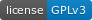

--- 
title: "Aprendiendo R sin morir en el intento"
author: "Javier Álvarez Liébana"
date: 'Última actualización: `r format(as.Date(Sys.Date()), "%d-%m-%Y")`'
documentclass: book
bibliography: [book.bib, packages.bib]
biblio-style: apalike
link-citations: yes
colorlinks: yes
graphics: yes
lot: yes
lof: yes
fontsize: 11pt
mainfont: Palatino
monofont: "Source Code Pro"
monofontoptions: "Scale=0.8"
site: bookdown::bookdown_site
github-repo: dadosdelaplace/cursoR_intro_2021_2022
header-includes:
- \usepackage{setspace}\doublespacing
- \usepackage{float}
- \usepackage{booktabs}
- \usepackage{longtable}
- \usepackage{amsmath}
- \usepackage{multicol}
- \usepackage{threeparttable}
- \usepackage{caption}
description: "Introducción a R desde cero. Curos elaborado por Javier Álvarez Liébana"
cover-image: img/logo_R.png
---

```{r settings, include=FALSE}
knitr::opts_chunk$set(echo = TRUE, message = FALSE, warning = FALSE, 
                      dev = "ragg_png", res = 600, retina = 2,
                      fig.width = 15, fig.height = 8.5)
Sys.setlocale("LC_TIME", "C")
```

```{r color, echo = FALSE}
library(knitr)

# Color text
colorize <- function(x, color) {
  
  if (knitr::is_latex_output()) {
    
    sprintf("\\textcolor{%s}{%s}", color, x)
    
  } else if (knitr::is_html_output()) {
    
    sprintf("<span style='color: %s;'>%s</span>", color, x)
    
  } else { x }
}
```

# Prefacio {-}

Este curso ha sido diseñado por [Javier Álvarez Liébana](https://dadosdelaplace.com) y pensado para introducir en el lenguaje `R` a todas aquellas personas que nunca hayan programado en él y/o en ningún otro lenguaje. Dicho manual ha sido elaborado a su vez en `R` con [{bookdown}](https://github.com/rstudio/bookdown). Puedes ver un resumen de las funcionalidades algunos paquetes documentados por el equipo de [R Studio](https://www.rstudio.com/) en sus [esquemas resumen](https://www.rstudio.com/resources/cheatsheets/). El **código** de dicho manual se encuentra en GitHub (https://github.com/dadosdelaplace/cursoR_intro_2021_2022).

```{r me-github, echo = FALSE, fig.align = 'center',  include = identical(knitr:::pandoc_to(), 'html'), fig.link = 'https://github.com/dadosdelaplace/cursoR_intro_2021_2022', out.width = '70%'}
knitr::include_graphics('img/me_github.jpg')
```

&nbsp;  

Para **elaborar informes o libros** con una estructura similar, de forma nativa en `R`, el paquete `{bookdown}` puede ser instalado desde la plataforma CRAN o desde su versión en desarrollo actualizada en Github:

```{r eval = FALSE}
install.packages("bookdown")
# o desde su versión en desarrollo actualizada
# devtools::install_github("rstudio/bookdown")
```


```{r hex-rmarkdown, echo = FALSE, fig.align = 'center',  include = identical(knitr:::pandoc_to(), 'html'), fig.link = 'https://github.com/rstudio/rmarkdown', out.width = '20%'}
knitr::include_graphics('img/hex-rmarkdown.png')
```


## Propósito {-}

El **objetivo** de este tutorial es introducir a la programación y análisis estadístico en `R` a toda aquella persona que nunca se haya iniciado en él, **sin necesitar conocimientos previos** de programación (aunque siempre ayuda, obviamente). Con este manual no se pretende que adquieras un vasto y experto conocimiento de `R`, pero si lo suficiente como para lograr **3 objetivos**:

* **No tener miedo** a programar.
* Entender los **conceptos básicos de `R`** y dotarte de una autonomía muy básica para pdoer trabajar con datos.
* Algunos **trucos sencillos** para que el trabajo sea más rápido, tanto en tiempo de escritura como de ejecución.

## Requisitos {-}

* **Conexión a internet**: se necesitará tener una conexión a internet disponible para la descarga de algunos datos y paquetes.

* **Instalar R** (ver \@ref(instalacionR)). **`R` será nuestro lenguaje**, nuestro diccionario, nuestro castellano, nuestra ortografía para poder «comunicarnos» con el ordenador. <https://cran.r-project.org/>

* **Instalar `R Studio`** (ver \@ref(instalacionRStudio)). De la misma manera que podemos escribir el mismo texto en castellano en una tablet, en un ordenador, en un Word, en un papel o en un tuit, en programación podemos usar distintos **IDE (entornos de desarrollo integrados, nuestro Office)**, para que el trabajo sea más cómodo. Nosotros trabajaremos con `RStudio`.

```{r rstudio-ide, echo = FALSE, fig.align = 'center',  include = identical(knitr:::pandoc_to(), 'html'), fig.link = 'https://www.rstudio.com/products/rstudio/download/#download', out.width = '75%'}
knitr::include_graphics('img/rstudio_cheetsheet.jpg')
```

Todo lo necesario para seguir este curso es de **descarga gratuita**: viva el software libre, abajo Excel.


## Código de colores {-} 


::: {.rmdcaution}

En los **`r colorize("recuadros rojos", "#dc3545")`** encontrarás **errores comunes** o prácticas que no deberías hacer.

:::

::: {.rmdwarning}

En los **`r colorize("recuadros naranjas", "#ffc107")`** encontrarás **warnings o advertencias** sobre cosas a tener en cuenta para evitar problemas.

:::

::: {.rmdwarning}

**`r colorize("Anular warnings", "#ffc107")`**

Algunas funciones pueden arrojarse ciertas advertencias que nunca está de más leer. Pero si dichos mensajes de alerta los tenemos controlados y no queremos que nos ensucie la ejecución en la consola, podemos poner al inicio del código ` assign("last.warning", NULL, envir = baseenv())` para limpiar los warnings antiguos y `options(warn = -1)` para desactivarlos.

:::


::: {.rmdimportant}

En los **`r colorize("recuadros verdes", "#20935E")`** encontrarás consejos o tips para ampliar y facilitar tu programación. Además en cada **cajita de código**, si pasas el ratón, encontrarás un botón 📄📄 en la esquina superior derecha de la caja para copiar el código directamente a tu consola. **Puedes encontrarlos todos escribiendo «consejo» en el buscador**.

:::


::: {.rmdnote}

En los **`r colorize("recuadros azules", "#4197D2")`** encontrarás un 📚 **glosario** con algunos términos estadísticos y conceptos básicos.
::: 


 
## Sobre el autor {-}

Esto de presentarse a sí mismo es siempre un poco raro pero vamos a intentarlo. Mi nombre es **Javier Álvarez Liébana**, soy **matemático**, nacido en 1989 en **Carabanchel (Madrid)**, pasando por Bologna (Italia). Tras terminar licenciatura y Máster en Ingeniería Matemática, recibí en julio de 2018 el título de **Doctor en Estadística** (por la Universidad de Granada, con dos estancias en Université Pierre et Marie Curie)

Además de **investigador** (con plaza y acreditación de Ayudante Doctor en la Facultad de Estudios Estadísticos de la Universidad Complutense de Madrid, tras ocupar dicha plaza en la Universidad de Oviedo), soy **docente** en dicha facultad y ando intentando eso de la **divulgación en estadística y dataviz** (visualización de datos) en redes sociales

🎲 [Web](https://dadosdelaplace.com)  
🐦 [Twitter](https://twitter.com/dadosdelaplace)  
📸 [Instagram](https://instagram.com/javieralvarezliebana)  


## Licencia {-}

[](https://www.gnu.org/licenses/gpl-3.0)

Este documento es publicado bajo **licencia pública general GNU**,
una licencia libre de copyleft que garantiza a los usuarios finales (personas, organizaciones, compañías) la **libertad de usar, estudiar, compartir (copiar) y modificar el software, citando adecuadamente al autor del mismo**. 


